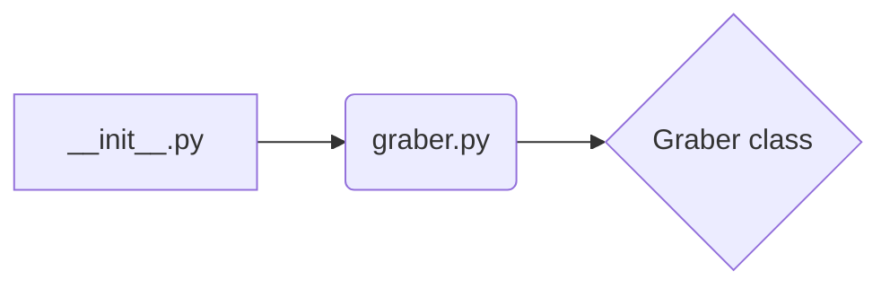

```MD
# Анализ кода hypotez/src/suppliers/ksp/__init__.py

## <input code>

```python
# -*- coding: utf-8 -*-
#! venv/Scripts/python.exe
#! venv/bin/python/python3.12

"""
.. module: src.suppliers.ksp 
	:platform: Windows, Unix
	:synopsis:

"""
MODE = 'dev'

from .graber import Graber
```

## <algorithm>

Алгоритм работы файла `__init__.py` достаточно тривиален.  Он, по сути, выполняет импорт модуля `graber.py`, находящегося в подпапке `ksp`.  Подробная блок-схема не нужна, так как действий по обработке данных нет.

* **Шаг 1:** Импорт. Файл `__init__.py` импортирует класс `Graber` из модуля `graber.py`, находящегося в подпапке `ksp`.

**Пример:**

```
# Внутри graber.py
class Graber:
    def __init__(self, ...):
        ...
    def get_data(...):
        ...
```


## <mermaid>



**Описание диаграммы:**

Файл `__init__.py` (A) импортирует модуль `graber.py` (B), который содержит класс `Graber` (C). Стрелки указывают направление импорта.


## <explanation>

**Импорты:**

- `from .graber import Graber`: Этот импорт из подпапки `ksp` забирает из файла `graber.py` определение класса `Graber`.  Символ `.` перед именем файла указывает на то, что файл `graber.py` находится в той же директории, что и `__init__.py`.  Эта конструкция предполагает, что модуль `graber.py` содержится внутри папки `ksp`.  В `__init__.py` определяется, что данный модуль `ksp` содержит какие-то объекты и функции, связанные с поставщиком данных.


**Классы:**

- `Graber`: Этот класс не определен в `__init__.py` и предполагается, что он находится в файле `graber.py`.  Его роль -  поиск, извлечение и/или преобразование данных от источника KSP.


**Функции:**

Нет функций, так как `__init__.py` лишь выполняет импорт.  Функциональность класса `Graber` (если таковая есть) определена в `graber.py`.


**Переменные:**

- `MODE = 'dev'`: Это переменная, которая, вероятно, определяет режим работы скрипта (например, 'dev' - для разработки, 'prod' - для производства). Ее использование будет зависеть от реализации в `graber.py`.


**Возможные ошибки или улучшения:**

- **Отсутствие документации:** В файле `graber.py` должна быть подробная документация к классу `Graber`, включая описание аргументов конструктора (`__init__`), методов и возвращаемых значений, чтобы другой код мог понять, как взаимодействовать с классом.

- **Недостаточно информации:**  Без `graber.py` сложно оценить функциональность и взаимосвязи с другими частями проекта.

- **Структура проекта:**  Необходимо больше контекста.  Для лучшего анализа необходимо увидеть остальные файлы в структуре пакета `src.suppliers.ksp` и понять их взаимосвязь.  Необходимо увидеть, как именно `Graber` используется в других частях проекта (`ksp` - это supplier, поставляющий данные).  В какой модуль `ksp` отправляет данные (например, `consumer.py` или similar).


**Цепочка взаимосвязей:**

`__init__.py` из `src.suppliers.ksp` импортирует класс `Graber` из `src.suppliers.ksp.graber.py`. Это означает, что `graber.py` предоставляет интерфейс для работы с источником данных KSP.  Дальнейшие взаимосвязи зависят от того, как класс `Graber` используется в других частях приложения.