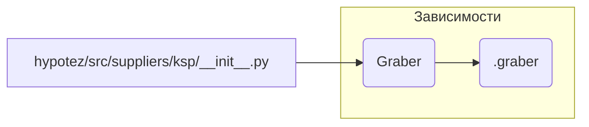

# <input code>

```python
## \file hypotez/src/suppliers/ksp/__init__.py
# -*- coding: utf-8 -*-
#! venv/Scripts/python.exe
#! venv/bin/python/python3.12

"""
.. module: src.suppliers.ksp 
	:platform: Windows, Unix
	:synopsis:

"""
MODE = 'dev'

from .graber import Graber
```

# <algorithm>

Этот код представляет собой инициализационный модуль для пакета `ksp` внутри проекта `hypotez`.  Он не содержит  логики обработки данных, а только импортирует класс `Graber`.  Пошаговая блок-схема будет очень простой:

1. **Импорт:** Модуль импортирует класс `Graber` из подпапки `.graber`.

**Пример:**

```
(в файле hypotez/src/suppliers/ksp/__init__.py)
from .graber import Graber
```


# <mermaid>



# <explanation>

* **Импорты:**
    * `from .graber import Graber`: Этот импорт подключает класс `Graber` из файла `graber.py` внутри той же директории (`ksp`).  Символ `.` указывает на поиск файла внутри текущей папки.  Это стандартная практика для организации кода и построения иерархии пакетов Python.  Связь с другими частями проекта через `Graber`.  Вероятно, `Graber` отвечает за получение данных из какого-то источника, связанного с `ksp` (например, API или базы данных).

* **Классы:**
    * `Graber`: Этот класс, определенный в файле `graber.py` (который не показан), содержит логику получения данных.  Без доступа к нему невозможно дать более подробное описание.  Этот файл вероятно содержит атрибуты для хранения параметров работы и методы для осуществления запросов/обработки данных.

* **Функции:**
    * Нет функций в данном файле.


* **Переменные:**
    * `MODE = 'dev'`: Эта константа хранит строковое значение. Вероятно,  эта переменная указывает на режим работы программы (разработка, производство и т.п.). Ее значение используется другими частями проекта для конфигурации, например, для выбора разных источников данных или способов логирования в зависимости от среды.  В данном случае, `'dev'` предполагает что-то вроде "режима разработки".


* **Возможные ошибки или области для улучшений:**

    * Отсутствует явное описание класса `Graber`.  Необходима информация о переменных, методах, используемых импортах и функциях класса, чтобы оценить его полную функциональность.  Нужен код файла `graber.py`.
    * Отсутствие документации внутри класса `Graber` может усложнить понимание его поведения.  Рекомендуется использовать docstrings.
    * В файле `.graber` (или в других файлах, импортируемых этим файлом) могут быть ошибки, которые могут привести к тому, что `Graber` не работает как ожидается.


* **Цепочка взаимосвязей с другими частями проекта:**

    Этот файл является частью пакета `ksp` (обработка данных от системы KSP), который, скорее всего, взаимодействует с другими модулями проекта для обработки, хранения, отображения или анализа данных, полученных от KSP.  Пример:
    1. `ksp` получает данные через `Graber`.
    2. Другие части проекта используют эти данные для анализа, вывода отчетов или отображения в пользовательском интерфейсе.
    Насколько обширной будет эта цепочка, зависит от архитектуры проекта.  Без доступа к другим частям проекта, невозможно определить все детали взаимосвязей.