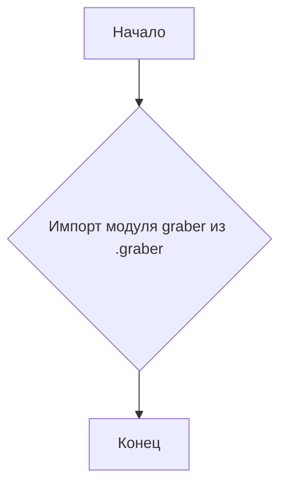
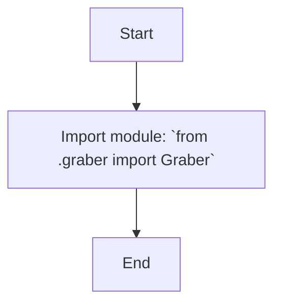

## Анализ кода `hypotez/src/suppliers/ksp/__init__.py`

### 1. <алгоритм>

1.  **Начало**: Запускается выполнение файла `__init__.py`.
2.  **Импорт модуля `graber`**: Из текущего пакета `src.suppliers.ksp` импортируется модуль `graber`.
    *   Пример: Если в файле `graber.py` есть класс `Graber`, то после импорта можно создать его экземпляр: `graber_instance = Graber()`.
3.  **Конец**: Завершается выполнение файла `__init__.py`.



### 2. <mermaid>



**Объяснение `mermaid`:**

Диаграмма показывает простой процесс импорта модуля `Graber` из `graber.py`, который находится в том же пакете (`.`) что и `__init__.py`.

### 3. <объяснение>

**Импорты:**

*   `from .graber import Graber`:  Импортирует класс `Graber` из модуля `graber.py`, который находится в том же пакете `ksp`. `. ` (точка) означает текущий пакет. Этот импорт позволяет использовать класс `Graber` внутри пакета `ksp`.

**Классы:**
*   `Graber`:  Предполагается, что в файле `graber.py` есть класс с именем `Graber`, который, вероятно, отвечает за получение данных из внешних источников, как предполагает имя (graber - похититель, захватчик). Точная функциональность класса определяется содержанием `graber.py`.

**Функции:**
*   В данном файле нет функций.

**Переменные:**
*   В данном файле нет переменных, кроме имён модулей и классов, которые являются объектами.

**Объяснение:**

Файл `__init__.py` пакета `ksp` служит для инициализации пакета и делает класс `Graber` доступным для использования в других частях проекта, например, `from src.suppliers.ksp import Graber`. По сути, этот файл позволяет импортировать `Graber` непосредственно из пакета `ksp`, а не из `graber.py`, что является более удобным.

**Потенциальные улучшения/ошибки:**

*   В данном коде, представленном в файле `__init__.py` нет никаких явных ошибок. Он выполняет свою основную функцию - импорт класса `Graber` для удобного использования в других частях проекта.
*   Чтобы понять полную картину, нам нужно видеть содержимое файла `graber.py`.
*   Нужно понимать контекст, для чего нужен этот `graber`.

**Взаимосвязь с другими частями проекта:**

*   Этот файл связывает пакет `ksp` с классом `Graber`.
*   Другие части проекта могут импортировать `Graber` из этого пакета, например: `from src.suppliers.ksp import Graber`.

```python

```