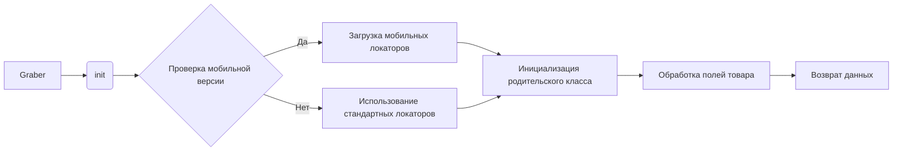

# Анализ кода graber.py

**1. <input code>**

```python
from __future__ import annotations
## \file hypotez/src/suppliers/ksp/graber.py
# -*- coding: utf-8 -*-\
#! venv/Scripts/python.exe
#! venv/bin/python/python3.12

"""
.. module: src.suppliers.ksp 
	:platform: Windows, Unix
	:synopsis: Класс собирает значение полей на странице  товара `ksp.co.il`. 
    Для каждого поля страницы товара сделана функция обработки поля в родительском классе.
    Если нужна нестандертная обработка, функция перегружается в этом классе.
    ------------------
    Перед отправкой запроса к вебдрайверу можно совершить предварительные действия через декоратор. 
    Декоратор по умолчанию находится в родительском классе. Для того, чтобы декоратор сработал надо передать значение 
    в `Context.locator`, Если надо реализовать свой декоратор - раскоментируйте строки с декоратором и переопределите его поведение

"""
MODE = 'dev'

from typing import Any
import header
from src import gs
from src.suppliers.graber import Graber as Grbr, Context, close_pop_up
#from src.webdriver.driver import Driver
from src.utils.jjson import j_loads_ns
from src.logger import logger


# # Глобальные настройки через отдельный объект
# class Context:
#     """Класс для хранения глобальных настроек."""
#     driver: Driver = None
#     locator: SimpleNamespace = None

# # Определение декоратора для закрытия всплывающих окон
# # В каждом отдельном поставщике (`Supplier`) декоратор может использоваться в индивидуальных целях
# # Общее название декоратора `@close_pop_up` можно изменить 


# def close_pop_up(value: Any = None) -> Callable:
#     """Создает декоратор для закрытия всплывающих окон перед выполнением основной логики функции.

#     Args:
#         value (Any): Дополнительное значение для декоратора.

#     Returns:
#         Callable: Декоратор, оборачивающий функцию.
#     """
#     def decorator(func: Callable) -> Callable:
#         @wraps(func)
#         async def wrapper(*args, **kwargs):
#             try:
#                 # await Context.driver.execute_locator(Context.locator.close_pop_up)  # Await async pop-up close  
#                 ... 
#             except ExecuteLocatorException as e:
#                 logger.debug(f'Ошибка выполнения локатора: {e}')
#             return await func(*args, **kwargs)  # Await the main function
#         return wrapper
#     return decorator


class Graber(Grbr):
    """Класс для операций захвата Morlevi."""
    supplier_prefix: str

    def __init__(self, driver: 'Driver'):
        """Инициализация класса сбора полей товара."""
        self.supplier_prefix = 'ksp'
        super().__init__(supplier_prefix=self.supplier_prefix, driver=driver)
 
        if '/mob/' in self.driver.current_url: # <- бывет, что подключается к мобильной версии сайта
            self.locator = j_loads_ns(gs.path.src / 'suppliers' / 'ksp' / 'locators' / 'product_mobile_site.json')
            logger.info("Установлены локаторы для мобильной версии сайта KSP")
            ...

        Context.locator_for_decorator = None # <- если будет уастановлено значение - то оно выполнится в декораторе `@close_pop_up`
```

**2. <algorithm>**

(Блок-схема отсутствует, так как сложно представить ее без значений, которые необходимо получить из сайта)

**3. <mermaid>**



**4. <explanation>**

* **Импорты:**
    * `from __future__ import annotations`:  Добавляет возможность использовать `annotations` для типов.
    * `import header`: Импортирует модуль `header`.  Без контекста, трудно сказать, что он делает. Возможно, конфигурационные настройки, или подключение дополнительных функций.
    * `from src import gs`: Импортирует модуль `gs` из пакета `src`. Предполагается, что `gs` содержит конфигурацию, пути к файлам или другие вспомогательные данные, необходимые для работы.
    * `from src.suppliers.graber import Graber as Grbr, Context, close_pop_up`:  Импортирует классы `Graber` (переименован в `Grbr`), `Context` и `close_pop_up` из модуля `graber` в папке `suppliers`. Эти классы, вероятно, являются базовыми для работы с веб-драйвером и обработкой данных.
    * `from src.utils.jjson import j_loads_ns`: Импортирует функцию `j_loads_ns` из модуля `jjson` в пакете `utils`, которая, вероятно, используется для парсинга JSON.
    * `from src.logger import logger`: Импортирует логгер из пакета `logger` в `src`, для записи сообщений об ошибках и других событий.
    
* **Классы:**
    * `Graber`: Наследуется от `Grbr`. Предназначен для сбора данных с сайта `ksp.co.il`.  
      * `supplier_prefix`: Хранит префикс для поставщика.
      * `__init__`: Инициализирует `Graber`, устанавливает `supplier_prefix` и вызывает конструктор родительского класса `Grbr`. Проверяет, есть ли мобильная версия сайта (`/mob/`). Если да, то загружает специфичные мобильные локаторы.
      * В данном коде нет реализации функциональности класса Graber.  

* **Функции:**
    * `close_pop_up`: (комментированная) - Декоратор, который предназначен для закрытия всплывающих окон перед выполнением основной функции. 
       * `decorator`: Внутренняя функция, которая принимает функцию и возвращает функцию-обертку.
       * `wrapper`: Обертка, которая пытается закрыть всплывающие окна, используя `Context.locator.close_pop_up` и в случае ошибки выводит лог. 
* **Переменные:**
    * `MODE`: Вероятно, переменная, определяющая режим работы (например, 'dev', 'prod').
    * `Context.locator_for_decorator`:  Переменная хранит данные для декоратора. По умолчанию `None`.

* **Возможные ошибки/улучшения:**
    * Код содержит комментированный код декоратора, который не реализован.
    * Нет проверки на корректность входных данных.
    * Отсутствует логика обработки полей товара в классе `Graber`.
    * Отсутствует описание класса `Context` и методов класса `Grbr`.
    * Отсутствует описание типа переменной `driver` в методе `__init__`.

**Взаимосвязи с другими частями проекта:**
* `Graber` зависит от `Grbr` (родительского класса), `Context`, `gs`, `j_loads_ns` и `logger`.
* `Graber` использует данные из файла `product_mobile_site.json` и `Context.locator_for_decorator`.
* Непонятно, как работает `Context` и `Grbr`. Требуется дополнительная информация о работе родительского класса `Graber`.


**Вывод:**

Код реализует базовый шаблон для работы с веб-драйвером, но требует дальнейшей реализации.  Необходимо реализовать логику обработки полей товара внутри класса `Graber`, а также уточнить, как взаимодействуют `Context` и `Grbr`.  Важно понимать, что код не является функциональным без дополнительных частей проекта, к которым он обращается.