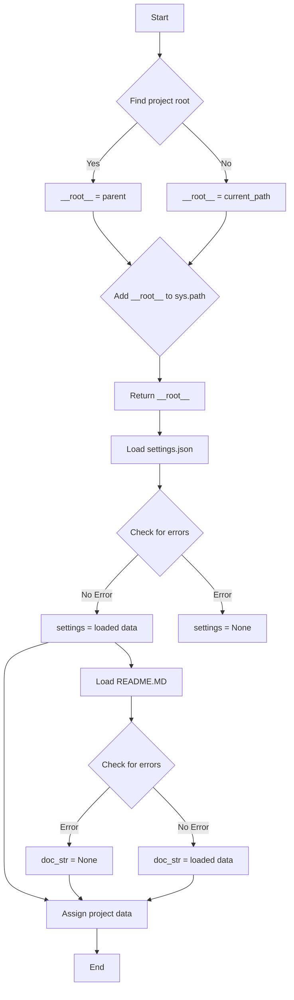
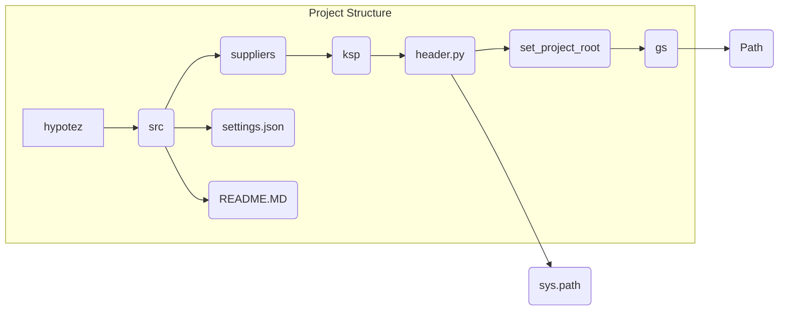

# <input code>

```python
## \file hypotez/src/suppliers/ksp/header.py
# -*- coding: utf-8 -*-
#! venv/Scripts/python.exe
#! venv/bin/python/python3.12

"""
.. module: src.suppliers.ksp 
	:platform: Windows, Unix
	:synopsis:

"""
MODE = 'dev'


import sys
import json
from packaging.version import Version

from pathlib import Path
def set_project_root(marker_files=('pyproject.toml', 'requirements.txt', '.git')) -> Path:
    """
    Finds the root directory of the project starting from the current file's directory,
    searching upwards and stopping at the first directory containing any of the marker files.

    Args:
        marker_files (tuple): Filenames or directory names to identify the project root.
    
    Returns:
        Path: Path to the root directory if found, otherwise the directory where the script is located.
    """
    __root__:Path
    current_path:Path = Path(__file__).resolve().parent
    __root__ = current_path
    for parent in [current_path] + list(current_path.parents):
        if any((parent / marker).exists() for marker in marker_files):
            __root__ = parent
            break
    if __root__ not in sys.path:
        sys.path.insert(0, str(__root__))
    return __root__


# Get the root directory of the project
__root__ = set_project_root()
"""__root__ (Path): Path to the root directory of the project"""

from src import gs

settings:dict = None
try:
    with open(gs.path.root / 'src' /  'settings.json', 'r') as settings_file:
        settings = json.load(settings_file)
except (FileNotFoundError, json.JSONDecodeError):
    ...

doc_str:str = None
try:
    with open(gs.path.root / 'src' /  'README.MD', 'r') as settings_file:
        doc_str = settings_file.read()
except (FileNotFoundError, json.JSONDecodeError):
    ...


__project_name__ = settings.get("project_name", 'hypotez') if settings  else 'hypotez'
__version__: str = settings.get("version", '')  if settings  else ''
__doc__: str = doc_str if doc_str else ''
__details__: str = ''
__author__: str = settings.get("author", '')  if settings else ''
__copyright__: str = settings.get("copyrihgnt", '')  if settings else ''
__cofee__: str = settings.get("cofee", "Treat the developer to a cup of coffee for boosting enthusiasm in development: https://boosty.to/hypo69")  if settings else "Treat the developer to a cup of coffee for boosting enthusiasm in development: https://boosty.to/hypo69"
```

# <algorithm>



**Пример:**
Если файл `header.py` находится в `/home/user/project/hypotez/src/suppliers/ksp`,  `set_project_root` найдет папку `/home/user/project` как корень проекта, так как в ней есть `pyproject.toml`, `requirements.txt` или `.git`.

# <mermaid>



# <explanation>

**Импорты:**

- `sys`: Предоставляет доступ к системным переменным и функциям, включая `sys.path`, необходимым для поиска модулей.
- `json`: Для работы с JSON-данными.
- `packaging.version`: Для работы с версиями пакетов.
- `pathlib`: Для работы с путями файлов и каталогов.
- `src.gs`:  Предполагает, что это модуль, определенный в папке `src`, вероятно, содержащий функции для работы с файловой системой проекта. Важно, что это показывает импортирование из папки проекта, а не из стороннего модуля.

**Классы:**

Нет определенных классов в данном коде.

**Функции:**

- `set_project_root(marker_files)`:  Находит корневой каталог проекта.  Ищет вверх по иерархии каталогов, начиная с текущего, до тех пор, пока не найдет каталог, содержащий один из файлов, указанных в `marker_files`. Если корневой каталог найден, добавляет его в `sys.path`, что позволяет импортировать модули из корня проекта.

**Переменные:**

- `MODE`: Строковая константа, вероятно, определяющая режим работы приложения (например, `dev` или `prod`).
- `__root__`: Путь к корневому каталогу проекта, полученный функцией `set_project_root`.
- `settings`: Словарь с настройками проекта, загруженный из `settings.json`.
- `doc_str`: Строка с содержимым файла `README.MD`.
- `__project_name__`, `__version__`, `__doc__`, `__details__`, `__author__`, `__copyright__`, `__cofee__`:  Строковые переменные, содержащие данные из файла настроек (или значения по умолчанию, если файл не найден или данные отсутствуют).


**Возможные ошибки и улучшения:**

- Обработка ошибок (блоками `try...except`) хороша, но можно добавить более конкретные сообщения об ошибках для лучшей отладки (например, `print(f"Error loading settings: {e}")`).
-  Переменная `__root__` используется в нескольких местах, что делает код более читаемым, но можно было бы вынести её определение в отдельную функцию.
- Лучше проверить, что `settings` не пусто перед обращением к его полям, избегая потенциальных ошибок `AttributeError`.
- Возможно, стоит использовать `importlib.resources` вместо открытия файлов напрямую.


**Взаимосвязи с другими частями проекта:**

Код из `header.py` выполняет важную инициализацию проекта, устанавливая путь к корневому каталогу (`src`) и загружая настройки (`settings.json`) и описание (`README.MD`).  Это предоставляет данные другим частям проекта. Другие модули, скорее всего, импортируют данные из `settings`, `version` и т.д. из переменных, определенных в этом файле, для работы с проектом. Например, в файле settings.json может быть конфигурация базы данных, а также ссылки на другие необходимые для работы модули.


Этот анализ показывает, что `header.py` играет роль инициализатора, загружая необходимые данные и конфигурацию для других частей проекта.