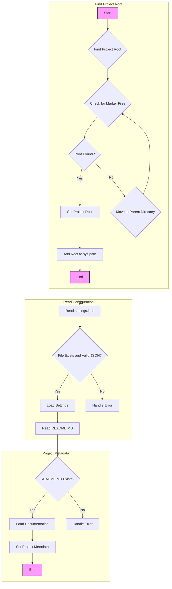
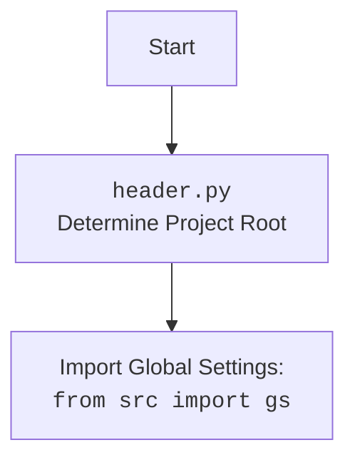

# Анализ кода `hypotez/src/suppliers/ksp/header.py`

## Алгоритм

1.  **`set_project_root(marker_files)`**:
    *   Начинает поиск корневого каталога проекта от текущего файла (`__file__`).
    *   Итерируется по родительским каталогам вверх по дереву директорий.
    *   Проверяет наличие одного из файлов-маркеров (`marker_files`) в каждом каталоге.
    *   Если маркер найден, устанавливает текущий родительский каталог как корневой.
    *   Добавляет корневой каталог в `sys.path`, если его там нет.
    *   Возвращает путь к корневому каталогу.
    ```python
    # Пример:
    root_path = set_project_root(marker_files=('__root__', '.git'))
    print(f"Root path: {root_path}")
    ```

2.  **Определение `__root__`**:
    *   Вызывает `set_project_root()` для определения корневого каталога проекта.
    *   Сохраняет результат в переменной `__root__`.
    ```python
    # Пример:
    __root__ = set_project_root()
    print(f"Project root: {__root__}")
    ```

3.  **Чтение `settings.json`**:
    *   Пытается открыть и прочитать файл `settings.json` из поддиректории `src` корневого каталога.
    *   Если файл найден и успешно прочитан, его содержимое сохраняется в переменной `settings`.
    *   Если файл не найден или не является валидным JSON, переходит к обработке исключения.
    ```python
    # Пример:
    try:
        with open(gs.path.root / 'src' / 'settings.json', 'r') as settings_file:
            settings = json.load(settings_file)
        print(f"Settings: {settings}")
    except (FileNotFoundError, json.JSONDecodeError) as e:
        print(f"Error reading settings: {e}")
    ```

4.  **Чтение `README.MD`**:
    *   Пытается открыть и прочитать файл `README.MD` из поддиректории `src` корневого каталога.
    *   Если файл найден и успешно прочитан, его содержимое сохраняется в переменной `doc_str`.
    *   Если файл не найден, переходит к обработке исключения.
    ```python
    # Пример:
    try:
        with open(gs.path.root / 'src' / 'README.MD', 'r') as readme_file:
            doc_str = readme_file.read()
        print(f"Readme content: {doc_str[:100]}...")
    except (FileNotFoundError) as e:
        print(f"Error reading readme: {e}")
    ```

5.  **Определение метаданных проекта**:
    *   Использует данные из `settings` (если они доступны) для определения метаданных проекта, таких как имя, версия, авторские права и т.д.
    *   Если `settings` отсутствует, устанавливает значения по умолчанию.
    ```python
    # Пример:
    project_name = settings.get("project_name", 'hypotez') if settings else 'hypotez'
    print(f"Project name: {project_name}")
    ```

## Mermaid



**Объяснение зависимостей (импортов) в `mermaid`**:

*   `packaging.version.Version`: Используется для работы с версиями пакетов.
*   `pathlib.Path`: Предоставляет способ работы с путями к файлам и директориям.
*   `sys`: Предоставляет доступ к некоторым переменным и функциям, взаимодействующим с интерпретатором Python.
*   `json`: Используется для работы с JSON-данными, например, для чтения файла `settings.json`.
*   `src`: `from src import gs` Импортирует глобальные настройки проекта.



## Объяснение

### Импорты

*   `sys`: Этот модуль предоставляет доступ к некоторым переменным и функциям, взаимодействующим с интерпретатором Python. В данном коде он используется для добавления корневой директории проекта в `sys.path`, что позволяет импортировать модули из этой директории.
*   `json`: Используется для работы с JSON-данными, например, для чтения файла `settings.json`.
*   `packaging.version.Version`: Этот модуль из библиотеки `packaging` предназначен для работы с версиями пакетов. Хотя он импортирован, в данном коде он не используется. Возможно, он предназначен для использования в других частях модуля или был добавлен по ошибке.
*   `pathlib.Path`: Предоставляет способ работы с путями к файлам и директориям в объектно-ориентированном стиле. Используется для определения и манипулирования путями к файлам проекта.
*   `from src import gs`: Импортирует глобальные настройки проекта, которые, вероятно, содержат пути к различным директориям и файлам, используемым в проекте.

### Функции

*   **`set_project_root(marker_files: tuple[str, ...]=('__root__', '.git')) -> Path`**:
    *   **Аргументы**:
        *   `marker_files` (tuple): Список файлов или директорий, наличие которых в каталоге указывает на то, что это корневой каталог проекта. По умолчанию `('__root__', '.git')`.
    *   **Возвращаемое значение**:
        *   `Path`: Путь к корневому каталогу проекта.
    *   **Назначение**:
        *   Функция определяет корневой каталог проекта, начиная с текущего файла и двигаясь вверх по дереву директорий. Она останавливается, когда находит каталог, содержащий один из файлов-маркеров.
        *   После определения корневого каталога, функция добавляет его в `sys.path`, если его там еще нет. Это позволяет импортировать модули из корневого каталога проекта.
    *   **Пример**:
        ```python
        root_path = set_project_root(marker_files=('__root__', '.git'))
        print(root_path)
        ```

### Переменные

*   `__root__: Path`:  Путь к корневому каталогу проекта. Определяется с помощью функции `set_project_root()`.
*   `settings: dict`: Словарь, содержащий настройки проекта, загруженные из файла `settings.json`. Если файл не найден или не удалось его прочитать, переменная остается `None`.
*   `doc_str: str`: Строка, содержащая содержимое файла `README.MD`. Если файл не найден или не удалось его прочитать, переменная остается `None`.
*   `__project_name__: str`: Имя проекта, извлеченное из `settings` или установленное в `'hypotez'` по умолчанию.
*   `__version__: str`: Версия проекта, извлеченная из `settings` или установленная в `''` по умолчанию.
*   `__doc__: str`: Содержимое файла `README.MD`, используемое в качестве документации проекта.
*   `__details__: str`: Пустая строка.
*   `__author__: str`: Имя автора проекта, извлеченное из `settings` или установленное в `''` по умолчанию.
*   `__copyright__: str`: Информация об авторских правах, извлеченная из `settings` или установленная в `''` по умолчанию.
*   `__cofee__: str`: Строка, содержащая призыв угостить разработчика кофе, извлеченная из `settings` или установленная в значение по умолчанию.

### Потенциальные ошибки и области для улучшения

1.  **Обработка исключений**:
    *   Обработка исключений при чтении файлов `settings.json` и `README.MD` использует `...` вместо явной обработки. Рекомендуется добавить логирование ошибок с использованием `logger.error` и предоставить более информативные сообщения об ошибках.

2.  **Использование `packaging.version`**:
    *   Модуль `packaging.version` импортирован, но не используется. Если он не нужен, его следует удалить.

3.  **Кофе**:
    *   Название переменной `__cofee__` написано с ошибкой.

4.  **Улучшение читаемости**:
    *   Можно улучшить читаемость кода, добавив больше пробелов и разделив логические блоки кода пустыми строками.

### Взаимосвязи с другими частями проекта

*   Этот модуль (`header.py`) устанавливает корневой каталог проекта и загружает настройки из `settings.json`, что позволяет другим модулям проекта получать доступ к этим настройкам.
*   Модуль импортирует `gs` из `src`, что указывает на использование глобальных настроек проекта.
*   Метаданные проекта (`__project_name__`, `__version__` и т.д.) могут использоваться в других частях проекта, например, для отображения информации о проекте в пользовательском интерфейсе или для логирования.