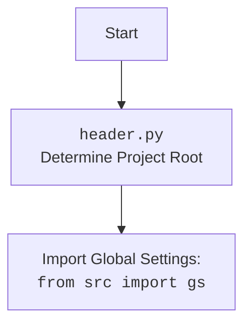

## <алгоритм>

1.  **`set_project_root(marker_files)`**:
    *   **Начало**: Функция принимает кортеж `marker_files` (по умолчанию `('__root__', '.git')`), используемый для определения корня проекта.
        *   *Пример*: `marker_files = ('__root__', '.git')`
    *   **Инициализация**: Определяется путь к директории текущего файла (`__file__`) и сохраняется в `current_path`, затем эта же директория присваивается переменной `__root__`.
        *   *Пример*: Если файл `header.py` находится в `/path/to/project/src/suppliers/ksp`, то `current_path` = `/path/to/project/src/suppliers/ksp`, и `__root__` = `/path/to/project/src/suppliers/ksp`.
    *   **Поиск корня проекта**:
        *   Для каждой директории в `current_path` и её родительских директориях:
            *   Проверяется наличие любого файла/директории из `marker_files` в текущей директории.
            *   Если хотя бы один маркер найден, то текущая директория становится корнем проекта (`__root__`). Поиск прекращается.
            *    *Пример*: Если в `/path/to/project` есть файл `.git`, то `__root__` станет `/path/to/project`.
    *   **Добавление пути к корню проекта в `sys.path`**:
        *   Если `__root__` ещё нет в `sys.path`, то он добавляется в начало списка путей.
        *   *Пример*: Добавление `/path/to/project` в `sys.path` чтобы можно было делать `from src import gs`.
    *   **Возврат**: Возвращает путь к корню проекта `__root__`.
        *   *Пример*: Возвращает `/path/to/project`.

2.  **`__root__ = set_project_root()`**:
    *   Вызывается функция `set_project_root()`, которая определяет корень проекта.
    *   Результат сохраняется в глобальную переменную `__root__`.

3.  **`from src import gs`**:
    *   Импортируется модуль `gs` из пакета `src`, который предполагается, что находится в корне проекта.

4.  **Загрузка `settings.json`**:
    *   Создаётся переменная `settings` для хранения настроек проекта.
    *   Пытается открыть и загрузить `settings.json` из директории `src` относительно корня проекта.
    *   Если файл не найден или если при загрузке `json` возникла ошибка, то происходит перехват исключений `FileNotFoundError` и `json.JSONDecodeError`, и ничего не выполняется (пропуск).
        *   *Пример*: Если `__root__` = `/path/to/project`, то файл читается из `/path/to/project/src/settings.json`.

5.  **Загрузка `README.MD`**:
    *   Создаётся переменная `doc_str` для хранения содержимого `README.MD` файла.
    *   Пытается открыть и прочитать файл `README.MD` из директории `src` относительно корня проекта.
    *   Если файл не найден или при чтении возникла ошибка, то происходит перехват исключений `FileNotFoundError` и `json.JSONDecodeError`, и ничего не выполняется (пропуск).
        *   *Пример*: Если `__root__` = `/path/to/project`, то файл читается из `/path/to/project/src/README.MD`.

6.  **Инициализация глобальных переменных**:
    *   Глобальные переменные `__project_name__`, `__version__`, `__doc__`, `__details__`, `__author__`, `__copyright__` и `__cofee__` инициализируются, используя значения из `settings`, если `settings` был успешно загружен, иначе устанавливаются значения по умолчанию.
    *    *Пример*:
       * Если `settings = {"project_name": "my_project", "version": "1.0", "author": "John Doe"}` и doc_str = 'test', то `__project_name__` = "my_project", `__version__` = "1.0",  `__doc__` = 'test', `__author__` = "John Doe".
       * Если `settings` пустой то  `__project_name__` = "hypotez", `__version__` = "", `__doc__` = "", `__author__` = "".

## <mermaid>

```mermaid
flowchart TD
    Start[Start] --> SetProjectRoot[set_project_root()];
    SetProjectRoot --> FindRoot[Find Project Root Directory <br> using marker files: "__root__", ".git"]
    FindRoot --> CheckRootInSysPath[Check if project root in sys.path]
    CheckRootInSysPath -- No --> AddRootToSysPath[Add Project Root to sys.path]
    CheckRootInSysPath -- Yes --> SetRootVariable[Set __root__ variable]
    AddRootToSysPath --> SetRootVariable
    SetRootVariable --> ImportGS[import src.gs]
    ImportGS --> LoadSettings[Load settings from settings.json]
    LoadSettings -- Success --> LoadReadme[Load doc string from README.MD]
     LoadSettings -- Failure --> LoadReadme
    LoadReadme  -- Success --> InitializeGlobalVars[Initialize Global Variables <br> with settings or defaults]
     LoadReadme  -- Failure --> InitializeGlobalVars
    InitializeGlobalVars --> End[End]
```

**Разбор зависимостей `mermaid`:**

*   **`flowchart TD`**: Объявляет тип диаграммы как блок-схему с направлением сверху вниз (`TD`).
*   **`Start[Start]`**: Начальная точка блок-схемы.
*   **`SetProjectRoot[set_project_root()]`**: Обозначает вызов функции `set_project_root`.
*    **`FindRoot[Find Project Root Directory <br> using marker files: "__root__", ".git"]`**: Блок с описанием процесса поиска корня проекта.
*   **`CheckRootInSysPath[Check if project root in sys.path]`**: Проверка наличия корня проекта в путях `sys.path`.
*   **`AddRootToSysPath[Add Project Root to sys.path]`**: Блок, добавляющий корень проекта в `sys.path`.
*   **`SetRootVariable[Set __root__ variable]`**: Блок, устанавливающий переменную `__root__`.
*   **`ImportGS[import src.gs]`**: Обозначает импорт модуля `gs` из пакета `src`.
*   **`LoadSettings[Load settings from settings.json]`**: Обозначает попытку загрузки файла настроек `settings.json`.
*   **`LoadReadme[Load doc string from README.MD]`**: Обозначает попытку загрузки документации из файла `README.MD`.
*    **`InitializeGlobalVars[Initialize Global Variables <br> with settings or defaults]`**: Инициализация глобальных переменных, используя настройки или значения по умолчанию.
*   **`End[End]`**: Конечная точка блок-схемы.
*   **`-->`**: Обозначает поток выполнения между блоками.
*   **`-- Yes -->`, `-- No -->`, `-- Success -->`, `-- Failure -->`**:  Условные переходы.



**Разбор зависимостей  `header.py`:**
*   **`flowchart TD`**: Объявляет тип диаграммы как блок-схему с направлением сверху вниз (`TD`).
*   **`Start[Start]`**: Начальная точка блок-схемы.
*   **`Header[<code>header.py</code><br> Determine Project Root]`**:  Блок с описанием модуля `header.py`.
*    **`import[Import Global Settings: <br><code>from src import gs</code>]`**: Блок с описанием импорта `gs` из пакета `src`.
*   **`-->`**: Обозначает поток выполнения между блоками.

## <объяснение>

### Импорты

*   `sys`: Используется для работы с системными параметрами, в частности, для добавления пути к корню проекта в `sys.path`, чтобы модули из этого проекта могли импортироваться.
*   `json`: Используется для загрузки данных настроек из файла `settings.json`, которые хранятся в формате JSON.
*   `packaging.version.Version`: Импортируется, но не используется в предоставленном коде. Возможно, планируется использование для обработки версий проекта в будущем.
*   `pathlib.Path`: Используется для работы с путями файлов и директорий, упрощая операции поиска и проверки файлов в файловой системе.

### Функция `set_project_root`

*   **Аргументы**: `marker_files` - кортеж строк, который содержит имена файлов или папок, по наличию которых определяется корень проекта.
*   **Возвращает**: `pathlib.Path` - путь к корню проекта, который удалось определить, или путь к директории, где находится сам скрипт, если корень не был найден.
*   **Назначение**: Функция определяет корень проекта, анализируя файловую структуру в поисках маркерных файлов или директорий. Это позволяет скрипту правильно определять пути к файлам относительно корня проекта, независимо от того, где этот скрипт вызывается.
*   **Пример**: Если файл `header.py` находится в `/path/to/project/src/suppliers/ksp`, и в директории `/path/to/project` существует файл `.git`, то функция вернет `/path/to/project`.

### Глобальные переменные

*   `__root__` (`Path`):  Хранит абсолютный путь к корневой директории проекта, определенный функцией `set_project_root()`.
*   `settings` (`dict` или `None`): Словарь, содержащий настройки проекта, загруженные из файла `settings.json`. Если файл не найден или поврежден, значение остается `None`.
*   `doc_str` (`str` или `None`): Строка, содержащая текст из файла `README.MD`. Если файл не найден или поврежден, значение остается `None`.
*   `__project_name__` (`str`): Название проекта. Загружается из `settings` или устанавливается значение по умолчанию 'hypotez'.
*    `__version__` (`str`): Версия проекта. Загружается из `settings` или устанавливается значение по умолчанию ''.
*   `__doc__` (`str`): Строка документации, загруженная из файла README.MD.
*   `__details__` (`str`):  Строка с деталями проекта. В коде всегда присваивается пустая строка `''`.
*   `__author__` (`str`): Автор проекта. Загружается из `settings` или устанавливается значение по умолчанию ''.
*   `__copyright__` (`str`): Информация о копирайте. Загружается из `settings` или устанавливается значение по умолчанию ''.
*   `__cofee__` (`str`): Сообщение с предложением угостить разработчика кофе. Загружается из `settings` или устанавливается значение по умолчанию.

### Потенциальные ошибки и улучшения

1.  **Отсутствие обработки ошибок при загрузке `settings.json` и `README.MD`:**
    *   Сейчас ошибки `FileNotFoundError` и `json.JSONDecodeError` игнорируются. Можно добавить логирование ошибок или использовать значения по умолчанию.
2.  **`packaging.version` импорт не используется:**
    *   Импорт не используется. Если нет планов на его использование, то импорт следует убрать.
3. **`__details__` всегда пустая:**
   *  Переменной `__details__` всегда присваивается пустая строка, можно убрать её или добавить функциональность.
4.  **Невозможность установить корень проекта из окружения:**
     * Не предусмотрен механизм определения корневой директории проекта, путем использования переменной окружения.

### Взаимосвязи с другими частями проекта

*   Этот модуль является частью пакета `src.suppliers.ksp`. Он предназначен для определения корня проекта и загрузки основных настроек, используемых в других модулях.
*   Импорт `from src import gs` показывает, что этот модуль зависит от модуля `gs`, который, вероятно, содержит общие настройки проекта.
*   Файл `settings.json` используется для настройки переменных, которые будут использоваться в проекте. Таким образом, данный модуль зависит от структуры и содержимого `settings.json`.
*   Файл `README.MD` используется для определения документации проекта, что также указывает на зависимость от этого файла.

Таким образом, данный модуль является ключевым для настройки и инициализации проекта.