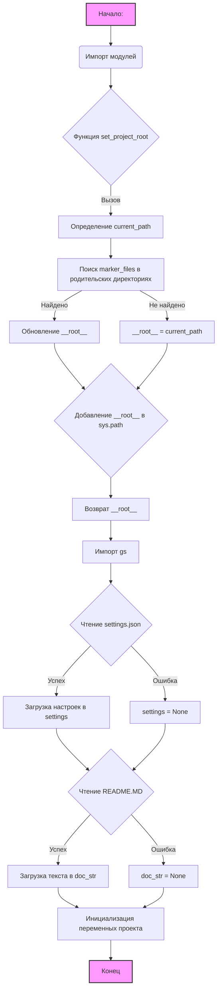

## <алгоритм>
1. **Начало:** Задана переменная ``.
2. **Импорт модулей:**
   - Импортируются модули `sys`, `json`, `Version` из `packaging.version` и `Path` из `pathlib`.
3. **Функция `set_project_root`:**
   - **Вход:** Принимает кортеж `marker_files` (по умолчанию `('pyproject.toml', 'requirements.txt', '.git')`).
   - **Начальная инициализация:**
     -  `current_path` устанавливается как абсолютный путь к директории, содержащей текущий файл.
     -  `__root__` устанавливается как `current_path`.
   - **Поиск родительских директорий:**
     - Цикл перебирает текущую директорию и все её родительские директории.
     - Для каждой родительской директории проверяется, существует ли в ней какой-либо из `marker_files`.
     - Если такой файл найден, `__root__` обновляется до этой директории, и цикл завершается.
   - **Добавление в `sys.path`:**
     - Если `__root__` отсутствует в списке путей поиска модулей (`sys.path`), то он добавляется в начало списка.
   - **Возврат:** Возвращает `__root__`.
4. **Вызов `set_project_root`:**
    - Вызывается функция `set_project_root()` для определения корневой директории проекта, результат сохраняется в `__root__`.
5. **Импорт `gs`:**
   - Выполняется импорт модуля `gs` из пакета `src`.
6. **Чтение `settings.json`:**
   - **Попытка открытия файла:** 
     - Пытается открыть файл `settings.json` (предполагается, что файл находится по пути `gs.path.root / 'src' / 'settings.json'`) в режиме чтения.
     - Если файл успешно открыт, его содержимое загружается как JSON и сохраняется в переменную `settings` (словарь).
   - **Обработка ошибок:**
     - Если возникает ошибка `FileNotFoundError` (файл не найден) или `json.JSONDecodeError` (ошибка декодирования JSON), блок `try` игнорируется, и `settings` остается `None`.
7. **Чтение `README.MD`:**
    - **Попытка открытия файла:**
      - Пытается открыть файл `README.MD` (предполагается, что файл находится по пути `gs.path.root / 'src' / 'README.MD'`) в режиме чтения.
      - Если файл успешно открыт, его содержимое читается и сохраняется в переменную `doc_str` (строка).
    - **Обработка ошибок:**
       - Если возникает ошибка `FileNotFoundError` или `json.JSONDecodeError`, блок `try` игнорируется, и `doc_str` остается `None`.
8. **Инициализация переменных:**
   - `__project_name__` устанавливается как значение из словаря `settings` по ключу "project_name", если `settings` не равен `None`, в противном случае устанавливается значение по умолчанию `'hypotez'`.
   - `__version__` устанавливается как значение из словаря `settings` по ключу "version", если `settings` не равен `None`, в противном случае устанавливается пустая строка.
   - `__doc__` устанавливается как значение `doc_str`, если `doc_str` не равен `None`, в противном случае устанавливается пустая строка.
   - `__details__` устанавливается как пустая строка.
   - `__author__` устанавливается как значение из словаря `settings` по ключу "author", если `settings` не равен `None`, в противном случае устанавливается пустая строка.
   - `__copyright__` устанавливается как значение из словаря `settings` по ключу "copyrihgnt", если `settings` не равен `None`, в противном случае устанавливается пустая строка.
   - `__cofee__` устанавливается как значение из словаря `settings` по ключу "cofee", если `settings` не равен `None`, в противном случае устанавливается значение по умолчанию "Treat the developer to a cup of coffee for boosting enthusiasm in development: https://boosty.to/hypo69".
9. **Конец**

## <mermaid>

**Описание диаграммы `mermaid`:**

-   **Начало процесса (A):**  Процесс начинается с установки ``.
-   **Импорт модулей (B):** Далее происходит импорт необходимых модулей (`sys`, `json`, `Version`, `Path`).
-   **Функция `set_project_root` (C):** Затем вызывается функция `set_project_root` для определения корневой директории проекта.
-   **Определение `current_path` (D):**  Внутри функции `set_project_root` определяется путь к директории текущего файла.
-   **Поиск `marker_files` (E):** Происходит поиск родительских директорий, содержащих маркерные файлы (`pyproject.toml`, `requirements.txt`, `.git`).
-   **Обновление `__root__` (F):** Если маркерный файл найден, то `__root__` обновляется.
-   **`__root__ = current_path` (G):** Если маркерный файл не найден, `__root__` остается равным `current_path`.
-   **Добавление `__root__` в `sys.path` (H):** `__root__` добавляется в пути поиска модулей (`sys.path`), если его там нет.
-   **Возврат `__root__` (I):** Функция возвращает значение `__root__`.
-   **Импорт `gs` (J):** Импортируется модуль `gs` из `src`.
-  **Чтение `settings.json` (K):** Происходит попытка чтения файла `settings.json`.
    - **Успех (L):** Если чтение удачно, настройки загружаются в переменную `settings`.
    - **Ошибка (M):** В случае ошибки, `settings` устанавливается в `None`.
-  **Чтение `README.MD` (N):** Происходит попытка чтения файла `README.MD`.
    - **Успех (O):** Если чтение удачно, текст загружается в переменную `doc_str`.
    - **Ошибка (P):** В случае ошибки, `doc_str` устанавливается в `None`.
-   **Инициализация переменных проекта (Q):**  Инициализируются переменные проекта (`__project_name__`, `__version__`, `__doc__`, `__details__`, `__author__`, `__copyright__`, `__cofee__`).
-   **Конец (R):** Процесс завершается.

## <объяснение>

**Импорты:**
- `sys`: Предоставляет доступ к некоторым переменным и функциям, взаимодействующим с интерпретатором Python. Используется для добавления корневой директории проекта в список путей поиска модулей (`sys.path`).
- `json`: Используется для работы с JSON (кодирования и декодирования). В этом файле используется для загрузки данных из файла `settings.json`.
- `packaging.version.Version`: Из модуля `packaging.version` импортируется класс `Version`. Не используется в этом коде.
- `pathlib.Path`: Предоставляет объектно-ориентированный способ работы с путями к файлам и директориям. В данном случае используется для манипуляции путями к файлам и для поиска корневой директории.
- `src.gs`: Импортируется пользовательский модуль `gs`, который предположительно содержит информацию о путях к директориям проекта.

**Переменные:**
-   `MODE`: Глобальная константа,  используемая  для определения текущего режима работы (в данном случае `'dev'`).
-   `__root__`:  Переменная типа `Path`, хранящая путь к корневой директории проекта.
- `settings`: Словарь, содержащий настройки проекта, загруженные из файла `settings.json`. Если файл не найден или содержит ошибки, будет равен `None`.
-   `doc_str`: Строка, содержащая содержимое файла `README.MD`. Если файл не найден или содержит ошибки, будет равен `None`.
-   `__project_name__`: Строка, представляющая имя проекта, извлекается из `settings` или устанавливается значением по умолчанию.
-   `__version__`: Строка, представляющая версию проекта, извлекается из `settings` или устанавливается пустой строкой.
-   `__doc__`: Строка, содержащая документацию к проекту, копируется из `doc_str` или устанавливается пустой строкой.
-   `__details__`: Строка, предназначенная для хранения детальной информации о проекте, но остается пустой.
-   `__author__`: Строка, представляющая автора проекта, извлекается из `settings` или устанавливается пустой строкой.
-  `__copyright__`: Строка, представляющая копирайт проекта, извлекается из `settings` или устанавливается пустой строкой.
-   `__cofee__`: Строка, содержащая информацию для поддержки разработчика через донат, извлекается из `settings` или устанавливается значением по умолчанию.

**Функции:**

-   **`set_project_root(marker_files)`**:
    -   **Аргументы**: `marker_files` - кортеж строк, представляющих имена файлов или директорий, которые могут использоваться для определения корня проекта. По умолчанию `('pyproject.toml', 'requirements.txt', '.git')`.
    -   **Возвращает**: Объект `Path`, представляющий абсолютный путь к корню проекта. Если маркерные файлы не найдены, возвращает путь к директории, где расположен текущий файл.
    -   **Назначение**: Функция определяет корень проекта, проходя по родительским директориям и проверяя наличие в них файлов или директорий, указанных в аргументе `marker_files`.

**Классы:**
- Отсутствуют

**Объяснение кода:**

Код предназначен для инициализации основных параметров проекта, включая поиск корневой директории, загрузку настроек из файла `settings.json`, чтение документации из `README.MD` и инициализации ряда глобальных переменных для хранения информации о проекте, таких как имя, версия, документация и т.д.

1.  **Поиск корневой директории проекта**: Функция `set_project_root` используется для автоматического определения корневой директории проекта на основе наличия в директории файлов-маркеров, таких как `pyproject.toml`, `requirements.txt`, или каталога `.git`. Это позволяет запускать скрипт из любой поддиректории проекта, не беспокоясь о необходимости задавать пути вручную.
2.  **Загрузка настроек**: Код пытается прочитать `settings.json`,  чтобы получить параметры проекта, такие как имя проекта, версия, автор, авторские права и т. д. Если файл отсутствует или не удаётся декодировать JSON, то переменной `settings` присваивается значение `None`, и используются значения по умолчанию.
3.  **Чтение документации**: Код пытается прочитать `README.MD` для получения документации по проекту. Если файл отсутствует, переменной `doc_str` присваивается значение `None`, и устанавливается пустая строка.
4.  **Инициализация переменных**:  Инициализируются  глобальные переменные (`__project_name__`, `__version__`, `__doc__`, `__details__`, `__author__`, `__copyright__`, `__cofee__`)  либо значениями из `settings.json`, либо значениями по умолчанию.
5.  **Импорт модуля `gs`**: Импортируется модуль, который предположительно предоставляет пути к другим частям проекта.

**Цепочка взаимосвязей с другими частями проекта:**

-   Модуль `src.gs` используется для определения пути к файлам `settings.json` и `README.MD`.
-   Данный модуль `header.py` устанавливает глобальные переменные, которые могут использоваться в других частях проекта для получения информации о проекте.

**Потенциальные ошибки и области для улучшения:**

-   **Обработка ошибок:** В блоках `try...except` обрабатываются только `FileNotFoundError` и `json.JSONDecodeError`. Возможно, следует рассмотреть обработку других исключений.
-   **Использование `gs.path.root`:** Зависимость от модуля `gs` для определения пути к файлам. Если `gs` не настроен или не содержит ожидаемые значения, то скрипт не сможет получить пути к файлам настроек и документации.
-  **`__details__`:**  Переменная `__details__` инициализируется пустой строкой и не используется в данном коде. Она может быть добавлена как функциональность в дальнейшем.
-  **Использование `__cofee__`:** Название переменной `__cofee__` может быть опечаткой (правильно `__coffee__`).

**Улучшения:**
- Добавить проверку корректности формата JSON в файле настроек.
- Реализовать проверку обязательных параметров настроек.
- Предусмотреть обработку других типов исключений при загрузке файлов.
- Реализовать логирование для отслеживания ошибок.

Этот код обеспечивает базовую настройку проекта, загрузку параметров и предоставляет общую информацию для использования в других частях проекта. Его можно улучшить, добавив более надежную обработку ошибок и проверок.