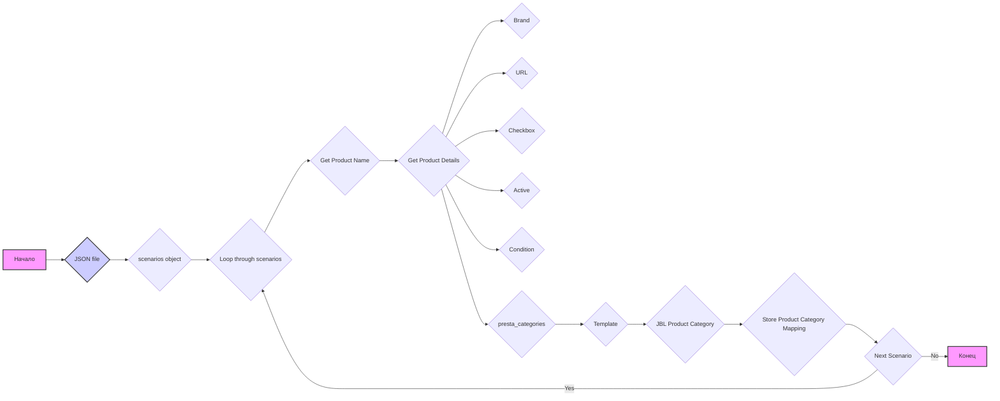
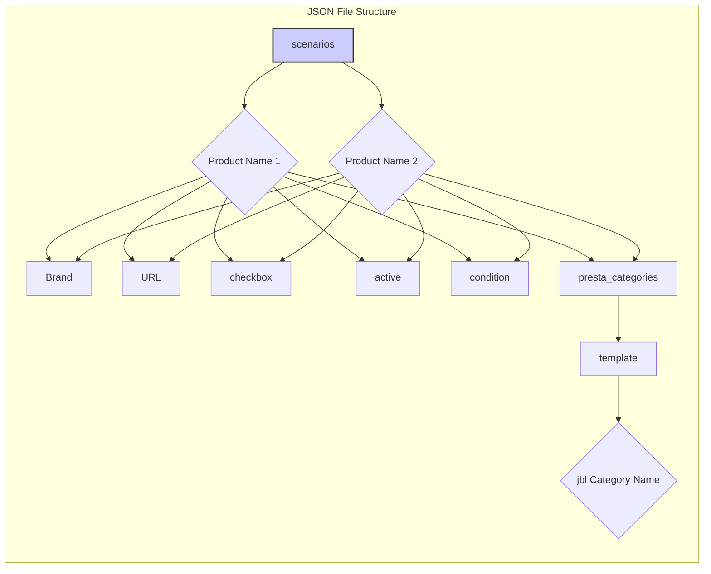

## АНАЛИЗ JSON ФАЙЛА: `hypotez/src/suppliers/ksp/scenarios/ksp_categories_headphones_jbl.json`

### 1. <алгоритм>
**Описание:**

JSON-файл содержит конфигурацию сценариев для парсинга наушников бренда JBL с сайта KSP. Каждый сценарий представляет собой отдельный продукт. Данные структурированы как словарь (`scenarios`), где ключи - названия моделей наушников, а значения - словари с информацией о продукте.

**Пошаговая блок-схема:**

**Примеры:**

1. **Начало:** Загрузка JSON-файла
2. **scenarios object**: Чтение корневого словаря `scenarios`
3. **Loop through scenarios:** Итерация по ключам (названиям моделей наушников).
   * Пример: `JBL Tune 225TWS True Wireless Earbuds` - первый ключ
4. **Get Product Name:** Получение имени продукта (`JBL Tune 225TWS True Wireless Earbuds`).
5. **Get Product Details:** Получение словаря с данными продукта.
6. **Brand:** Извлечение бренда (`JBL`).
7. **URL:** Извлечение URL страницы продукта (`https://ksp.co.il/web/cat/242..1250..3127..36135`).
8. **Checkbox:** Извлечение значения `checkbox` (`false`).
9. **Active:** Извлечение значения `active` (`true`).
10. **Condition:** Извлечение значения `condition` (`new`).
11. **presta_categories:** Получение словаря с категориями.
12.  **Template:** Получение словаря с шаблоном категорий
13. **JBL Product Category**: Получение категории для JBL(`JBL Tune 225TWS True Wireless Earbuds`)
14. **Store Product Category Mapping**: Сохранение соответствия категории JBL с категорией магазина (PrestaShop)
15. **Next Scenario:** Переход к следующей модели.
16. **Конец:** Обработка всех сценариев.

### 2. <mermaid>

**Объяснение:**
- **`scenarios`**: Корневой объект JSON, содержащий все сценарии.
- **`Product Name 1`, `Product Name 2`**: Название конкретного продукта (ключ в словаре `scenarios`), который идентифицирует товар.
- **`Brand`**:  Бренд товара (например, "JBL").
- **`URL`**:  Ссылка на страницу товара на сайте KSP.
- **`checkbox`**: Флаг для ручного выбора товара (`true` или `false`).
- **`active`**: Флаг, указывающий, активен ли сценарий (`true` или `false`).
- **`condition`**: Условие товара (например, "new").
- **`presta_categories`**: Объект, содержащий информацию о категориях PrestaShop
- **`template`**: Объект, содержащий информацию о шаблонах категорий PrestaShop
- **`jbl Category Name`**:  Категория PrestaShop товара (например,"JBL Tune 225TWS True Wireless Earbuds" ).

### 3. <объяснение>
**Импорты:**
В данном коде нет импортов. Это файл конфигурации.

**Классы:**
В данном коде нет классов. Это JSON файл, представляющий собой структуру данных.

**Функции:**
В данном коде нет функций.

**Переменные:**
- `scenarios`:  Словарь, где ключи - это названия моделей наушников, а значения - словари с данными о каждой модели.
    - **Тип**: `dict`
    - **Использование**: Содержит всю конфигурацию для парсинга наушников JBL.
-  `JBL Tune 225TWS True Wireless Earbuds` (и другие аналогичные ключи) : Строка, являющаяся ключем  в словаре `scenarios` и  названием модели наушников.
    - **Тип**: `str`
    - **Использование**: Служит ключом для доступа к информации о конкретной модели наушников.
- `brand` : Строка, содержащая бренд наушников.
    - **Тип**: `str`
    - **Использование**: Идентификация производителя товара.
-  `url` : Строка, содержащая URL-адрес страницы товара на сайте KSP.
    - **Тип**: `str`
    - **Использование**: Адрес для парсинга данных о товаре.
- `checkbox` : Логическое значение, определяющее, выбран ли товар для ручной обработки.
    - **Тип**: `bool`
    - **Использование**: Флаг для указания ручного выбора.
- `active` : Логическое значение, определяющее, активен ли сценарий для парсинга.
    - **Тип**: `bool`
    - **Использование**:  Включает или отключает парсинг для конкретной модели.
- `condition` : Строка,  содержащая условие товара (например, "new").
    - **Тип**: `str`
    - **Использование**:  Состояние товара.
- `presta_categories` :  Словарь, содержащий категории для PrestaShop.
    - **Тип**: `dict`
    - **Использование**:  Соответствие категорий товара и магазина.
- `template` : Словарь, содержащий шаблон категорий для PrestaShop.
    - **Тип**: `dict`
    - **Использование**:  Шаблон соответствия категорий товара и магазина.
- `"jbl"` : Строка, являющаяся ключом в словаре `template` и  названием  категории товара.
    - **Тип**: `str`
    - **Использование**:  Название категории товара.
-  `"JBL Tune 225TWS True Wireless Earbuds"` (и другие аналогичные значения): Строка, являющаяся значением в словаре `template` и название  категории товара для PrestaShop.
    - **Тип**: `str`
    - **Использование**:  Название категории PrestaShop для конкретной модели.

**Потенциальные ошибки и области для улучшения:**

- **Дублирование данных:** Некоторые значения, как "new", и "JBL" повторяются в каждом объекте. Можно перенести их на более высокий уровень (например, в общие настройки) для избежания дублирования.
- **Жестко закодированные URL:** Если структура сайта KSP изменится, нужно будет обновлять все URL-адреса. Целесообразно рассмотреть возможность параметризации URL.
- **Отсутствие валидации:** Не выполняется валидация данных, что может привести к ошибкам при парсинге. Добавить проверку типов данных, наличие обязательных полей и т.д.
- **Обработка ошибок:**  Не предусмотрена обработка ошибок.  Например, если сайт KSP не доступен, парсер должен корректно обработать это.
- **Поддержка других брендов/категорий**: Текущая структура JSON-файла ориентирована только на наушники JBL. Необходимо предусмотреть поддержку других брендов и категорий в будущем.

**Взаимосвязи с другими частями проекта:**

Этот JSON-файл является частью системы парсинга. Его данные используются для:

1. **Определение страниц товаров:**  URL-адреса используются для загрузки HTML-страниц с сайта KSP.
2. **Идентификация товаров:** Названия моделей (`"JBL Tune 225TWS True Wireless Earbuds"`) используются для идентификации товаров и связи с базами данных.
3. **Настройка категорий:** Информация `presta_categories` используется для связи товаров с категориями PrestaShop.
4. **Управление парсингом:**  `active` и `checkbox`  определяют, какие товары должны быть обработаны.
5. **Условие товара**: Определяет состояние товара `new`.

Этот файл конфигурации управляет поведением парсера, позволяя ему выбирать и обрабатывать товары.