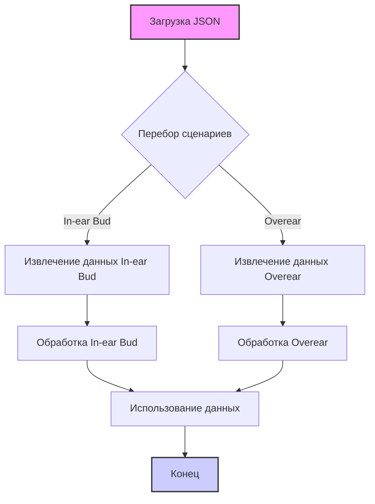

## Анализ кода `hypotez/src/suppliers/ksp/scenarios/ksp_categories_headphones_msi.json`

### 1. <алгоритм>

JSON-файл представляет собой конфигурационный файл, описывающий сценарии для сбора данных о наушниках от поставщика KSP для бренда MSI. Файл структурирован в виде объекта JSON, содержащего поле "scenarios", которое само является объектом, где ключи - это типы наушников, а значения - конфигурации для каждого типа.

**Пошаговая блок-схема:**

1.  **Начало**: Загрузка JSON-файла.
    *   Пример: `{"scenarios": {...}}`
2.  **Разбор объекта "scenarios"**: Обход ключей этого объекта.
    *   Пример ключей: `"In-ear Bud"`, `"Overear"`
3.  **Обработка сценария для каждого типа наушников**:
    *   Извлечение значений для каждого ключа.
        *   Пример ключа `"In-ear Bud"`:
            *   `brand` (строка): `"MSI"`
            *   `url` (строка): `"https://ksp.co.il/web/cat/242..47..1250"`
            *   `checkbox` (логическое значение): `false`
            *   `active` (логическое значение): `true`
            *    `condition`(строка): `"new"`
            *   `presta_categories` (объект):
                *   `template` (объект):
                    *   `msi` (строка): `"HEADPHONES BT In-ear Bud"`
        *   Пример ключа `"Overear"`:
            *   `brand` (строка): `"MSI"`
            *   `url` (строка): `"https://ksp.co.il/web/cat/242..1252..47"`
            *   `checkbox` (логическое значение): `false`
            *   `active` (логическое значение): `true`
            *   `condition`(строка): `"new"`
            *   `presta_categories` (объект):
                *   `template` (объект):
                    *   `msi` (строка): `"HEADPHONES Overear"`
4.  **Использование данных**: Данные, извлеченные для каждого типа, используются для настройки процессов сбора данных с веб-сайта KSP и классификации в PrestaShop.
5.  **Конец**: Завершение обработки.

### 2. <mermaid>

**Объяснение `mermaid`:**

Диаграмма `mermaid` представляет процесс разбора JSON-файла и обработки сценариев для разных типов наушников.

*   `A[Загрузка JSON]`: Начальный этап, представляющий загрузку JSON-файла с конфигурацией.
*   `B{Перебор сценариев}`: Решение о том, какие сценарии обрабатывать (In-ear Bud, Overear и т.д.).
*   `C[Извлечение данных In-ear Bud]`:  Извлечение конфигурационных данных для типа наушников "In-ear Bud".
*    `E[Извлечение данных Overear]`: Извлечение конфигурационных данных для типа наушников "Overear".
*   `D[Обработка In-ear Bud]`: Обработка данных для "In-ear Bud".
*   `F[Обработка Overear]`: Обработка данных для "Overear".
*   `G[Использование данных]`: Этап, где обработанные данные применяются для дальнейших действий.
*    `H[Конец]`: Завершение обработки.

Имена переменных в диаграмме имеют осмысленные имена, что соответствует требованиям.

### 3. <объяснение>

**Импорты:**

В данном JSON-файле отсутствуют импорты. Это файл конфигурации, а не программный код, поэтому импорты не требуются.

**Классы:**

Классов в данном файле нет, так как это JSON-файл, предназначенный для хранения данных, а не для реализации логики программы.

**Функции:**

Функции в данном файле также отсутствуют, поскольку это файл конфигурации, а не исполняемый код.

**Переменные:**

*   `scenarios` (объект): Содержит все сценарии для различных типов наушников. Ключи объекта — названия типов наушников (например, "In-ear Bud", "Overear").
    *   `In-ear Bud` (объект): Конфигурация для наушников типа "In-ear Bud".
        *   `brand` (строка): `"MSI"` - бренд производителя наушников.
        *   `url` (строка): `"https://ksp.co.il/web/cat/242..47..1250"` - URL-адрес страницы категории наушников на сайте KSP.
        *   `checkbox` (логическое значение): `false` - флаг, указывающий на необходимость использования чекбокса.
        *   `active` (логическое значение): `true` - флаг, указывающий на активность сценария.
        *   `condition` (строка): `"new"` - состояние товара.
        *   `presta_categories` (объект):
            *   `template` (объект):
                *   `msi` (строка): `"HEADPHONES BT In-ear Bud"` - шаблон категории в PrestaShop для наушников MSI типа "In-ear Bud".
    *   `Overear` (объект): Конфигурация для наушников типа "Overear".
        *   `brand` (строка): `"MSI"` - бренд производителя наушников.
        *   `url` (строка): `"https://ksp.co.il/web/cat/242..1252..47"` - URL-адрес страницы категории наушников на сайте KSP.
        *   `checkbox` (логическое значение): `false` - флаг, указывающий на необходимость использования чекбокса.
        *   `active` (логическое значение): `true` - флаг, указывающий на активность сценария.
          *   `condition` (строка): `"new"` - состояние товара.
        *   `presta_categories` (объект):
            *   `template` (объект):
                *   `msi` (строка): `"HEADPHONES Overear"` - шаблон категории в PrestaShop для наушников MSI типа "Overear".

**Цепочка взаимосвязей:**

Этот JSON-файл является частью системы для сбора и обработки данных о товарах. Он используется для настройки процесса сбора информации с веб-сайта KSP (веб-скрейпинга) и классификации товаров в PrestaShop.

*   **Веб-скрейпинг**: URL-адреса из этого файла используются для определения страниц, с которых нужно собирать данные о наушниках.
*   **Классификация товаров**: Значения в `presta_categories.template.msi` используются для определения категорий товаров в PrestaShop.
*   **Гибкость конфигурации**: Наличие такой конфигурации в JSON позволяет гибко настраивать процесс сбора данных и классификацию для разных типов товаров и брендов без изменения основного кода.

**Потенциальные ошибки и области для улучшения:**

*   **Отсутствие валидации**: JSON-файл не имеет встроенной валидации. Необходимо предусмотреть валидацию при чтении файла, чтобы предотвратить ошибки, связанные с неправильными типами данных или отсутствием необходимых полей.
*   **Жестко заданные значения**: Значения `brand`, `url` и `presta_categories` заданы непосредственно в файле. В будущем, возможно, потребуется расширить эту конфигурацию, чтобы добавить динамические параметры или дополнительные условия для сбора данных.
*   **Управление активацией**: Возможно, стоит добавить более гранулярное управление активацией. Например, возможность включать/отключать отдельные параметры сбора данных.
*   **Обработка ошибок**:  Необходимо предусмотреть обработку ошибок при сборе данных, например, если URL-адрес недоступен или структура веб-страницы изменилась.
*   **Универсализация**:  Можно подумать о создании более универсальной структуры JSON, позволяющей описывать сценарии не только для наушников, но и для других категорий товаров.