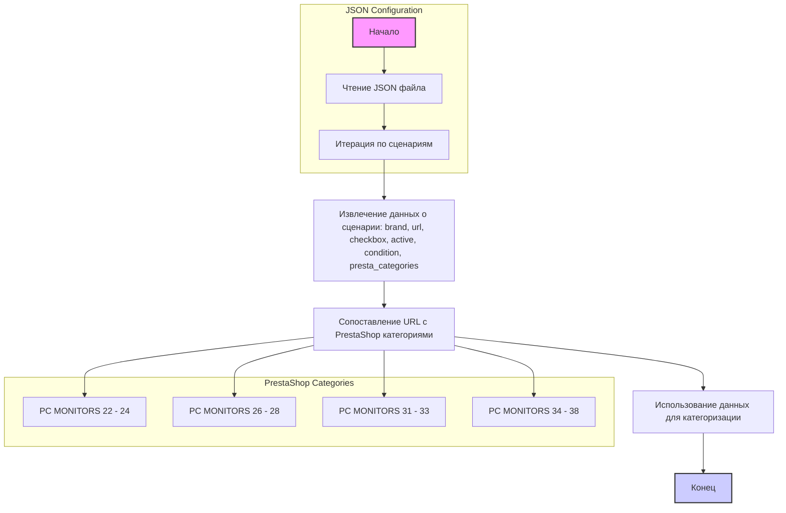

## <алгоритм>

**Описание алгоритма:**

Данный JSON-файл представляет собой конфигурацию для парсинга категорий мониторов Lenovo с сайта KSP. Алгоритм обработки этого файла заключается в следующем:

1.  **Чтение JSON:** Загрузка JSON-файла в память программы (например, с помощью `json.load()` в Python).
2.  **Итерация по сценариям:** Программа проходит по каждому сценарию, представленному в корневом ключе `"scenarios"`.
3.  **Извлечение данных:** Для каждого сценария извлекаются следующие данные:
    *   `brand` (строка): Бренд монитора (в данном случае всегда "Lenovo").
    *   `url` (строка): URL-адрес страницы категории на сайте KSP.
    *   `checkbox` (булево): Логический флаг, указывающий, нужно ли использовать чекбокс (здесь всегда `false`).
    *   `active` (булево): Флаг, указывающий, активен ли данный сценарий (здесь всегда `true`).
    *   `condition` (строка): Условие товара (здесь всегда "new").
    *   `presta_categories` (объект): Объект с ключом `template`, который содержит объект с ключом `lenovo` и соответствующей категорией PrestaShop.
4.  **Сопоставление категорий:** Используя полученные данные, программа устанавливает соответствие между URL-адресом на сайте KSP и категорией в PrestaShop. Например, URL `"https://ksp.co.il/web/cat/159..230..38350..1649"` соответствует категории `"PC MONITORS 22 - 24"` в PrestaShop.
5.  **Использование данных:** Данные могут быть использованы для автоматической категоризации товаров при парсинге сайта KSP.

**Примеры:**

*   **Вход:**

    ```json
    "Lenovo Monitor L Series 23,8": {
        "brand": "Lenovo",
        "url": "https://ksp.co.il/web/cat/159..230..38350..1649",
        "checkbox": false,
        "active": true,
        "condition":"new",
        "presta_categories": {
          "template": { "lenovo": "PC MONITORS 22 - 24" }
        }
      }
    ```
*   **Обработка:**
    *   `brand` = "Lenovo"
    *   `url` = "https://ksp.co.il/web/cat/159..230..38350..1649"
    *   `checkbox` = `false`
    *   `active` = `true`
    *    `condition` = "new"
    *   `presta_categories` = `{ "template": { "lenovo": "PC MONITORS 22 - 24" } }`

*   **Выход:** Соответствие URL "https://ksp.co.il/web/cat/159..230..38350..1649" категории PrestaShop "PC MONITORS 22 - 24" для бренда Lenovo.

**Поток данных:**
JSON-файл -> `Загрузка JSON` -> `Итерация по сценариям` -> `Извлечение данных` -> `Сопоставление категорий` -> `Использование данных`

## <mermaid>



**Описание диаграммы:**

Диаграмма `mermaid` показывает процесс обработки JSON-файла с конфигурациями для парсинга категорий мониторов Lenovo.

*   **JSON Configuration:** Подграф описывает процесс обработки файла:
    *   `Start` - начало процесса.
    *   `ReadJson` - чтение JSON файла.
    *   `IterateScenarios` - итерация по каждому сценарию.
*   **ExtractData:** Извлечение необходимых данных, таких как `brand`, `url`, `checkbox`, `active`, `condition` и `presta_categories` для текущего сценария.
*   **MatchCategories:** Сопоставление извлечённого URL с соответствующей категорией PrestaShop, основываясь на данных в `presta_categories`
*   **UseData:** Использование полученных данных для категоризации продуктов.
*   **PrestaShop Categories:** Подграф показывает различные категории PrestaShop, к которым будут сопоставляться товары.
*   **Связи:** Стрелки показывают поток данных и зависимость между блоками.

## <объяснение>

**Импорты:**

В данном коде нет импортов. Это JSON-файл, который используется как конфигурационный файл, а не как исполняемый код.

**Классы:**

В данном файле нет классов.

**Функции:**

В данном файле нет функций.

**Переменные:**

*   `scenarios` (объект): Корневой объект, содержащий все сценарии парсинга. Ключи этого объекта - названия сценариев, а значения - объекты, описывающие каждый сценарий.
*   `brand` (строка): Бренд монитора. Всегда "Lenovo".
*   `url` (строка): URL-адрес категории мониторов на сайте KSP.
*   `checkbox` (булево): Флаг, указывающий на использование чекбокса. Всегда `false`.
*   `active` (булево): Флаг, указывающий на активность сценария. Всегда `true`.
*    `condition` (строка): Условие товара (новый или б/у). Всегда "new".
*   `presta_categories` (объект): Объект, содержащий информацию о сопоставлении с категориями PrestaShop.
    *   `template` (объект): Объект, содержащий соответствия между брендами и категориями PrestaShop.
        *   `lenovo` (строка): Категория PrestaShop, соответствующая данному сценарию.

**Взаимосвязи с другими частями проекта:**

Этот JSON-файл, вероятно, используется в системе парсинга, которая:

1.  Считывает этот файл для получения конфигураций парсинга.
2.  Использует URL-адреса для сканирования страниц KSP.
3.  Сопоставляет товары с категориями PrestaShop, используя данные из `presta_categories`.
4.  Загружает полученные данные (названия, цены, описания, категории) в PrestaShop.

**Потенциальные ошибки или области для улучшения:**

1.  **Отсутствие проверок:** В данном файле отсутствуют проверки на валидность данных (например, проверка на корректность URL).
2.  **Жесткая привязка:** Категории PrestaShop жестко заданы в JSON. Возможно, имеет смысл вынести их в отдельный файл конфигурации.
3.  **Поддержка нескольких брендов:** Файл заточен только под бренд Lenovo, что не позволяет расширять парсинг на другие бренды.
4.  **Отсутствие гибкости:** Использование статических URL-ов усложняет обновление конфигурации в случае изменения структуры KSP.

**Дополнительные замечания:**

*   Файл является конфигурационным и предназначен для использования в других программах.
*   Конфигурация позволяет автоматизировать процесс категоризации товаров Lenovo на сайте KSP в PrestaShop.
*   Важно проверять соответствие категорий KSP и PrestaShop для правильной работы парсинга.