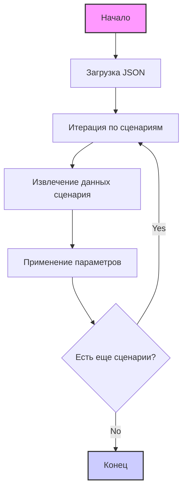

## АНАЛИЗ JSON КОДА

### 1. <алгоритм>

Представленный JSON-код описывает конфигурации сценариев для парсинга материнских плат MSI с сайта KSP. Каждый сценарий содержит информацию о конкретной модели материнской платы, включая URL страницы, параметры для фильтрации и настройки.

**Блок-схема:**

1.  **Начало**: JSON-файл загружается как структура данных (словарь).
    ```
    Пример:
    {
      "scenarios": {
        "MSI Intel-1200 H510": { ... },
        "MSI Intel-1200 B460": { ... },
        ...
      }
    }
    ```
2.  **Обход сценариев**: Итерируется по ключам в словаре `"scenarios"`. Каждый ключ представляет собой уникальный идентификатор сценария (например, `"MSI Intel-1200 H510"`).
    ```
    Пример (первая итерация):
    key = "MSI Intel-1200 H510"
    value = {
      "brand": "MSI",
      "url": "https://ksp.co.il/web/cat/47..3..52..23877",
      "checkbox": false,
      "active": true,
      "condition":"new",
      "presta_categories": {
        "template": { "msi": "INTEL 1200 H510" }
      },
      "price_rule": 1
    }
    ```
3.  **Извлечение данных**: Извлекаются значения параметров для каждого сценария.
    *   `brand`: Строка, представляющая бренд материнской платы ("MSI").
    *   `url`: Строка, URL для парсинга.
    *   `checkbox`: Логическое значение (false).
    *   `active`: Логическое значение (true).
    *   `condition`: Строка, состояние товара ("new").
    *    `presta_categories`: Словарь с  `template` для  преобразование категории.
    *   `price_rule`: Число, правило ценообразования (1).
4.  **Применение параметров**:  Параметры, полученные из JSON, используются для настройки процесса парсинга и определения категорий товаров.
    * `url` -  используется для перехода на страницу товара.
    * `brand` - идентифицирует бренд.
    * `presta_categories` -  используется для сопоставление категории.
5.  **Конец**: Цикл завершается, когда все сценарии обработаны.

### 2. <mermaid>



**Объяснение:**

*   `Start`: Начальная точка процесса.
*   `LoadJSON`: Загрузка данных из JSON файла.
*   `IterateScenarios`:  Цикл, проходящий по всем сценариям в JSON-файле.
*   `ExtractData`: Извлечение данных (бренд, URL, настройки и т.д.) из текущего сценария.
*  `ApplyParameters` :  Использование извлеченных данных для настройки процессов, таких как парсинг.
*   `CheckNextScenario`: Проверка, есть ли еще сценарии для обработки.
*   `End`: Конечная точка процесса.

### 3. <объяснение>

**Импорты:**

В представленном JSON-файле нет импортов. Он является файлом конфигурации, а не исполняемым кодом Python.

**Классы:**

В данном файле нет классов, поскольку это JSON. Он представляет собой структуру данных.

**Функции:**

В данном файле нет функций, поскольку это JSON. Он представляет собой структуру данных.

**Переменные:**

*   `scenarios`:  Словарь (объект JSON), где ключи — это имена сценариев (например, `"MSI Intel-1200 H510"`), а значения — это словари с настройками для каждого сценария.
    *   `brand`:  Строка, представляющая бренд материнской платы (например, `"MSI"`).
    *   `url`:  Строка, представляющая URL-адрес страницы товара.
    *   `checkbox`:  Логическое значение, управляющее состоянием чекбокса (всегда `false`).
    *   `active`: Логическое значение, определяющее, активен ли сценарий (всегда `true`).
    *    `condition`: Строка, состояние товара ("new").
    *   `presta_categories`: Словарь с ключом `template`, который содержит маппинг для категории `msi`.
    *   `price_rule`: Числовое значение, определяющее правило ценообразования.

**Объяснение**

Файл `ksp_categories_motherboards_msi.json` содержит настройки для парсинга материнских плат MSI с сайта KSP. Каждый сценарий представляет собой конфигурацию для конкретной модели материнской платы.
*  `scenarios` - содержит словарь, где ключ - это название модели материнской платы, а значение - это словарь с настройками.
*   `brand` задает бренд товара.
*   `url`  содержит ссылку на страницу с товаром, что позволяет парсеру получить необходимую информацию.
*   `checkbox`  управляет  состоянием чекбокса, но всегда имеет значение `false`.
*   `active` определяет, нужно ли обрабатывать конкретный сценарий.  Всегда имеет значение `true`.
*    `condition`  указывает состояние товара как `new`.
*    `presta_categories`  содержит словарь с ключом `template`, который мапит  внутренние категории `msi` на категории PrestaShop.
*   `price_rule` устанавливает правило для определения цены товара.

**Потенциальные ошибки и области для улучшения:**

*   **Избыточность `checkbox` и `active`**: Значения `checkbox` всегда `false`, а `active` всегда `true`. Можно пересмотреть их необходимость в таком виде, или сделать их более динамичными.
*   **Отсутствие динамической конфигурации**:  Все сценарии имеют одинаковое правило ценообразования (`price_rule`: 1). Возможно, в будущем потребуется более гибкое управление правилами ценообразования.
*   **Отсутствие обработки ошибок**:  В JSON нет никакой информации о том, как обрабатывать ошибки, если какие-либо значения отсутствуют или имеют неправильный тип.

**Взаимосвязи с другими частями проекта:**

Этот файл предназначен для использования в системе парсинга, вероятно, в `src/suppliers/ksp/`, и служит источником конфигурации для парсера материнских плат MSI.  Он связывается с модулем парсинга, передавая ему необходимую информацию для обработки страниц товаров.