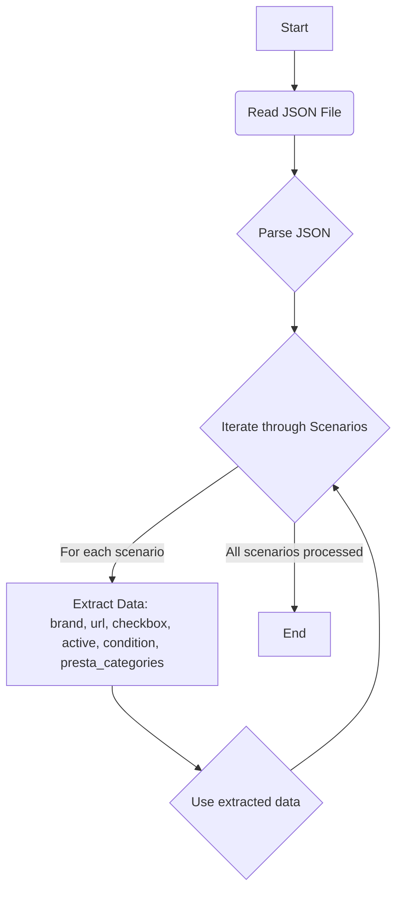

## АНАЛИЗ JSON ФАЙЛА

### <алгоритм>

1. **Начало**: Чтение JSON файла.
2. **Разбор JSON**: Парсинг содержимого JSON в структуру данных (словарь/объект).
   *   Пример: `{ "scenarios": { ... } }` превращается в Python словарь.
3. **Обход сценариев**: Итерация по ключам словаря `"scenarios"`.
   *   Пример: "Huawei MateBook 14", "Huawei Matebook D14"
4.  **Извлечение данных для каждого сценария**: Для каждого сценария извлекаются значения ключей:
     * "brand": Строка, представляющая бренд товара. Пример: `"HUAWEI"`
     *   "url": Строка, представляющая URL-адрес. Пример: `"https://ksp.co.il/web/cat/268..271..583..31024"`
     *   "checkbox": Логическое значение. Пример: `false`
     *   "active": Логическое значение. Пример: `true`
     *   "condition": Строка, представляющая состояние товара. Пример: `"new"`
     *   "presta_categories": Словарь, содержащий категории товара. Пример: `{"3405": "GOOGLE PIXEL PRO", ... }`
5. **Использование данных**: Извлечённые данные могут быть использованы для:
     *   Фильтрации товаров по бренду.
     *   Сбор данных о товарах с указанных URL-адресов.
     *   Отображения или изменения настроек, связанных с "checkbox" и "active".
     *   Определение состояния товара (новое или б/у).
     *   Сопоставления категорий PrestaShop с товарами.
6. **Конец**: Обработка всех сценариев завершена.

### <mermaid>

**Объяснение зависимостей:**

Диаграмма `mermaid` описывает процесс обработки JSON-файла:

1.  **Start**: Начало процесса.
2.  **Read JSON File**: Чтение JSON-файла с диска.
3.  **Parse JSON**: Парсинг содержимого файла в структуру данных (словарь/объект).
4.  **Iterate through Scenarios**: Итерация по ключам словаря "scenarios", которые представляют различные сценарии.
5.  **Extract Data**: Извлечение данных для каждого сценария (бренд, URL, флажок, активность, состояние, категории).
6.  **Use extracted data**: Использование данных в зависимости от сценария.
7.  **End**: Завершение процесса.

### <объяснение>

**Импорты:**

В предоставленном коде нет явных операторов импорта, так как это JSON-файл, а не код на Python. JSON используется для хранения данных, а не для их обработки. Если бы это был Python-файл, и он использовал бы JSON, то он мог бы использовать импорты `json` (например `import json`).

**Классы:**

В JSON-файле классы не используются. Это просто структура данных, которая описывает конфигурацию сценариев.

**Функции:**

В JSON-файле функции не используются. Он предоставляет данные, которые могут быть использованы функциями в программах на других языках (например, Python).

**Переменные:**

В этом JSON-файле ключи в структуре представляют собой как бы имена переменных, а их значения — их содержания.

*   `"scenarios"`: **Словарь**, где каждый ключ — это имя сценария (например, `"Huawei MateBook 14"`), а значение — это ещё один словарь, содержащий данные для этого сценария.
*   `"brand"`: **Строка**, представляющая бренд товара (например, `"HUAWEI"`).
*   `"url"`: **Строка**, представляющая URL-адрес страницы товара.
*   `"checkbox"`: **Логическое значение** (`true` или `false`), указывающее, выбрано ли поле с флажком.
*   `"active"`: **Логическое значение** (`true` или `false`), указывающее, активен ли сценарий.
*   `"condition"`: **Строка**, представляющая состояние товара (например, `"new"`).
*    `"presta_categories"`: **Словарь**, где каждый ключ — это ID категории PrestaShop, а значение — это название категории.

**Объяснение:**

Файл `ksp_categories_notebooks_huawei_by_model.json` представляет собой JSON-файл, который содержит конфигурационные данные для обработки каталога ноутбуков Huawei в магазине KSP. Он структурирован в виде словаря со следующим форматом:

*   **"scenarios"**: Основной ключ, содержащий словарь, где каждый ключ - название модели ноутбука Huawei, а значение - словарь с данными для конкретной модели.
*   **Вложенные словари (для каждой модели)**: Содержат такие ключи, как:
    *   `"brand"`: Указывает на бренд (в данном случае `"HUAWEI"`).
    *   `"url"`: URL для получения списка товаров этой модели.
    *   `"checkbox"`: Логическое значение, которое может быть использовано для отметки/выбора этого сценария.
    *   `"active"`: Логическое значение, определяющее, активен ли данный сценарий.
    *   `"condition"`: Строка, указывающая состояние товара, например, `"new"`.
    *   `"presta_categories"`: Словарь, где ключи - ID категорий PrestaShop, а значения - их названия.

**Цепочка взаимосвязей:**

1.  **Источник данных**: Данные в этом JSON файле используются для автоматизации сбора и категоризации данных о товарах на сайте KSP.
2.  **Модули обработки**: Этот файл используется как конфигурация для скриптов, написанных на Python (или других языках), которые анализируют веб-страницы и сопоставляют их с категориями PrestaShop.
3.  **Цель**: Конечная цель — это пополнение базы данных PrestaShop товарами из KSP, где каждый товар будет отнесён к правильной категории.
4.  **Автоматизация**: Файл позволяет автоматизировать процесс, настраивая скрипты под конкретные модели ноутбуков.

**Потенциальные ошибки и улучшения:**

*   **Отсутствие валидации**: Нет проверки типов данных или правильности URL-адресов в самом JSON-файле.
*   **Жёстко закодированные категории**: Категории PrestaShop жёстко закодированы и могут потребовать ручного обновления при изменениях на сайте PrestaShop.
*   **Дублирование кода**: Структура для каждого сценария (модели) повторяется, что может быть улучшено путем вынесения общих параметров в отдельный блок (если это будет необходимо в будущем).
*  **Нет описания полей**: Отсутствуют описания для  ключей JSON, их допустимые значения, это затрудняет понимание назначения файла, особенно если у него много полей.
*  **Повторение значений**: Значения ключей `"presta_categories"` идентичны для разных сценариев, что может указывать на потенциальную ошибку.

**Улучшения**:

*   **Валидация**: Добавить валидацию структуры JSON и данных в скриптах, использующих этот файл.
*   **Конфигурация категорий**: Возможность загружать категории из внешнего файла или API для динамического обновления.
*   **Централизация**: Создать базовый шаблон для сценария, чтобы избежать дублирования кода.
*  **Документирование**: Добавить комментарии, объясняющие назначение каждого поля в JSON.
*  **Проверка дублирования**: Проверить уникальность значений для полей `"presta_categories"`

В целом, это файл конфигурации, который служит источником данных для автоматизированного сбора данных о товарах и их категоризации.