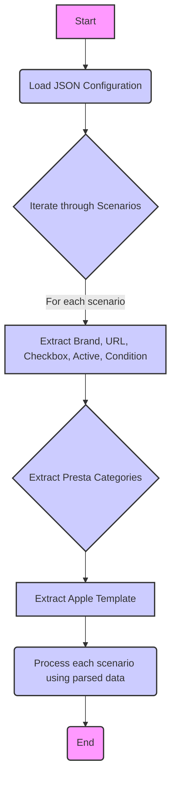

## <алгоритм>

Этот JSON-файл описывает сценарии для парсинга цен на телефоны Apple в интернет-магазине KSP. Каждый сценарий соответствует конкретной модели iPhone.

1.  **Начало**: JSON-файл представляет собой структуру данных, где ключом верхнего уровня является `"scenarios"`. Значение этого ключа - это JSON объект, где ключи - названия моделей iPhone (например, "iPhone SE 2022").

2.  **Обработка сценария**: Для каждой модели iPhone (например, "iPhone SE 2022") существует объект со следующими ключами:
    *   `"brand"`: Указывает на производителя ("APPLE").
    *   `"url"`: Ссылка на страницу категории товара на сайте KSP.
    *   `"checkbox"`: Булевое значение, указывающее на то, нужно ли использовать чекбокс (всегда `false` в текущем файле).
    *   `"active"`: Булевое значение, указывающее, активен ли этот сценарий (всегда `true` в текущем файле).
    *   `"condition"`: Состояние товара (всегда `new` в текущем файле).
    *   `"presta_categories"`: Объект, содержащий информацию о категориях PrestaShop.

3.  **Обработка категорий PrestaShop**: Внутри `"presta_categories"` есть ключ `"template"`, значение которого - объект, где ключ `"apple"` - это название модели iPhone в PrestaShop. Например, для "iPhone SE 2022" `"template"` выглядит как `{"apple": "iPhone SE 2022"}`.

4.  **Повторение**: Шаги 2 и 3 повторяются для каждой модели iPhone, включая "iPhone 11", "iPhone 12 MINI", "iPhone 12", "iPhone 13", "iPhone 13 MINI", "iPhone 13 PRO", "iPhone 13 PRO MAX", "iPhone 14", "iPhone 14 PLUS", "iPhone 14 PRO", "iPhone 14 PRO MAX".

**Примеры:**

*   Для модели "iPhone SE 2022":
    *   `"brand"`: "APPLE"
    *   `"url"`: "https://ksp.co.il/web/cat/573..245..36192"
    *   `"presta_categories"`: `{"template": {"apple": "iPhone SE 2022"}}`
*   Для модели "iPhone 13 PRO MAX":
    *   `"brand"`: "APPLE"
    *   `"url"`: "https://ksp.co.il/web/cat/573..29011"
    *    `"presta_categories"`: `{"template": {"apple": "iPhone 13 PRO MAX"}}`

## <mermaid>

**Описание диаграммы:**

1.  **Start**: Начало процесса.
2.  **Load JSON Configuration**: Загрузка JSON-файла конфигурации.
3.  **Iterate through Scenarios**: Проход по всем сценариям, описанным в JSON-файле.
4.  **Extract Brand, URL, Checkbox, Active, Condition**: Извлечение данных: бренда, URL, флага чекбокса, флага активности и состояния товара для текущего сценария.
5.  **Extract Presta Categories**: Извлечение данных о категориях PrestaShop для текущего сценария.
6.  **Extract Apple Template**: Извлечение данных из шаблона PrestaShop для Apple, определяющего название товара для PrestaShop.
7.  **Process each scenario using parsed data**: Выполнение обработки для каждого сценария с использованием извлеченных данных, таких как парсинг страницы по URL и сопоставление с категорией PrestaShop.
8.  **End**: Конец процесса.

## <объяснение>

**Импорты:**

В данном коде нет явных импортов Python. Этот файл представляет собой JSON, а не Python-скрипт. JSON-файл используется как конфигурация и, вероятно, загружается с помощью модулей `json` в Python-скрипте.

**Структура JSON:**

Файл JSON описывает структуру данных, представляющую собой набор сценариев для парсинга цен на телефоны Apple на сайте KSP. Основная структура состоит из объекта с ключом `"scenarios"`, значением которого является другой объект. Ключи этого объекта являются именами моделей iPhone, а значения – это объекты, содержащие данные о каждом конкретном сценарии.

**Ключи сценария:**

*   `"brand"`: Строка, указывающая на производителя телефона. В данном случае всегда "APPLE".
*   `"url"`: Строка, содержащая URL-адрес страницы категории телефона на сайте KSP. Этот URL используется для парсинга цен.
*   `"checkbox"`: Логическое значение (всегда `false` в текущем файле), вероятно, указывает на использование чекбокса при парсинге, но здесь это не используется.
*   `"active"`: Логическое значение (всегда `true` в текущем файле), указывающее, что сценарий активен.
*   `"condition"`: Строка (всегда `"new"` в текущем файле) указывает на состояние товара.
*   `"presta_categories"`: Объект, содержащий информацию о категориях PrestaShop.
    *   `"template"`: Объект, содержащий шаблон соответствия, где ключ `"apple"` указывает на название категории в PrestaShop.

**Предназначение файла:**

Этот файл используется для настройки парсера, который извлекает информацию о ценах на телефоны Apple с сайта KSP. Данные в файле используются для:

1.  Определение URL-адресов, по которым нужно парсить данные.
2.  Сопоставление моделей iPhone с их категориями в PrestaShop.
3.  Управление активностью и условиями парсинга.

**Потенциальные области для улучшения:**

1.  **Гибкость:** Жесткое задание состояния товара как `"new"` может ограничить применение файла. Возможно, стоит добавить возможность выбора состояния.
2.  **Унификация:** Ключ `"apple"` в `"presta_categories"` может быть параметризован, чтобы файл был более гибким для других производителей.
3.  **Обработка ошибок:** JSON-файл не может сам обрабатывать ошибки, но код, который будет его использовать должен будет обрабатывать такие ошибки, как неверный URL или ненайденная категория.
4.  **Проверки:** Код, который будет читать этот JSON-файл, должен проверять наличие необходимых полей и их соответствие ожидаемым типам данных.

**Взаимосвязь с другими частями проекта:**

Этот JSON-файл используется модулем парсера цен, который загружает его, чтобы узнать, какие телефоны Apple нужно парсить, откуда брать URL-адреса и как сопоставлять их с категориями в PrestaShop. Данные, полученные парсером, могут использоваться для обновления цен в базе данных PrestaShop или для других целей, связанных с каталогом продукции.