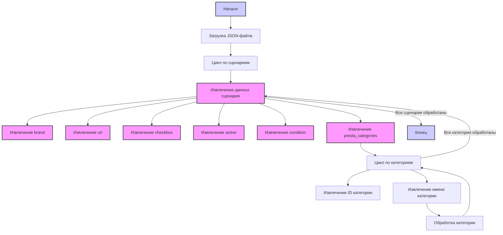

## <алгоритм>

1. **Начало**: Программа начинается с загрузки JSON-объекта. Этот объект содержит сценарии для различных продуктов JBL.
2. **Итерация по сценариям**: Программа перебирает каждый сценарий, находящийся в ключе `scenarios`.
   - Пример: Для сценария "BoomBox 2" обрабатываются его параметры.
3. **Извлечение данных**: Из каждого сценария извлекаются следующие данные:
   - `brand`: Бренд продукта (в данном случае всегда "JBL").
   - `url`: URL-адрес продукта на сайте KSP.
   - `checkbox`: Логическое значение, указывающее, отмечен ли чекбокс (всегда `false`).
   - `active`: Логическое значение, указывающее, активен ли сценарий (всегда `true`).
   - `condition`: Состояние продукта (всегда "new").
   - `presta_categories`: Словарь, сопоставляющий идентификаторы категорий PrestaShop с их названиями.
      - Пример: `"3496": "BT Speakers"` и `"2628": "FLIP 5"`.
4. **Обработка категорий**: Внутри каждого сценария обрабатывается словарь `presta_categories`.
   - Ключи представляют идентификаторы категорий.
   - Значения - названия категорий.
5. **Конец**: Программа завершает выполнение после обработки всех сценариев.

## <mermaid>

## <объяснение>

**Импорты:**
В данном коде нет импортов, так как это JSON-файл, а не Python-файл.

**Классы:**
В данном коде нет классов, так как это JSON-файл, а не Python-файл.

**Функции:**
В данном коде нет функций, так как это JSON-файл, а не Python-файл.

**Переменные:**
- `scenarios`: Объект JSON, представляющий собой словарь, где ключи - это названия сценариев, а значения - это словари с данными о сценариях.
   -  Тип: `dict`
   -  Использование: Хранит все сценарии и их параметры.
- Внутри каждого сценария:
    - `brand`: Бренд продукта (строка, всегда "JBL").
       -  Тип: `str`
       -  Использование: Идентифицирует бренд продукта.
    - `url`: URL-адрес страницы продукта на сайте KSP (строка).
       -  Тип: `str`
       -  Использование: Предоставляет ссылку на страницу продукта.
    - `checkbox`: Логическое значение, указывающее, отмечен ли чекбокс (всегда `false`).
       -  Тип: `bool`
       -  Использование: Может использоваться для управления отображением в интерфейсе.
    - `active`: Логическое значение, указывающее, активен ли сценарий (всегда `true`).
       -  Тип: `bool`
       -  Использование: Указывает, следует ли обрабатывать данный сценарий.
    - `condition`: Состояние продукта (строка, всегда "new").
       -  Тип: `str`
       -  Использование: Указывает состояние продукта.
    - `presta_categories`: Словарь, сопоставляющий идентификаторы категорий PrestaShop с их названиями.
       -  Тип: `dict`
       -  Использование: Связывает категории KSP с категориями PrestaShop.
         - Ключи: Идентификаторы категорий (строки).
         - Значения: Названия категорий (строки).

**Цепочка взаимосвязей:**

- Этот файл `ksp_categories_speakers_jbl.json` является частью конфигурации для сбора данных с сайта KSP.
- Данные из этого файла используются в скриптах, которые работают с сайтом KSP и связывают его категории с категориями PrestaShop.
- Этот файл используется как входные данные для процессов сбора данных, которые могут включать в себя:
   - Загрузку страниц с продуктами с использованием `url`.
   - Сопоставление категорий KSP с категориями PrestaShop, используя `presta_categories`.
   - Обработку данных в зависимости от значения `active`.
- Файл может использоваться совместно с другими JSON файлами для других брендов для обработки данных.

**Потенциальные ошибки или области для улучшения:**

- **Жестко заданные значения:** Поля `checkbox` и `active` всегда имеют значения `false` и `true` соответственно. Это может быть не всегда нужно и лучше сделать эти значения настраиваемыми через входные параметры или конфигурации.
- **Отсутствие проверок:** Отсутствует валидация данных. Необходимо предусмотреть проверки на корректность данных (например, проверка URL на корректность).
- **Расширяемость:** В текущем формате трудно добавлять новые поля для сценариев. Может потребоваться рефакторинг для более гибкой структуры.
- **Использование ключей:** Использование идентификаторов категорий в виде строк может быть неудобным. Возможно, имеет смысл использовать целые числа.
- **Дублирование:** Многие категории дублируются в каждом сценарии. Возможно, имеет смысл использовать отдельный файл для категорий и привязывать к сценариям только ключи.