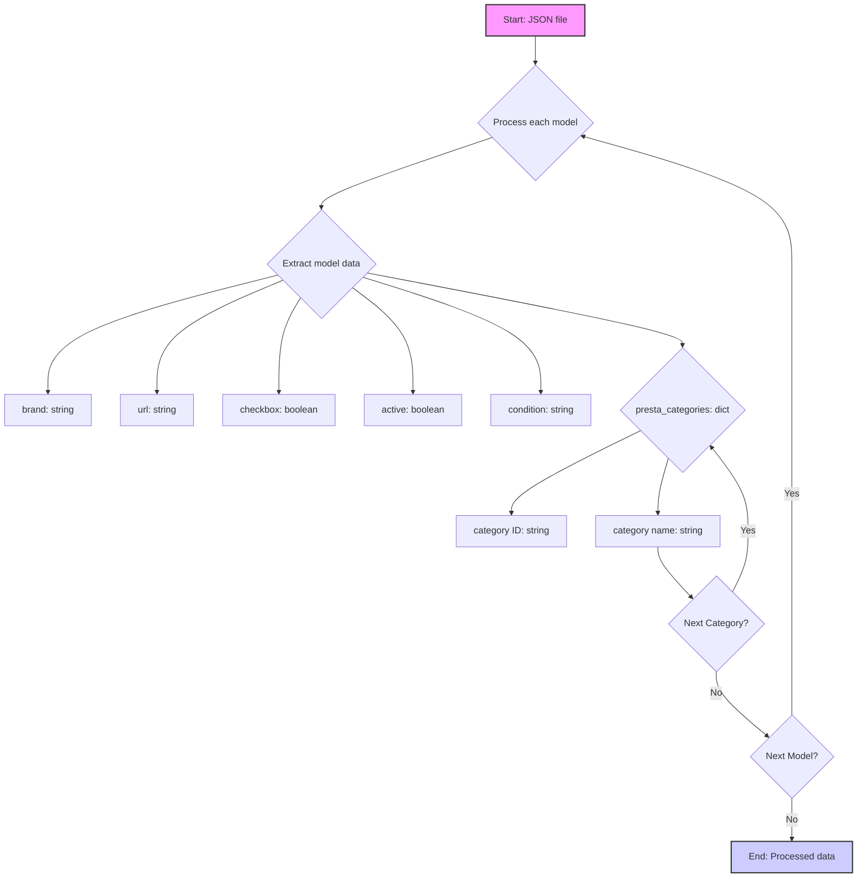

## АНАЛИЗ JSON КОДА

### <алгоритм>

1. **Начало**: JSON-файл содержит словарь (`scenarios`), где ключами являются названия моделей часов Honor, а значениями - словари с данными о каждой модели.
2.  **Обработка каждой модели**:
    *   **Извлечение данных**: Для каждой модели (`Honor Magic Watch 2`, `Honor Band 6`) извлекаются значения по ключам:
        *   `brand` (строка): Марка устройства ("HONOR").
        *   `url` (строка): URL-адрес страницы товара.
        *   `checkbox` (логическое значение): Флаг, указывающий, должен ли быть выбран чекбокс (false).
        *   `active` (логическое значение): Флаг, указывающий, активно ли устройство (true).
        *  `condition` (строка): Состояние товара ("new").
        *   `presta_categories` (словарь): Словарь, содержащий категории PrestaShop.
            *   Ключи: Идентификаторы категорий (числа в виде строк: "3405", "3198", "3202", "6471", "3403").
            *   Значения: Названия категорий ("GOOGLE PIXEL PRO", "CONSUMER ELECTRONICS", "computer,smartphone,gaming console,smart device", "Smartphones", "GOOGLE").
3. **Завершение**: После обработки всех моделей, данные могут быть использованы для парсинга страниц, сопоставления категорий или других целей.

### <mermaid>



**Объяснение `mermaid`:**

*   **A[Start: JSON file]**: Начало процесса обработки JSON-файла.
*   **B{Process each model}**: Цикл обработки каждой модели часов, описанной в JSON.
*   **C{Extract model data}**: Извлечение данных о конкретной модели.
*   **D[brand: string]**: Переменная, хранящая строку с маркой часов.
*   **E[url: string]**: Переменная, хранящая URL-адрес страницы товара.
*   **F[checkbox: boolean]**: Переменная, хранящая логическое значение, указывающее на необходимость установки чекбокса.
*   **G[active: boolean]**: Переменная, хранящая логическое значение, указывающее, является ли товар активным.
*    **H[condition: string]**: Переменная, хранящая строку с состоянием товара.
*   **I{presta_categories: dict}**: Словарь, содержащий категории PrestaShop.
*   **J[category ID: string]**: Строковый идентификатор категории PrestaShop.
*   **K[category name: string]**: Строковое название категории PrestaShop.
*  **L{Next Category?}**: Проверка, есть ли еще категории для текущей модели.
*   **M{Next Model?}**: Проверка, есть ли еще модели для обработки.
*   **N[End: Processed data]**: Конец обработки данных, все модели обработаны.

### <объяснение>

**Импорты:**

В представленном коде нет импортов, так как это просто данные в формате JSON. JSON (JavaScript Object Notation) - это текстовый формат для представления структурированных данных.

**Классы:**

В этом JSON-файле нет классов. Он представляет собой структуру данных, которая может быть использована классами или функциями в других частях проекта.

**Функции:**

В этом JSON-файле нет функций. Он представляет собой структуру данных, которая может быть передана в качестве аргумента в функции для дальнейшей обработки.

**Переменные:**

*   `scenarios` (словарь): Основной словарь, содержащий данные о различных сценариях (в данном случае, о моделях часов).
    *   Ключи: Названия моделей часов (например, `"Honor Magic Watch 2"`).
    *   Значения: Словари, содержащие данные о каждой модели.
*   `brand` (строка): Марка устройства.
*   `url` (строка): URL-адрес страницы товара.
*   `checkbox` (логическое значение): Флаг, указывающий, нужно ли установить чекбокс.
*   `active` (логическое значение): Флаг, указывающий, активен ли товар.
*   `condition` (строка): Cостояние товара.
*   `presta_categories` (словарь): Словарь, сопоставляющий идентификаторы категорий PrestaShop с их названиями.
    *   Ключи: Строковые идентификаторы категорий.
    *   Значения: Строковые названия категорий.

**Потенциальные ошибки и улучшения:**

*   **Несоответствия в категориях**: Категории `presta_categories` имеют одни и те же значения для обеих моделей. Это может быть ошибкой или намеренным поведением. Если это ошибка, то нужно убедиться, что категории правильно соответствуют товарам.
*   **Отсутствие валидации**: Нет валидации данных. Было бы полезно проверять, например, что URL корректен, а значения `checkbox` и `active` являются логическими.
*   **Дублирование данных**: `presta_categories` дублируются между разными моделями. Если категории общие, можно вынести их в отдельное место и ссылаться на них.

**Цепочка взаимосвязей:**

1.  **Парсинг JSON**: Этот JSON-файл может быть загружен и проанализирован с помощью библиотек для работы с JSON (например, Python `json`).
2.  **Обработка данных**: После парсинга данные используются для определения моделей часов, их URL-адресов и категорий.
3.  **Веб-парсинг**: URL-адреса используются для парсинга страниц товаров.
4.  **Категоризация**: Категории `presta_categories` используются для сопоставления товаров с категориями в PrestaShop.
5. **Использование в сценариях**: Данные могут быть использованы для автоматизации задач, таких как обновление цен, наличия товара и других параметров, связанных с продуктами в PrestaShop.

**Пример использования в Python:**

```python
import json

with open('ksp_categories_watches_honor.json', 'r') as f:
    data = json.load(f)

for model_name, model_data in data['scenarios'].items():
    print(f"Модель: {model_name}")
    print(f"  Бренд: {model_data['brand']}")
    print(f"  URL: {model_data['url']}")
    print(f"  Чекбокс: {model_data['checkbox']}")
    print(f"  Активен: {model_data['active']}")
    print(f"  Состояние: {model_data['condition']}")
    print(f"  Категории PrestaShop:")
    for cat_id, cat_name in model_data['presta_categories'].items():
        print(f"    ID: {cat_id}, Название: {cat_name}")