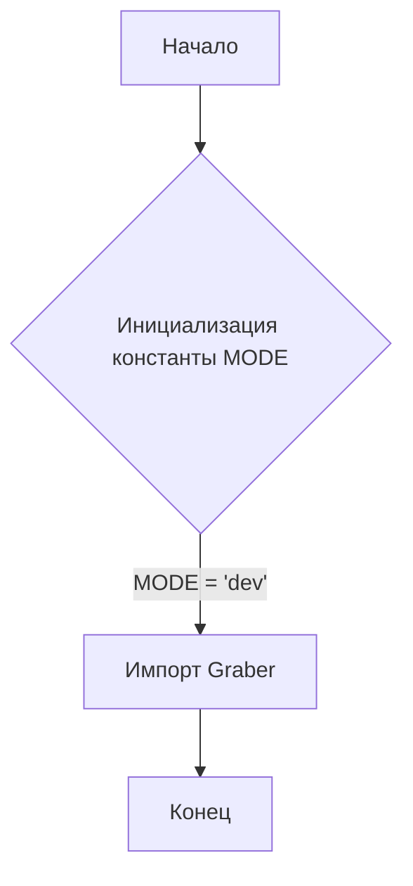
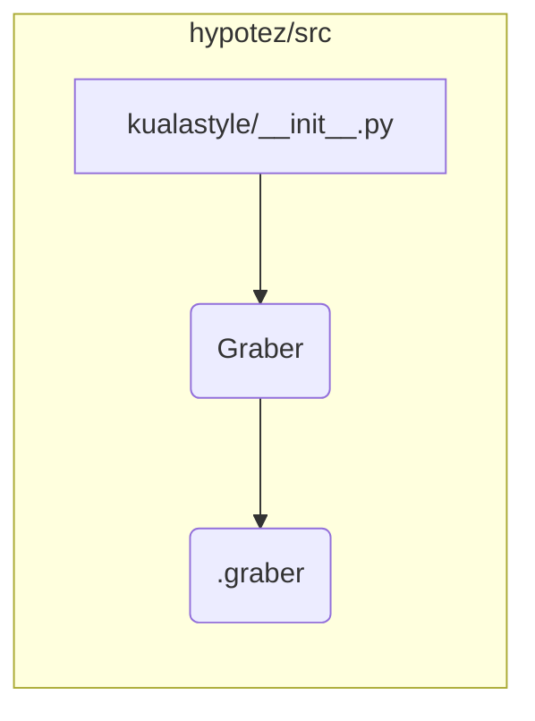

```MD
# <input code>

```python
## \file hypotez/src/suppliers/kualastyle/__init__.py
# -*- coding: utf-8 -*-
#! venv/Scripts/python.exe
#! venv/bin/python/python3.12

"""
.. module: src.suppliers.kualastyle 
	:platform: Windows, Unix
	:synopsis:

"""
MODE = 'dev'

from .graber import Graber
```

# <algorithm>

Этот код является файлом инициализации модуля `kualastyle` в пакете `suppliers` проекта `hypotez`. Он определяет константу `MODE` и импортирует класс `Graber` из модуля `graber`.  Блок-схема не очень сложная:



**Пример:**

При импорте `kualastyle` в другой части проекта, эта константа и класс будут доступны.

# <mermaid>



**Объяснение диаграммы:**

Диаграмма показывает, что файл `kualastyle/__init__.py` импортирует класс `Graber` из модуля `.graber`, который находится в подпапке `kualastyle`.


# <explanation>

* **Импорты:**
    * `from .graber import Graber`: Этот импорт необходим для использования класса `Graber` в файле `kualastyle/__init__.py`.  `.graber`  предполагает, что модуль `graber` находится в той же директории, что и `kualastyle/__init__.py`.  Связь с другими пакетами через относительный импорт.  Это предполагает, что в папке `kualastyle` есть модуль `graber.py`.  Это является частью общей структуры пакета `src.suppliers`.


* **Классы:**
    * `Graber`:  Этот класс определён в файле `graber.py` (который не представлен в данном запросе). Его функциональность неизвестна, но он связан с поставщиком данных `kualastyle`. Нельзя указать точное поведение без доступа к определению класса.


* **Функции:**
    * Нет функций в данном файле.

* **Переменные:**
    * `MODE = 'dev'`:  Это константа, которая, вероятно, указывает на режим работы (разработки или производства).  Это общая практика в программировании для выбора разных наборов конфигураций.


* **Возможные ошибки/улучшения:**
    *  Отсутствует документация к классу `Graber`. Необходимо добавить docstrings для объяснений предназначения, параметров и возвращаемых значений методов.
    * Отсутствие проверки корректности значения `MODE`. Лучше использовать перечисление (enum) для этого типа переменной.


* **Цепочка взаимосвязей:**
    * Файл `kualastyle/__init__.py`  служит для импорта и экспорта класса `Graber`, который, вероятно, взаимодействует с источниками данных или сервисами, предоставляющими данные (например, API).

**Заключение:**

Код представляет собой простую инициализацию, обеспечивающую доступ к классу `Graber`, который выполняет функции, связанные с получением данных из поставщика.  Следующий шаг - посмотреть содержимое  `graber.py` для полного понимания его функциональности.