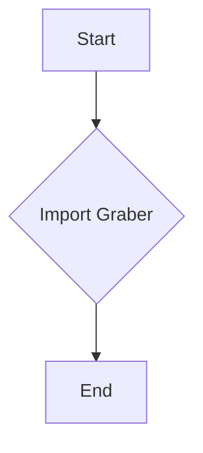
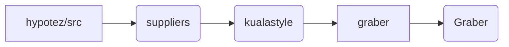

# <input code>

```python
## \file hypotez/src/suppliers/kualastyle/__init__.py
# -*- coding: utf-8 -*-
#! venv/Scripts/python.exe
#! venv/bin/python/python3.12

"""
.. module: src.suppliers.kualastyle 
	:platform: Windows, Unix
	:synopsis:

"""
MODE = 'dev'

from .graber import Graber
```

# <algorithm>

Этот код представляет собой начальную точку входа для модуля `kualastyle` в пакете `suppliers` проекта `hypotez`.  Алгоритм прост: он импортирует класс `Graber` из подпапки `graber`.

**Шаг 1:** Импорт `Graber`.

```
from .graber import Graber
```


**Пример:**

Данный код не выполняет никаких действий, кроме импорта, поэтому блок-схема будет очень простой.



# <mermaid>



**Описание диаграммы:**

* `hypotez/src`: Корневая директория проекта.
* `suppliers`: Подпапка, содержащая модули для работы с различными поставщиками данных.
* `kualastyle`: Подпапка, содержащая код для взаимодействия с поставщиком данных "kualastyle".
* `graber`: Подмодуль, отвечающий за получение данных (возможно, из API или файлов).
* `Graber`: Класс, реализующий процесс извлечения данных из поставщика "kualastyle".

# <explanation>

* **Импорты:**

    `from .graber import Graber`:  Этот импорт вводит в текущий модуль класс `Graber` из файла `graber.py` в той же директории (`.`).  Это позволяет использовать класс `Graber` в других модулях пакета `kualastyle`.  Эта конструкция `.graber` указывает на относительный путь.

* **Классы:**

    Нет определения классов непосредственно в файле `__init__.py`.  Это `__init__.py` файл, он указывает, что данный пакет содержит класс `Graber`, определенный в файле `graber.py` и доступен для импорта.  В данном случае, `Graber` — ключевой класс, отвечающий за получение данных от поставщика *kualastyle*.


* **Функции:**

    Нет определений функций в этом `__init__.py` файле. Функциональность предоставлена через класс `Graber` (определение которого содержится в файле `graber.py`).

* **Переменные:**

    `MODE = 'dev'`: Эта константа хранит строковое значение, вероятно, для указания режима работы (например, `dev`, `prod`). Значение `MODE` может быть использовано в других частях проекта для корректировки поведения приложения в разных средах (разработка, производство).

* **Возможные ошибки или улучшения:**

    -  Отсутствует подробное описание класса `Graber` в `graber.py`.  Важно указать его атрибуты (данные, которые хранит) и методы (что он умеет делать), чтобы лучше понимать его функциональность.
    - Не указан контекст, в котором используется `MODE` значение.  В идеале, нужно описать, как это значение влияет на работу проекта.
    - Рекомендуется использовать строковые литералы в формате `'str'`, а не `str`, чтобы избежать неясных ошибок при импорте.

**Цепочка взаимосвязей:**

Файл `hypotez/src/suppliers/kualastyle/__init__.py` определяет, какие элементы доступны для импорта в других частях проекта, делая `Graber` из подмодуля `graber` доступным.  Это означает, что другие части проекта могут взаимодействовать с поставщиком данных `kualastyle` через этот класс, импортируя его из пакета `kualastyle`.  Для того, чтобы понять полную функциональность, необходимо рассмотреть `graber.py`.
```