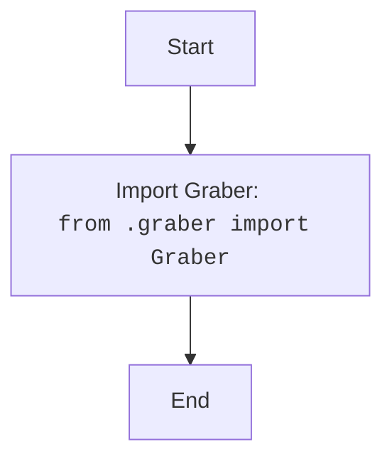

## Анализ кода `src/suppliers/kualastyle/__init__.py`

### <алгоритм>

1.  **Импорт модуля `graber`**:
    *   Импортируется модуль `Graber` из текущего каталога (`.`). Этот модуль предположительно содержит класс или функции для сбора данных с веб-сайта Kualastyle.
    *   **Пример**:  `from .graber import Graber` означает, что  класс `Graber` будет доступен для использования в текущем файле (и в других файлах, импортирующих этот файл).

### <mermaid>

**Объяснение `mermaid`:**

*   `flowchart TD`:  Обозначает тип диаграммы —  блок-схема, идущая сверху вниз.
*   `Start --> ImportGraber`: Стрелка указывает поток выполнения от начала к импорту.
*   `ImportGraber[Import Graber:  <code>from .graber import Graber</code>]`:  Представляет блок с описанием импорта модуля `graber`.
*   `ImportGraber --> End`: Стрелка указывает, что после импорта выполнение заканчивается.

### <объяснение>

**Импорты:**

*   `from .graber import Graber`:
    *   **Назначение**: Импортирует класс `Graber` из модуля `graber.py`, находящегося в той же директории, что и `__init__.py`.
    *   **Взаимосвязь с `src`**: Этот импорт позволяет использовать функциональность класса `Graber`, предназначенного для сбора данных, в других частях пакета `src.suppliers.kualastyle` или в других модулях, импортирующих этот пакет.
    *   Предполагается, что `graber.py` содержит логику для парсинга и извлечения информации с сайта Kualastyle.

**Классы:**

*   В данном коде напрямую не определяются классы. Однако, импортируется класс `Graber`, который, вероятно, определен в модуле `graber.py`.
    *   **Предполагаемая роль**: `Graber`, скорее всего, предназначен для сбора данных с веб-сайта Kualastyle. Он, вероятно, содержит методы для загрузки страниц, парсинга HTML/JSON и извлечения нужной информации.
    *   **Атрибуты и методы**: Полагаясь на типичные реализации, `Graber`, вероятно, содержит методы вроде `fetch_page(url)`, `parse_data(html)`, `extract_items()`.
    *   **Взаимодействие**:  Может взаимодействовать с другими частями приложения, например, с модулями, отвечающими за сохранение данных или с модулями для обработки и анализа.

**Функции:**

*   В текущем файле нет определенных функций. Все функциональность, вероятно, находится в классе `Graber` и других файлах пакета.

**Переменные:**

*   В текущем файле отсутствуют явно объявленные переменные.

**Потенциальные ошибки и области для улучшения:**

*   **Отсутствие явного определения класса**:  В файле `__init__.py` не определены классы или функции. Файл выступает как точка входа в пакет `kualastyle`, делая класс `Graber` доступным для импорта.
*   **Необходимость проверки `graber.py`**: Для полноценного анализа необходимо посмотреть содержимое `graber.py`, чтобы понять точную функциональность класса `Graber`.
*   **Обработка ошибок**: Важно, чтобы `Graber` обрабатывал возможные ошибки, такие как сбои сети, неверные URL-адреса или изменения в структуре веб-сайта Kualastyle.
*   **Документация**: Необходима более подробная документация, описывающая работу класса `Graber`.

**Цепочка взаимосвязей с другими частями проекта:**

1.  Файл `__init__.py` делает класс `Graber` доступным для импорта другими модулями проекта.
2.  Предположительно, другие модули в `src.suppliers` могут использовать класс `Graber` для извлечения данных.
3.  Извлеченные данные могут быть использованы модулями, например, `src.database` для сохранения или `src.processing` для дальнейшего анализа и обработки.
4.  Модуль `src.main` или другие пользовательские интерфейсы могут инициировать работу по сбору данных с помощью этого класса.

**В итоге**: Файл `__init__.py` является точкой входа для пакета `kualastyle` и обеспечивает доступ к классу `Graber`, который, вероятно, отвечает за сбор данных с веб-сайта Kualastyle. Для более полного анализа необходимо изучить содержимое модуля `graber.py`.