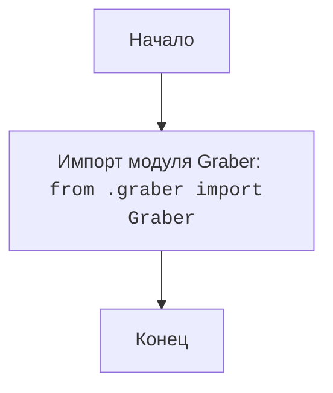

## АНАЛИЗ КОДА: `hypotez/src/suppliers/kualastyle/__init__.py`

### <алгоритм>
1. **Импорт модуля `graber`:**
   - Импортируется модуль `Graber` из текущего пакета (`.`).
   - Пример: `from .graber import Graber`
   - Поток данных:  Файл `__init__.py` получает доступ к классу `Graber`,  определённому в файле `graber.py` в том же каталоге. Это позволяет использовать `Graber` в контексте пакета `kualastyle`.

### <mermaid>

**Объяснение:**

- `flowchart TD`:  Указывает, что это диаграмма потока сверху вниз.
- `Start[Начало]`:  Начальная точка выполнения.
- `ImportGraber[Импорт модуля Graber:  <code>from .graber import Graber</code>]`:  Импортирует класс `Graber` из модуля `graber.py`, который находится в том же каталоге.
- `End[Конец]`: Конечная точка выполнения.

### <объяснение>

**Импорты:**

- `from .graber import Graber`:  Импортирует класс `Graber` из модуля `graber.py`, расположенного в той же директории, что и файл `__init__.py`.  Это позволяет использовать класс `Graber` для сбора данных или выполнения операций, специфичных для поставщика Kualastyle.   Так как импорт происходит из текущего пакета (`.`), это означает, что  `graber.py` должен быть в той же директории, что и  `__init__.py`.
  
**Классы:**
- В данном файле классы не определены. Но импортируется класс `Graber`. Класс `Graber` вероятно используется для извлечения данных с веб-сайта kualastyle.
    
**Функции:**

- В данном файле функции не определены.

**Переменные:**

- В данном файле переменные не используются напрямую, но импортируется класс `Graber`.

**Потенциальные проблемы и улучшения:**

- **Отсутствие документации:**  Хотя есть docstring для модуля, было бы полезно добавить подробное описание класса `Graber` и его методов для понимания функциональности.
- **Обработка ошибок:**  В коде не видно обработки исключений, которые могут возникнуть при импорте или использовании модуля `graber`. В `graber.py`  следует добавить обработку исключений для обеспечения надежности.
- **Непонятный заголовок**: Заголовки вида `` и `#! venv/bin/python/python3.12` являются устаревшими и некорректными в данном контексте.  Они не используются для запуска скрипта как такового, и их можно убрать, либо прописать корректный shebang.
- **Цепочка взаимосвязей**: `__init__.py` является точкой входа для пакета `kualastyle`. Он делает класс `Graber` доступным для использования из других частей проекта, когда пакет `kualastyle` импортируется.  Если `Graber` взаимодействует с другими частями проекта, например `src.database` или `src.utils`, то это взаимодействие должно быть отражено в `graber.py`, который импортируется в данном файле.

В целом, этот файл является простым, но ключевым для организации пакета `kualastyle`. Он  позволяет другим частям проекта импортировать и использовать функциональность,  реализованную в модуле `graber`.  Дальнейший анализ  должен сосредоточиться на `graber.py`, чтобы понять детали работы с поставщиком Kualastyle.