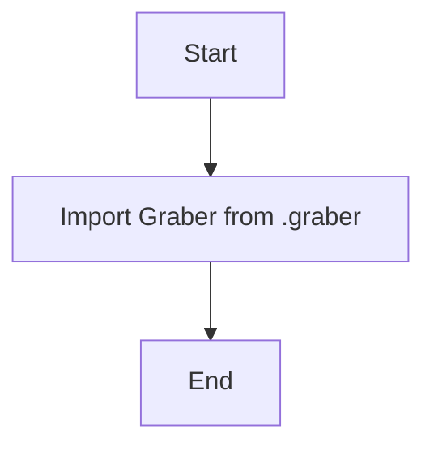

# Анализ кода `src/suppliers/kualastyle/__init__.py`

## <алгоритм>

1. **Импорт `Graber`:**
   - Начинается выполнение скрипта.
   - Из модуля `src.suppliers.kualastyle.graber` импортируется класс `Graber`.

   ```python
    from .graber import Graber
   ```
   
   - **Пример**: Если `graber.py` содержит класс `Graber`, то после импорта, в текущем модуле можно использовать `Graber` для создания объектов или вызова его методов.

2. **Конец выполнения**:
    - Скрипт заканчивает свое выполнение, создавая пакет `kualastyle`, с доступным классом `Graber`.

## <mermaid>



## <объяснение>

### Импорты

-   `from .graber import Graber`:
    -   Этот импорт делает класс `Graber` из модуля `graber.py`, находящегося в той же директории, доступным для использования в `__init__.py` и, следовательно, для всех модулей, которые импортируют пакет `kualastyle`.
    -   `src.` -  это корень проекта. `suppliers` - папка внутри `src`, которая содержит подпапку `kualastyle`. Файл `__init__.py` превращает папку `kualastyle` в пакет, позволяя импортировать его содержимое.

### Классы

-   `Graber`:
    -   Класс `Graber` импортируется из `graber.py` и предположительно отвечает за выполнение действий, связанных с "граббингом" данных (например, парсингом веб-страниц). 
    -   Атрибуты и методы класса определены в файле `graber.py`

### Функции

-   В этом файле нет функций, он используется для инициализации пакета `kualastyle` и делает доступным класс `Graber`.

### Переменные

-   В данном файле нет переменных, только импорты.

### Потенциальные ошибки и области для улучшения

-   **Недостаток документации:** Код содержит докстринг, но он очень общий и не описывает конкретную функциональность пакета.
-   **Зависимости:** Необходимо подробнее изучить файл `graber.py`, чтобы полностью понять функциональность класса `Graber`.
-   **Отсутствие явного назначения:** В `__init__.py` не происходит никакой явной инициализации пакета. Обычно в `__init__.py` помещают код, который должен выполняться при первом импорте пакета.

### Взаимосвязи с другими частями проекта

-   Пакет `kualastyle` является частью более широкой структуры `suppliers`, которая, вероятно, предназначена для управления взаимодействием с разными поставщиками.
-   Предполагается, что `Graber` используется для извлечения данных от поставщика Kualastyle.
-   Другие части проекта могут импортировать `kualastyle` и использовать класс `Graber` для получения данных.

Данный анализ предоставляет подробное объяснение функциональности `__init__.py`, а также выделяет ключевые аспекты и потенциальные точки для улучшения.