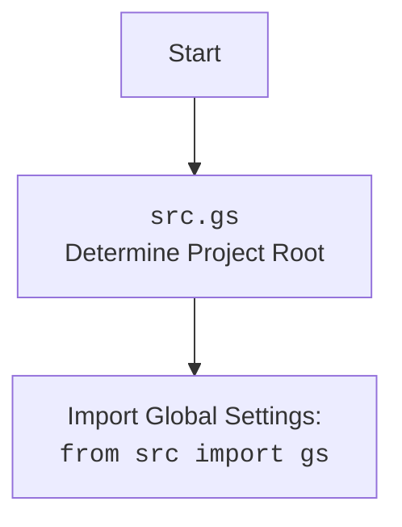

## Анализ кода `hypotez`

### 1. <алгоритм>

**get_list_products_in_category (s: Supplier)**

1.  **Инициализация**:
    *   Принимает объект `Supplier` в качестве аргумента.
    *   Извлекает объект `Driver` из `s.driver`.
    *   Извлекает локаторы для категории из `s.locators['category']`.
2.  **Подготовка страницы**:
    *   Ожидает 1 секунду (`d.wait(1)`).
    *   Выполняет локатор для закрытия баннера (`d.execute_locator(s.locators['product']['close_banner'])`).
    *   Прокручивает страницу (`d.scroll()`).
3.  **Извлечение ссылок на товары**:
    *   Извлекает список ссылок на товары с использованием локатора `l['product_links']`.
    *   Если список пуст, логирует предупреждение и возвращает `None`.
4.  **Пагинация**:
    *   Пока текущий URL не равен предыдущему URL:
        *   Вызывает функцию `paginator()` для перехода на следующую страницу.
        *   Если `paginator()` возвращает `True`, добавляет новые ссылки на товары в `list_products_in_category`.
        *   Иначе выходит из цикла.
5.  **Обработка результата**:
    *   Преобразует `list_products_in_category` в список, если это строка.
    *   Логирует количество найденных товаров в категории.
    *   Возвращает список ссылок на товары.

**Пример**:

```python
# Пример вызова функции get_list_products_in_category
supplier = Supplier(...)  # Предположим, что объект Supplier уже инициализирован
product_links = get_list_products_in_category(supplier)

if product_links:
    print(f"Найдено {len(product_links)} ссылок на товары.")
    for link in product_links:
        print(link)
else:
    print("Не найдено ссылок на товары.")
```

**paginator(d: Driver, locator: dict, list_products_in_category: list)**

1.  **Переход на следующую страницу**:
    *   Выполняет локатор для кнопки пагинации "<-" (`locator['pagination']['<-']`).
    *   Если результат выполнения локатора пуст или является пустым списком, возвращает `None`.
2.  **Возврат результата**:
    *   Возвращает `True`, если переход на следующую страницу успешен.

**Пример**:

```python
# Пример вызова функции paginator
driver = Driver(...)  # Предположим, что объект Driver уже инициализирован
locator = {...}  # Предположим, что локаторы уже определены
product_list = [...]  # Предположим, что список товаров уже существует

if paginator(driver, locator, product_list):
    print("Переход на следующую страницу успешен.")
else:
    print("Переход на следующую страницу не удался.")
```

**get_list_categories_from_site(s)**

1.  **Сбор категорий**:
    *   Собирает актуальные категории с сайта.

### 2. <mermaid>

```mermaid
flowchart TD
    A[get_list_products_in_category(s: Supplier)] --> B{d: Driver = s.driver}
    B --> C{l: dict = s.locators['category']}
    C --> D{d.wait(1)}
    D --> E{d.execute_locator(s.locators['product']['close_banner'])}
    E --> F{d.scroll()}
    F --> G{list_products_in_category: List = d.execute_locator(l['product_links'])}
    G --> H{if not list_products_in_category}
    H -- True --> I[logger.warning('Нет ссылок на товары. Так бывает')]
    I --> J[return]
    H -- False --> K{while d.current_url != d.previous_url}
    K -- True --> L{if paginator(d, l, list_products_in_category)}
    L -- True --> M{list_products_in_category.append(d.execute_locator(l['product_links']))}
    M --> K
    L -- False --> K
    K -- False --> N{list_products_in_category = [list_products_in_category] if isinstance(list_products_in_category, str) else list_products_in_category}
    N --> O[logger.debug(f"Found {len(list_products_in_category)} items in category {s.current_scenario['name']}")]
    O --> P[return list_products_in_category]
    
    subgraph paginator
    PAG1[paginator(d: Driver, locator: dict, list_products_in_category: list)] --> PAG2{response = d.execute_locator(locator['pagination']['<-'])}
    PAG2 --> PAG3{if not response or (isinstance(response, list) and len(response) == 0)}
    PAG3 -- True --> PAG4[return]
    PAG3 -- False --> PAG5[return True]
    end
    L --> PAG1
```

**Объяснение `mermaid`**:

*   `get_list_products_in_category`: Функция, которая собирает ссылки на товары со страницы категории.
*   `s: Supplier`: Объект поставщика, содержащий информацию о драйвере и локаторах.
*   `d: Driver = s.driver`: Драйвер веб-браузера, используемый для взаимодействия со страницей.
*   `l: dict = s.locators['category']`: Локаторы элементов на странице категории.
*   `d.wait(1)`: Ожидание в 1 секунду.
*   `d.execute_locator(s.locators['product']['close_banner'])`: Закрытие баннера на странице.
*   `d.scroll()`: Прокрутка страницы.
*   `list_products_in_category`: Список ссылок на товары, найденных на странице.
*   `paginator`: Функция для перехода на следующую страницу.



```mermaid
flowchart TD
    A[get_list_categories_from_site(s)] --> B[сборщик актуальных категорий с сайта]
```

### 3. <объяснение>

**Импорты**:

*   `typing`: Используется для аннотации типов.
    *   `Dict`, `List`: Указание типов для переменных.
*   `pathlib`: Используется для работы с путями к файлам.
    *   `Path`: Представление пути к файлу или директории.
*   `src.gs`:  Предположительно, содержит глобальные настройки проекта.
*   `src.logger.logger`: Модуль логирования для записи информации о работе программы.
    *   `logger`: Объект логгера для записи сообщений.
*   `src.webdriver.driver`: Модуль, содержащий класс `Driver` для управления веб-браузером.
    *   `Driver`: Класс для взаимодействия с веб-браузером.
*   `src.suppliers`: Общий пакет для поставщиков.
    *   `Supplier`: Класс, представляющий поставщика.

**Функции**:

*   `get_list_products_in_category(s: Supplier) -> list[str, str, None]`:
    *   **Аргументы**:
        *   `s`: Объект класса `Supplier`, содержащий информацию о поставщике, драйвере и локаторах.
    *   **Возвращаемое значение**:
        *   `list[str]`: Список URL-адресов товаров на странице категории.
    *   **Назначение**:
        *   Собирает ссылки на товары со страницы категории, пролистывая страницы, если это необходимо.
        *   Использует локаторы, определенные в объекте `Supplier`, для поиска элементов на странице.
    *   **Пример**:
        ```python
        supplier = Supplier(...)
        product_links = get_list_products_in_category(supplier)
        if product_links:
            print(f"Найдено {len(product_links)} ссылок на товары.")
        ```
*   `paginator(d: Driver, locator: dict, list_products_in_category: list)`:
    *   **Аргументы**:
        *   `d`: Объект класса `Driver`, представляющий драйвер веб-браузера.
        *   `locator`: Словарь с локаторами элементов на странице.
        *   `list_products_in_category`: Список ссылок на товары.
    *   **Возвращаемое значение**:
        *   `bool`: `True`, если переход на следующую страницу успешен, `False` в противном случае.
    *   **Назначение**:
        *   Переходит на следующую страницу категории, используя локатор для кнопки пагинации.
    *   **Пример**:
        ```python
        driver = Driver(...)
        locator = {...}
        product_list = [...]
        if paginator(driver, locator, product_list):
            print("Переход на следующую страницу успешен.")
        ```
*   `get_list_categories_from_site(s)`:
    *   **Аргументы**:
        *   `s`: Объект класса `Supplier`.
    *   **Возвращаемое значение**:
        *   `None`
    *   **Назначение**:
        *   Собирает актуальные категории с сайта.

**Переменные**:

*   `s`: Объект класса `Supplier`, содержащий информацию о поставщике.
*   `d`: Объект класса `Driver`, представляющий драйвер веб-браузера.
*   `l`: Словарь с локаторами элементов на странице категории.
*   `list_products_in_category`: Список URL-адресов товаров на странице категории.
*   `response`: Результат выполнения локатора.

**Потенциальные ошибки и области для улучшения**:

*   В функции `get_list_products_in_category` отсутствует обработка исключений.  Стоит добавить обработку исключений, чтобы предотвратить падение программы в случае возникновения ошибок.
*   В функции `paginator` возвращается `None` если не удалось перейти на следующую страницу.  Это может привести к ошибкам в вызывающей функции.  Стоит возвращать `False` в этом случае.
*   Функция `get_list_categories_from_site` не имеет реализации (`...`). Необходимо реализоваеть сбор категорий с сайта.

**Взаимосвязи с другими частями проекта**:

*   Модуль `category.py` зависит от модулей `src.gs`, `src.logger.logger`, `src.webdriver.driver` и `src.suppliers`.
*   Он использует классы `Driver` и `Supplier` для взаимодействия с веб-браузером и получения информации о поставщике.
*   Он использует модуль `logger` для записи информации о работе программы.

```