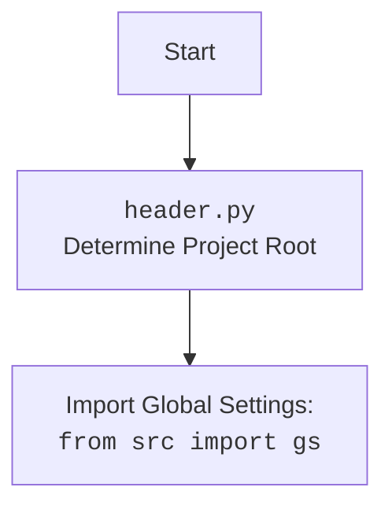

## <алгоритм>

1.  **Импорт модулей**:
    *   Импортируются необходимые модули и классы для работы, такие как `Any` из `typing`, `header`, `Graber` (как `Grbr`), `Context`, `close_pop_up` из `src.suppliers.graber`, `Driver` из `src.webdriver.driver` и `logger` из `src.logger.logger`.

2.  **Объявление класса `Graber`**:
    *   Объявляется класс `Graber`, который наследуется от `Grbr` из `src.suppliers.graber`.
    *   Устанавливается атрибут `supplier_prefix` как строка.
    
3.  **Инициализация `__init__`**:
    *   Конструктор класса `__init__` принимает объект `Driver` в качестве аргумента.
    *   Устанавливает `supplier_prefix` равным `'kualastyle'`.
    *   Вызывает конструктор родительского класса `Grbr` с `supplier_prefix` и `driver`.
    *   Устанавливает `Context.locator_for_decorator` в `None`, отключая таким образом использование декоратора по умолчанию.

**Пример выполнения:**

```
# 1. Импорт модулей
from typing import Any
import header
from src.suppliers.graber import Graber as Grbr, Context, close_pop_up
from src.webdriver.driver import Driver
from src.logger.logger import logger

# 2. Объявление класса Graber
class Graber(Grbr):
    supplier_prefix: str

    def __init__(self, driver: Driver):
        # 3. Инициализация __init__
        self.supplier_prefix = 'kualastyle'
        super().__init__(supplier_prefix=self.supplier_prefix, driver=driver)
        Context.locator_for_decorator = None

# Пример создания объекта
# Предположим, что driver является экземпляром класса Driver.
# driver = Driver()
# grabber = Graber(driver)
```

## <mermaid>

```mermaid
flowchart TD
    Start[Start] --> ImportModules[Импорт модулей]
    ImportModules --> DefineGraberClass[Определение класса Graber (наследуется от Grbr)]
    DefineGraberClass --> InitMethod[Инициализация __init__]
    InitMethod --> SetSupplierPrefix[Установка supplier_prefix = 'kualastyle']
    SetSupplierPrefix --> CallParentInit[Вызов __init__ родительского класса Grbr]
    CallParentInit --> SetContextLocator[Установка Context.locator_for_decorator = None]
    SetContextLocator --> End[End]


    
    classDef imported fill:#f9f,stroke:#333,stroke-width:2px
    class ImportModules imported
    class DefineGraberClass imported
    class InitMethod imported
    class SetSupplierPrefix imported
    class CallParentInit imported
    class SetContextLocator imported
```


**Объяснение зависимостей `mermaid`:**

*   `flowchart TD` - указывает, что это блок-схема, которая строится сверху вниз.
*   `Start` - начало процесса.
*   `ImportModules` - импорт необходимых модулей: `typing`, `header`, `src.suppliers.graber`, `src.webdriver.driver` и `src.logger.logger`.
*   `DefineGraberClass` - определение класса `Graber`, который наследуется от `Grbr`.
*   `InitMethod` - вызов метода `__init__` (конструктора) класса `Graber`.
*  `SetSupplierPrefix`-  установка префикса поставщика
* `CallParentInit` -  вызов родительского метода `__init__`
*   `SetContextLocator` - установка переменной `Context.locator_for_decorator` в `None`, чтобы отключить дефолтный декоратор
*   `End` - конец процесса.

Классы с `classDef imported` выделены стилем, чтобы показать, что это шаги в процессе.

## <объяснение>

**Импорты:**

*   `from typing import Any`: Импортирует `Any` для возможности использовать произвольный тип данных.
*   `import header`: Импортирует модуль `header`, который, вероятно, используется для настройки окружения и путей проекта.
*   `from src.suppliers.graber import Graber as Grbr, Context, close_pop_up`:
    *   Импортирует класс `Graber` из `src.suppliers.graber` и переименовывает его в `Grbr`. Это класс-родитель для текущего класса `Graber`.
    *   Импортирует класс `Context` и функцию `close_pop_up` из того же модуля.
*   `from src.webdriver.driver import Driver`: Импортирует класс `Driver` из `src.webdriver.driver`, который, вероятно, отвечает за управление веб-драйвером.
*   `from src.logger.logger import logger`: Импортирует объект `logger` из `src.logger.logger` для ведения логов.

**Классы:**

*   `class Graber(Grbr)`:
    *   Это класс, предназначенный для сбора данных со страниц товаров поставщика "kualastyle".
    *   Наследуется от `Grbr` (родительского класса).
    *   Атрибут `supplier_prefix` хранит префикс поставщика (`'kualastyle'`).
    *   Метод `__init__`:
        *   Принимает экземпляр класса `Driver`.
        *   Устанавливает `supplier_prefix`.
        *   Вызывает конструктор родительского класса (`Grbr`) для инициализации общих параметров.
        *   Устанавливает `Context.locator_for_decorator` в `None`, отключая применение декоратора по умолчанию.

**Функции:**

*   `__init__(self, driver: Driver)`:
    *   Конструктор класса `Graber`.
    *   Принимает объект `Driver` для управления веб-драйвером.
    *   Устанавливает префикс поставщика и вызывает конструктор родительского класса.

**Переменные:**

*   `supplier_prefix`: Строка, содержащая префикс поставщика (в данном случае, `'kualastyle'`).
*   `Context.locator_for_decorator`:  Устанавливается в `None`, отключая использование декоратора по умолчанию.

**Потенциальные ошибки и улучшения:**

*   **Обработка исключений**: В коде есть закомментированный декоратор, который содержит блок `try-except`, но он отключен. Рекомендуется добавить или включить обработку исключений в основные функции сбора данных, чтобы код был более надежным.
*   **Динамическое переключение декораторов**: Текущий код устанавливает `Context.locator_for_decorator` в `None` статически. Возможно, потребуется динамически переключать декораторы на основе условий.
*   **Тестирование**: Недостаточно примеров или тестов, которые бы демонстрировали работу с веб-драйвером и реальным сбором данных. Желательно добавить тесты.

**Взаимосвязи с другими частями проекта:**

*   **`header.py`**: Используется для настройки окружения и путей проекта.
*   **`src.suppliers.graber`**: Предоставляет родительский класс `Graber` (`Grbr`), а также классы `Context` и функцию `close_pop_up` для сбора данных.
*   **`src.webdriver.driver`**: Предоставляет класс `Driver` для управления веб-драйвером.
*   **`src.logger.logger`**: Используется для ведения логов.

**Заключение:**

Класс `Graber` в `kualastyle/graber.py` предназначен для сбора данных с веб-сайта поставщика "kualastyle", наследуясь от базового класса `Graber` и используя веб-драйвер. Он имеет возможность использования декораторов, но в текущем виде они отключены. В целом, код организован и понятен, но может быть улучшен путем добавления обработки исключений, динамического переключения декораторов и тестов.