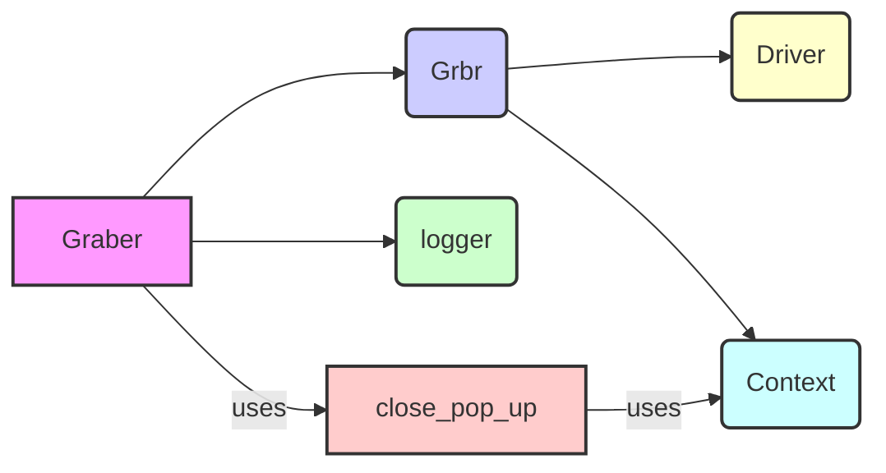

## <алгоритм>

1.  **Инициализация класса `Graber`**:
    *   Создается экземпляр класса `Graber`, который наследуется от `Grbr`.
    *   Устанавливается префикс поставщика `supplier_prefix` как `'kualastyle'`.
    *   Вызывается конструктор родительского класса `Grbr` с указанным префиксом и драйвером.
    *   Устанавливается `Context.locator_for_decorator` в `None`. Это означает, что декоратор `@close_pop_up` не будет выполнять никаких дополнительных действий перед выполнением основной логики функции (в примере закомментирован)
    *   Пример:
        ```python
        driver = Driver() # Предположим, что Driver инициализирован
        graber = Graber(driver)
        print(graber.supplier_prefix) # Выведет: kualastyle
        print(Context.locator_for_decorator) # Выведет: None
        ```
        
2.  **Декоратор (закомментирован)**
   *   Определена функция `close_pop_up`, которая является декоратором.
   *   Декоратор предназначен для выполнения предварительных действий (например, закрытия всплывающих окон) перед выполнением функции, к которой он применен.
   *   Декоратор принимает `value` как дополнительное значение, но в текущей реализации никак не используется.
   *   Внутри декоратора, функция `wrapper` перехватывает выполнение основной функции.
   *   Перед выполнением основной функции, `wrapper` пытается выполнить действия, связанные с `Context.locator` для закрытия всплывающего окна (в примере закомментировано).
   *   Если выполнение локатора вызывает ошибку `ExecuteLocatorException`, ошибка логируется.
   *   После предварительных действий или в случае ошибки, выполняется основная функция.
   *   Пример:
        ```python
        # Пример использования декоратора (раскомментировать код декоратора в файле для использования)
        # @close_pop_up()
        # async def some_function():
        #   print("Функция выполнена")
        # await some_function() # сначала выполнится попытка закрыть pop-up, потом функция
        ```
3.  **Использование класса `Graber` для сбора данных**:
    *   Класс `Graber` предназначен для сбора данных со страниц товаров.
    *   В текущем коде нет конкретных методов для сбора данных, но он наследуется от класса `Grbr`, который, предположительно, содержит общую логику.
    *   Методы для конкретного сбора данных (например, парсинг HTML) должны быть реализованы в `Graber` и переопределять методы родительского класса `Grbr`, если требуется нестандартная обработка.
4.  **Поток данных**:
    *   Драйвер браузера (`Driver`) передается в конструктор `Graber`.
    *   `supplier_prefix` устанавливается и передается в конструктор родительского класса.
    *   Класс `Graber` может использовать `Context` для хранения глобальных настроек.
    *   Декоратор (если используется) может обращаться к `Context.locator`, для выполнения действий перед функцией.
5.  **Цепочка взаимосвязей**:
    *   `src.suppliers.kualastyle.graber.Graber` -> `src.suppliers.graber.Graber` (наследование)
    *   `src.suppliers.kualastyle.graber.Graber` -> `src.webdriver.driver.Driver` (использование в конструкторе)
    *   `src.suppliers.kualastyle.graber.Graber` -> `src.logger.logger` (для логирования ошибок)
    *   `src.suppliers.kualastyle.graber.Graber` -> `src.suppliers.graber.Context` (использование для хранения глобальных настроек).
    
## <mermaid>


**Объяснение зависимостей `mermaid`:**

*   **`Graber`**:  Основной класс, наследует функциональность от `Grbr` и использует другие компоненты.
*   **`Grbr`**: Родительский класс, предоставляет общую логику для грабберов.
*   **`Driver`**: Класс для управления веб-драйвером (браузером).
*   **`Context`**: Класс для хранения глобального контекста, используется для передачи настроек и данных.
*   **`logger`**: Класс для логирования сообщений и ошибок.
*   **`close_pop_up`**: Декоратор, предназначенный для закрытия всплывающих окон. Зависит от `Context` для доступа к настройкам и данным.

Диаграмма показывает зависимости между классами и функциями. `Graber` наследует `Grbr`, который в свою очередь использует `Driver`, `Context` и `logger`.  Декоратор `close_pop_up` использует `Context`.

## <объяснение>

**Импорты:**

*   `from typing import Any`: Используется для аннотации типов переменных. `Any` позволяет переменной принимать значения любого типа.
*   `import header`: Импортирует модуль `header`, предположительно, содержащий общие заголовки или настройки. В коде не используется.
*   `from src.suppliers.graber import Graber as Grbr, Context, close_pop_up`: Импортирует класс `Graber` (переименованный в `Grbr`), класс `Context` и функцию `close_pop_up` из модуля `src.suppliers.graber`.  `Grbr` служит базовым классом для конкретных грабберов. `Context` предназначен для управления глобальными настройками.
*   `from src.webdriver.driver import Driver`: Импортирует класс `Driver` из модуля `src.webdriver.driver`, который используется для управления веб-драйвером.
*   `from src.logger.logger import logger`: Импортирует объект `logger` из модуля `src.logger.logger`, который используется для логирования сообщений.

**Классы:**

*   `class Graber(Grbr)`:
    *   **Роль**: Класс `Graber` предназначен для сбора данных со страниц товаров конкретного поставщика `kualastyle`.
    *   **Атрибуты**:
        *   `supplier_prefix`: Строковый префикс, идентифицирующий поставщика.
    *   **Методы**:
        *   `__init__(self, driver: Driver)`: Конструктор класса, принимающий экземпляр драйвера браузера `Driver`. Инициализирует `supplier_prefix` и вызывает конструктор родительского класса `Grbr`. Устанавливает `Context.locator_for_decorator` в `None`, что означает, что декоратор `@close_pop_up` не будет выполнять никаких дополнительных действий перед выполнением основной логики функции, если не задан явно.
    *   **Взаимодействие**: Наследует функциональность от `Grbr` и использует `Driver` для взаимодействия с веб-страницами.

**Функции:**

*   `def close_pop_up(value: Any = None) -> Callable`:
    *   **Аргументы**:
        *   `value`: Произвольное значение, которое можно передать декоратору (в текущей версии не используется).
    *   **Возвращаемое значение**: Возвращает декоратор.
    *   **Назначение**: Создает декоратор для закрытия всплывающих окон перед выполнением основной логики функции.
    *   **Примеры**:
        ```python
        # Пример использования декоратора
        # @close_pop_up()
        # async def some_function():
        #   print("Функция выполнена")
        # await some_function()
        ```

**Переменные:**

*   ``: Глобальная переменная, указывающая на режим работы (в данном случае, "dev"). В коде не используется.
*   `supplier_prefix`: Атрибут класса `Graber`, строка, которая содержит префикс поставщика.

**Потенциальные ошибки и области для улучшения:**

1.  **Зависимость от `Context.locator_for_decorator`**: Текущая реализация декоратора `close_pop_up` зависит от глобальной переменной `Context.locator_for_decorator` для управления выполнением предварительных действий. Это может сделать код менее читаемым и сложным для отладки.  Для того, чтобы декоратор сработал нужно присвоить значение `Context.locator_for_decorator` до вызова декорируемой функции.
2.  **Отсутствие реализации сбора данных**: Класс `Graber` не содержит конкретных методов для сбора данных, что делает его малофункциональным в текущем виде. Методы для конкретного сбора данных должны быть реализованы.
3.  **Неиспользуемый `value` в декораторе**: Аргумент `value` в декораторе `close_pop_up` никак не используется, что может быть лишним.
4.  **Закомментированный код**: Код с примером декоратора и его использованием закомментирован.  
5. **Отсутствует обработка ошибок**: В текущем примере при ошибке выполнения локатора просто выводится сообщение в дебаг лог. Хотелось бы более детальной обработки ошибок и прерывания выполнения функции в случае ошибки при работе декоратора.
6. **Отсутствие асинхронности в декораторе**: В примере декоратора `wrapper` объявлен как асинхронная функция, но внутри, если не раскомментировать строку `await Context.driver.execute_locator(Context.locator.close_pop_up)`, то нет асинхронных операций.  
7. **Глобальные настройки через `Context`**: Использование `Context` для глобальных настроек может быть не лучшим решением. Возможно, стоит рассмотреть другие варианты управления настройками, такие как конфигурационные файлы.

**Цепочка взаимосвязей с другими частями проекта:**

*   `src.suppliers.kualastyle.graber.Graber` использует `src.suppliers.graber.Graber` (наследование)
*   `src.suppliers.kualastyle.graber.Graber` использует `src.webdriver.driver.Driver` для управления браузером.
*   `src.suppliers.kualastyle.graber.Graber` использует `src.logger.logger` для логирования.
*   `src.suppliers.kualastyle.graber.Graber` использует `src.suppliers.graber.Context` для работы с глобальными настройками.

**Дополнительные замечания:**

*   Код содержит закомментированные строки с указанием путей к интерпретаторам Python.
*   В начале файла есть docstring, который описывает модуль.
*   В целом, код предоставляет базовую структуру для граббера конкретного поставщика, но требует дополнительной реализации методов для сбора данных и более продуманной обработки ошибок и зависимостей.