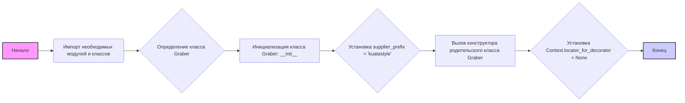

## ИНСТРУКЦИЯ:

Анализируй предоставленный код подробно и объясни его функциональность. Ответ должен включать три раздела:

1. **<алгоритм>**: Опиши рабочий процесс в виде пошаговой блок-схемы, включая примеры для каждого логического блока, и проиллюстрируй поток данных между функциями, классами или методами.
2. **<mermaid>**: Напиши код для диаграммы в формате `mermaid`, проанализируй и объясни все зависимости,
    которые импортируются при создании диаграммы.
    **ВАЖНО!** Убедитесь, что все имена переменных, используемые в диаграмме `mermaid`,
    имеют осмысленные и описательные имена. Имена переменных вроде `A`, `B`, `C`, и т.д., не допускаются!

    **Дополнительно**: Если в коде есть импорт `import header`, добавьте блок `mermaid` flowchart, объясняющий `header.py`:
    ```mermaid
    flowchart TD
        Start --> Header[<code>header.py</code><br> Determine Project Root]

        Header --> import[Import Global Settings: <br><code>from src import gs</code>]
    ```

3. **<объяснение>**: Предоставьте подробные объяснения:
   - **Импорты**: Их назначение и взаимосвязь с другими пакетами `src.`.
   - **Классы**: Их роль, атрибуты, методы и взаимодействие с другими компонентами проекта.
   - **Функции**: Их аргументы, возвращаемые значения, назначение и примеры.
   - **Переменные**: Их типы и использование.
   - Выделите потенциальные ошибки или области для улучшения.

Дополнительно, постройте цепочку взаимосвязей с другими частями проекта (если применимо).

Это обеспечивает всесторонний и структурированный анализ кода.
## Формат ответа: `.md` (markdown)
**КОНЕЦ ИНСТРУКЦИИ**

## <алгоритм>



**Примеры для каждого блока:**

*   **A (Начало)**: Начало выполнения скрипта.
*   **B (Импорт необходимых модулей и классов)**: Импортируются `header`, `Graber` (как `Grbr`), `Context`, `close_pop_up` из `src.suppliers.graber`, `Driver` из `src.webdriver.driver`, и `logger` из `src.logger.logger`.
*   **C (Определение класса `Graber`)**: Объявление класса `Graber`, который наследуется от класса `Grbr` (родительский класс `Graber`).
*   **D (Инициализация класса `Graber`: `__init__`)**: Вызывается метод `__init__` при создании экземпляра класса `Graber`. Пример: `graber_instance = Graber(driver_instance)`.
*   **E (Установка `supplier_prefix = 'kualastyle'`)**: Присваивание строкового значения `'kualastyle'` атрибуту `supplier_prefix`.
*   **F (Вызов конструктора родительского класса `Graber`)**: Вызывается метод `__init__` родительского класса (`Grbr`) с параметрами `supplier_prefix` и `driver`.
*   **G (Установка `Context.locator_for_decorator = None`)**: Установка значения `None` для атрибута `locator_for_decorator` в объекте `Context`.
*   **H (Конец)**: Завершение процесса инициализации класса.

**Поток данных:**

1.  Импортированные модули предоставляют необходимые классы и функции.
2.  Создание экземпляра `Graber` передаёт объект `Driver` в конструктор.
3.  `supplier_prefix` инициализируется и передается в конструктор родительского класса.
4.  `Context.locator_for_decorator` устанавливается в `None`.

## <mermaid>

```mermaid
flowchart TD
    Start --> ImportModules[Импорт модулей: <br> <code>typing, header, src.suppliers.graber, src.webdriver.driver, src.logger.logger</code>]
    ImportModules --> DefineGraberClass[Определение класса <code>Graber</code> (наследуется от <code>Grbr</code>)]
    DefineGraberClass --> GraberInit[Метод <code>__init__</code> класса <code>Graber</code>]
    GraberInit --> SetSupplierPrefix[Установка <code>supplier_prefix = 'kualastyle'</code>]
    SetSupplierPrefix --> CallParentInit[Вызов конструктора родительского класса <code>Grbr</code>]
    CallParentInit --> SetContextLocator[Установка <code>Context.locator_for_decorator = None</code>]
    SetContextLocator --> End[Конец]

    classDef imported fill:#ccf,stroke:#333,stroke-width:2px
    class ImportModules imported
```


**Анализ зависимостей:**

1.  **`typing`**:
    *   Используется для статической типизации, что улучшает читаемость и предотвращает ошибки.
        В данном случае используется `Any`
2.  **`header`**:
    *   Обеспечивает определение корневой директории проекта и импорт глобальных настроек.
3.  **`src.suppliers.graber`**:
    *   Импортирует базовый класс `Graber` (переименованный в `Grbr`), класс `Context`, и функцию `close_pop_up`.
    *   `Graber` (как `Grbr`) - это родительский класс, предоставляющий общую функциональность для классов, которые собирают данные с веб-сайтов.
    *   `Context` - класс, используемый для хранения глобального состояния.
    *   `close_pop_up` - функция для создания декоратора, который закрывает всплывающие окна.
4.  **`src.webdriver.driver`**:
    *   Импортирует класс `Driver`, который управляет веб-драйвером для взаимодействия с браузером.
5.  **`src.logger.logger`**:
    *   Импортирует объект `logger`, который используется для записи событий и ошибок.

## <объяснение>

**Импорты:**

*   **`typing`**:
    *   Используется для статической типизации, что делает код более читаемым и помогает отлавливать ошибки на ранних стадиях разработки. В данном случае импортируется `Any` для возможности передачи любого типа данных.
*   **`header`**:
    *   `header.py` отвечает за определение корневой директории проекта и импорт общих настроек, которые могут быть использованы в разных модулях.
        Импортируя `header` мы обеспечиваем доступ к глобальным настройкам (`gs`).
*   **`src.suppliers.graber`**:
    *   **`Graber as Grbr`**: Импортирует родительский класс `Graber` из модуля `graber.py` и переименовывает его в `Grbr`. Это сделано, чтобы не было конфликта имен с текущим классом `Graber`.
    *   **`Context`**: Импортирует класс `Context`, который используется для управления глобальным состоянием и конфигурациями в рамках граббера.
    *   **`close_pop_up`**: Импортирует функцию `close_pop_up`, которая создает декоратор для закрытия всплывающих окон перед выполнением основной логики.
*   **`src.webdriver.driver`**:
    *   Импортирует класс `Driver` из модуля `driver.py`, который используется для управления веб-драйвером и взаимодействия с браузером.
*   **`src.logger.logger`**:
    *   Импортирует объект `logger` из модуля `logger.py`, который используется для логирования ошибок и событий в процессе работы граббера.

**Классы:**

*   **`Graber(Grbr)`**:
    *   **Роль**: Класс `Graber` предназначен для сбора данных о товарах с веб-сайта `kualastyle.co.il`. Он наследует функциональность от родительского класса `Grbr`, что позволяет переиспользовать общий код для различных поставщиков.
    *   **Атрибуты**:
        *   `supplier_prefix`: Строковый атрибут, который хранит префикс поставщика (в данном случае `'kualastyle'`). Используется для идентификации поставщика в рамках системы.
    *   **Методы**:
        *   `__init__(self, driver: Driver)`: Метод инициализации класса.
            *   Принимает объект `driver` типа `Driver` в качестве аргумента.
            *   Устанавливает `self.supplier_prefix` в `'kualastyle'`.
            *   Вызывает конструктор родительского класса (`Grbr`) с параметрами `supplier_prefix` и `driver`.
            *   Устанавливает `Context.locator_for_decorator` в `None`.

**Функции:**

*   В данном коде нет явно определенных функций, кроме метода `__init__` класса `Graber`. Функция `close_pop_up` импортируется из другого модуля.

**Переменные:**

*   **`supplier_prefix`**: Строковая переменная, хранящая префикс поставщика.
*   **`driver`**: Объект класса `Driver`, используется для управления веб-драйвером.
*   **`Context.locator_for_decorator`**: Глобальная переменная, хранящая локатор для декоратора, который может быть использован для выполнения каких-либо действий перед выполнением основной логики функции (например, закрытие всплывающих окон).

**Потенциальные ошибки и области для улучшения:**

1.  **Закомментированный декоратор**: Код содержит закомментированный шаблон декоратора. Это может быть потенциальным источником путаницы. В будущем, этот код можно либо убрать, либо раскомментировать и использовать.
2.  **Обработка исключений**: В закомментированном декораторе присутствует блок `try...except` для обработки `ExecuteLocatorException`, но сам декоратор не используется. Необходимо либо его активировать, либо удалить этот блок, чтобы избежать лишнего кода.
3.  **Зависимость от `Context`**: Код полагается на глобальный объект `Context` для хранения состояния. Использование глобальных переменных может затруднить тестирование и отладку.
4.  **Отсутствие конкретной реализации методов**: Класс `Graber` наследуется от родительского класса, но в предоставленном коде нет реализации методов сбора данных. Это означает, что логика сбора данных будет реализована в родительском классе или в дочерних классах.

**Взаимосвязи с другими частями проекта:**

*   **`header.py`**: Обеспечивает глобальные настройки и корневую директорию проекта.
*   **`src.suppliers.graber`**: Предоставляет базовый класс и контекст для работы грабберов.
*   **`src.webdriver.driver`**: Поставляет драйвер для взаимодействия с браузером.
*   **`src.logger.logger`**: Обеспечивает логирование событий в процессе работы граббера.
*   Этот граббер будет использован для сбора данных с вебсайта `kualastyle.co.il` и, вероятно, будет взаимодействовать с другими частями проекта, такими как база данных для хранения собранных данных, или API для предоставления этих данных.

Этот анализ предоставляет подробное описание функциональности кода, его зависимостей, и областей, которые можно улучшить для более надежной и удобной работы.