```MD
# <input code>

```python
## \file hypotez/src/suppliers/kualastyle/header.py
# -*- coding: utf-8 -*-
#! venv/Scripts/python.exe
#! venv/bin/python/python3.12

"""
.. module: src.suppliers.kualastyle 
	:platform: Windows, Unix
	:synopsis:

"""
MODE = 'dev'


import sys
import json
from packaging.version import Version

from pathlib import Path
def set_project_root(marker_files=('pyproject.toml', 'requirements.txt', '.git')) -> Path:
    """
    Finds the root directory of the project starting from the current file's directory,
    searching upwards and stopping at the first directory containing any of the marker files.

    Args:
        marker_files (tuple): Filenames or directory names to identify the project root.
    
    Returns:
        Path: Path to the root directory if found, otherwise the directory where the script is located.
    """
    __root__:Path
    current_path:Path = Path(__file__).resolve().parent
    __root__ = current_path
    for parent in [current_path] + list(current_path.parents):
        if any((parent / marker).exists() for marker in marker_files):
            __root__ = parent
            break
    if __root__ not in sys.path:
        sys.path.insert(0, str(__root__))
    return __root__


# Get the root directory of the project
__root__ = set_project_root()
"""__root__ (Path): Path to the root directory of the project"""

from src import gs

settings:dict = None
try:
    with open(gs.path.root / 'src' /  'settings.json', 'r') as settings_file:
        settings = json.load(settings_file)
except (FileNotFoundError, json.JSONDecodeError):
    ...

doc_str:str = None
try:
    with open(gs.path.root / 'src' /  'README.MD', 'r') as settings_file:
        doc_str = settings_file.read()
except (FileNotFoundError, json.JSONDecodeError):
    ...


__project_name__ = settings.get("project_name", 'hypotez') if settings  else 'hypotez'
__version__: str = settings.get("version", '')  if settings  else ''
__doc__: str = doc_str if doc_str else ''
__details__: str = ''
__author__: str = settings.get("author", '')  if settings else ''
__copyright__: str = settings.get("copyrihgnt", '')  if settings else ''
__cofee__: str = settings.get("cofee", "Treat the developer to a cup of coffee for boosting enthusiasm in development: https://boosty.to/hypo69")  if settings else "Treat the developer to a cup of coffee for boosting enthusiasm in development: https://boosty.to/hypo69"
```

# <algorithm>

**Шаг 1:** Вызов `set_project_root(marker_files)`.
  * Входные данные: кортеж `marker_files` (по умолчанию ('pyproject.toml', 'requirements.txt', '.git')).
  * Выходные данные: `Path` к корневой директории проекта.
  * Пример: `set_project_root() ` находит корень проекта, начиная с текущей директории, и поднимается по дереву каталогов.

**Шаг 2:** Чтение файла `settings.json` в переменную `settings`
  * Входные данные: путь `gs.path.root / 'src' / 'settings.json'`.
  * Выходные данные: словарь `settings` (если файл существует и является валидным JSON), иначе `settings` остается `None`.
  * Пример: если файл существует и содержит `{"project_name": "Мой проект", "version": "1.0.0"}`, то `settings` будет содержать этот словарь.

**Шаг 3:** Чтение файла `README.MD` в переменную `doc_str`
  * Входные данные: путь `gs.path.root / 'src' / 'README.MD'`.
  * Выходные данные: строка `doc_str` (если файл существует), иначе `doc_str` остается `None`.
  * Пример: если файл README.MD существует и содержит текст "Мой замечательный проект", то `doc_str` будет содержать эту строку.


**Шаг 4:** Вывод значения переменных `__project_name__`, `__version__`, `__doc__`,  `__details__`, `__author__`, `__copyright__`, `__cofee__`
  * Входные данные: словарь `settings`, переменные `doc_str`
  * Выходные данные: значения переменных, извлеченные из `settings` или имеющие значения по умолчанию.
  * Пример: если `settings` содержит ключ `project_name` со значением "Мой проект", то `__project_name__` получит значение "Мой проект".

```mermaid
graph LR
    A[set_project_root] --> B{Find root};
    B -- marker files exist --> C[__root__ = parent];
    B -- marker files not exist --> D[__root__ = current_path];
    C --> E[sys.path.insert];
    D --> E;
    E --> F[__root__];
    F --> G[Open settings.json];
    G -- success --> H[settings];
    G -- error --> I[settings = None];
    H --> J[Open README.MD];
    J -- success --> K[doc_str];
    J -- error --> L[doc_str = None];
    K --> M[Assign variables];
    I --> M;
    L --> M;
    M --> N[__project_name__, __version__, __doc__, ...];
    subgraph "External Dependencies"
        style H fill:#f9f,stroke:#333,stroke-width:2px
        style J fill:#ccf,stroke:#333,stroke-width:2px
        style K fill:#ccf,stroke:#333,stroke-width:2px

        style G fill:#ccf,stroke:#333,stroke-width:2px

        style M fill:#ccf,stroke:#333,stroke-width:2px

        style N fill:#ccf,stroke:#333,stroke-width:2px
        style E fill:#ccf,stroke:#333,stroke-width:2px

        style F fill:#ccf,stroke:#333,stroke-width:2px
        style B fill:#ccf,stroke:#333,stroke-width:2px
        style C fill:#ccf,stroke:#333,stroke-width:2px
        style D fill:#ccf,stroke:#333,stroke-width:2px

    end
```


# <mermaid>



# <explanation>

**Импорты:**

* `sys`:  Предоставляет доступ к системным переменным, в том числе `sys.path`, что позволяет добавить пути к корневой директории проекта.
* `json`: Используется для работы с файлами JSON (чтение и декодирование данных).
* `packaging.version`: Используется для работы с версиями пакетов, но в этом конкретном случае, не используется.
* `pathlib`:  Обеспечивает объектно-ориентированный способ работы с путями к файлам.
* `src.gs`:  Вероятно, модуль, предоставляющий функции для работы с корневой директорией проекта (`gs.path.root`).

**Классы:**

Нет классов в этом коде.

**Функции:**

* `set_project_root(marker_files)`:
    *  Ищет корневую директорию проекта, поднимаясь по дереву каталогов, пока не найдет директорию, содержащую файлы из `marker_files` (по умолчанию `pyproject.toml`, `requirements.txt`, `.git`).
    *  Добавляет путь к корневой директории в `sys.path`, что позволит импортировать модули из пакета.
    *  Возвращает `Path` к корневой директории или текущей директории, если не найдена.

**Переменные:**

* `MODE`, `__root__`, `settings`, `doc_str`, `__project_name__`, `__version__`, `__doc__`, `__details__`, `__author__`, `__copyright__`, `__cofee__`:  Переменные, содержащие значения, описывающие проект (имя, версия, описание).

**Возможные ошибки и улучшения:**

* **Обработка ошибок:**  Обработка `FileNotFoundError` и `json.JSONDecodeError` в блоках `try...except` является хорошей практикой, но может быть улучшена. Например, можно выводить более информативные сообщения об ошибках или записывать их в лог-файл.
* **Типизация:**  Использование аннотаций типов (например, `-> Path` для `set_project_root`) улучшает читаемость и позволяет статическим анализаторам выявлять потенциальные ошибки.
* **Использование `logging`:** Для более детальной диагностики, можно использовать модуль `logging`, чтобы записывать информацию о поиске корневой директории и чтении файлов.

**Взаимосвязь с другими частями проекта:**

Функция `set_project_root` и чтение `settings.json` и `README.MD` предполагают, что модуль `gs` определен в другом месте проекта и обеспечивает доступ к корневой директории (`gs.path.root`). Этот модуль играет ключевую роль в установлении пути к ресурсам проекта.