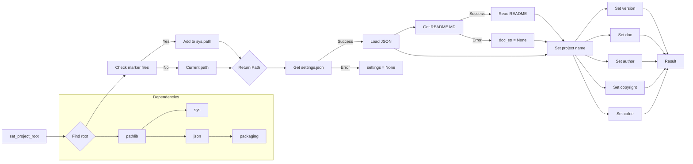

```MD
# <input code>

```python
## \file hypotez/src/suppliers/kualastyle/header.py
# -*- coding: utf-8 -*-
#! venv/Scripts/python.exe
#! venv/bin/python/python3.12

"""
.. module: src.suppliers.kualastyle 
	:platform: Windows, Unix
	:synopsis:

"""
MODE = 'dev'


import sys
import json
from packaging.version import Version

from pathlib import Path
def set_project_root(marker_files=('pyproject.toml', 'requirements.txt', '.git')) -> Path:
    """
    Finds the root directory of the project starting from the current file's directory,
    searching upwards and stopping at the first directory containing any of the marker files.

    Args:
        marker_files (tuple): Filenames or directory names to identify the project root.
    
    Returns:
        Path: Path to the root directory if found, otherwise the directory where the script is located.
    """
    __root__:Path
    current_path:Path = Path(__file__).resolve().parent
    __root__ = current_path
    for parent in [current_path] + list(current_path.parents):
        if any((parent / marker).exists() for marker in marker_files):
            __root__ = parent
            break
    if __root__ not in sys.path:
        sys.path.insert(0, str(__root__))
    return __root__


# Get the root directory of the project
__root__ = set_project_root()
"""__root__ (Path): Path to the root directory of the project"""

from src import gs

settings:dict = None
try:
    with open(gs.path.root / 'src' / 'settings.json', 'r') as settings_file:
        settings = json.load(settings_file)
except (FileNotFoundError, json.JSONDecodeError):
    ...

doc_str:str = None
try:
    with open(gs.path.root / 'src' / 'README.MD', 'r') as settings_file:
        doc_str = settings_file.read()
except (FileNotFoundError, json.JSONDecodeError):
    ...


__project_name__ = settings.get("project_name", 'hypotez') if settings  else 'hypotez'
__version__: str = settings.get("version", '')  if settings  else ''
__doc__: str = doc_str if doc_str else ''
__details__: str = ''
__author__: str = settings.get("author", '')  if settings  else ''
__copyright__: str = settings.get("copyrihgnt", '')  if settings  else ''
__cofee__: str = settings.get("cofee", "Treat the developer to a cup of coffee for boosting enthusiasm in development: https://boosty.to/hypo69")  if settings else "Treat the developer to a cup of coffee for boosting enthusiasm in development: https://boosty.to/hypo69"
```

# <algorithm>

**Шаг 1**: `set_project_root(marker_files)`

* Вход: кортеж `marker_files` с именами файлов, указывающих на корень проекта.
* Выход: путь `Path` к корню проекта.
* Действие:
    * Начинает поиск с текущего каталога.
    * Проверяет каждый родительский каталог, начиная с текущего, на наличие файлов/каталогов из `marker_files`.
    * Если один из файлов/каталогов найден, то это корень проекта, и поиск завершается.
    * Если не найден ни один из файлов/каталогов, то возвращается текущий каталог.
    * Если найден корень, то добавляет его в `sys.path`, чтобы импорты работали корректно.

**Пример**:
```
marker_files = ('pyproject.toml', 'requirements.txt')
текущий каталог = /path/to/my/project/suppliers/kualastyle
корень проекта = /path/to/my/project
```

**Шаг 2**: Чтение `settings.json`

* Вход: путь к `settings.json`
* Выход: словарь `settings` или None, если файл не найден или некорректный формат JSON.
* Действие:
    * Попытка открыть и прочитать `settings.json`
    * Если открытие и чтение прошли успешно, то загружает JSON в переменную `settings`.
    * Если произошла ошибка (FileNotFoundError или json.JSONDecodeError), то `settings` остается None.

**Пример**:
```
путь к файлу = /path/to/my/project/src/settings.json
settings = {'project_name': 'MyProject', 'version': '1.0.0'}
```


**Шаг 3**: Чтение `README.MD`

* Вход: путь к `README.MD`
* Выход: строка `doc_str` со содержимым файла или None, если файл не найден или при ошибке чтения.
* Действие:
    * Попытка открыть и прочитать `README.MD`.
    * Если открытие и чтение прошли успешно, то загружает содержимое в `doc_str`.
    * Если произошла ошибка, то `doc_str` остается None.


**Пример**:
```
путь к файлу = /path/to/my/project/src/README.MD
doc_str = "Описание проекта"
```

**Шаг 4**: Чтение настроек

* Вход: словарь `settings`
* Выход: значения переменных `__project_name__`, `__version__`, `__doc__`, `__author__`, `__copyright__`, `__cofee__`.
* Действие:
    * Использует метод `settings.get()` для извлечения значений из словаря `settings`. Если ключ не существует, возвращается значение по умолчанию.

# <mermaid>



**Подключаемые зависимости:**

* `pathlib`: для работы с путями к файлам.
* `sys`: для доступа к системным переменным, включая `sys.path`.
* `json`: для работы с файлом `settings.json`.
* `packaging`: для работы с версиями пакетов.


# <explanation>

**Импорты:**

* `sys`: предоставляет доступ к системным переменным и функциям, в частности, к `sys.path`.
* `json`: используется для работы с файлами в формате JSON.
* `packaging.version`: используется для работы с версиями пакетов.
* `pathlib`: предоставляет объектно-ориентированный способ работы с путями.
* `src import gs`:  Подключает модуль `gs`, скорее всего, содержащий вспомогательные функции для работы с путями проекта.  Это ключевая зависимость, указывающая на структуру проекта и взаимодействие между модулями.


**Классы:**

Нет определенных классов.


**Функции:**

* `set_project_root(marker_files)`: находит корневой каталог проекта, начиная с текущего файла и ища указанные файлы (например, `pyproject.toml`). Возвращает `Path` к корневому каталогу.  Эта функция крайне важна для корректной работы импорта модулей и поиска других файлов конфигурации проекта.


**Переменные:**

* `MODE`, `__root__`, `settings`, `doc_str`: глобальные переменные, хранящие различные данные.
* `__project_name__`, `__version__`, `__doc__`, `__author__`, `__copyright__`, `__cofee__`:  переменные, содержащие информацию о проекте, полученную из `settings.json` или установленные по умолчанию.

**Возможные ошибки и улучшения:**

* **Обработка ошибок:**  Код содержит `try...except` блоки для обработки `FileNotFoundError` и `json.JSONDecodeError`.  Это хорошо, но можно добавить более подробные сообщения об ошибках для отладки.
* **Управление зависимостями:**  Если `gs` используется во многих частях проекта,  можно вынести его в отдельный файл, чтобы избежать дублирования кода и упростить управление импортами.
* **Документация:**  Добавить более подробную документацию к функциям и переменным.
* **Типизация:**  Можно использовать более сложную типизацию, например, annotate variables, чтобы улучшить читаемость и помочь статическому анализатору.


**Взаимосвязи с другими частями проекта:**

Функция `set_project_root` является ключевой для нахождения корневого каталога, что важно для поиска `settings.json` и `README.MD`, а также корректного импорта модулей из `src`.  Это подразумевает, что проект имеет структуру, где модули расположены в `src` каталоге, а конфигурационные файлы хранятся в корневом каталоге.  `gs` модуль важен для корректной работы с путями внутри проекта.