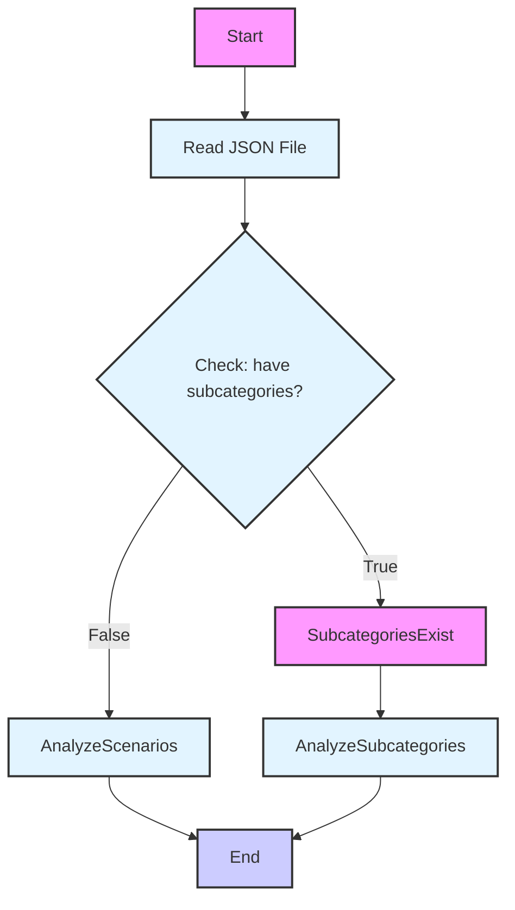

## АНАЛИЗ КОДА

### <алгоритм>
1. **Начало**: Чтение JSON-файла, описывающего категорию товаров "מראות" (зеркала).
2. **Проверка подкатегорий**: Анализ ключа `"have subcategories"`. Значение `false` указывает на отсутствие подкатегорий.
3. **Анализ сценариев**: Ключ `"scenarios"` содержит пустой словарь, что означает отсутствие сценариев для данной категории.
4. **Конец**: Завершение обработки JSON-файла.

**Примеры:**

- **`"category name on site": "מראות"`**: Обозначает, что категория товаров называется "מראות" (зеркала) на сайте.
- **`"have subcategories": false`**: Указывает, что у категории "מראות" нет подкатегорий.
- **`"scenarios": {}`**: Демонстрирует отсутствие каких-либо сценариев для категории "מראות".

### <mermaid>

**Описание диаграммы:**

- **`Start`**: Начальная точка процесса.
- **`ReadJSON[Read JSON File]`**: Чтение содержимого JSON-файла `kualastyle_categories_mirrors.json`.
- **`CheckSubcategories{Check: have subcategories?}`**: Проверка наличия подкатегорий (`"have subcategories"`). Если `true`, то переходим к блоку `SubcategoriesExist`, если `false` - к `AnalyzeScenarios`.
- **`SubcategoriesExist`**: Блок, обрабатывающий наличие подкатегорий.
- **`AnalyzeSubcategories`**: Блок обработки данных, если есть подкатегории
- **`AnalyzeScenarios`**: Анализ сценариев (`"scenarios"`). В данном случае он пустой.
- **`End`**: Конечная точка процесса.

### <объяснение>

**Импорты:**
В данном коде нет импортов, так как это чистый JSON-файл.

**Классы:**
В данном коде нет классов, так как это JSON-файл с описанием данных.

**Функции:**
В данном коде нет функций, так как это JSON-файл с описанием данных.

**Переменные:**
-   **`"category name on site"`**: Строка, представляющая название категории товара на сайте (в данном случае "מראות").
-   **`"have subcategories"`**: Булево значение, указывающее наличие подкатегорий (в данном случае `false`).
-   **`"scenarios"`**: Словарь, содержащий сценарии для данной категории (в данном случае пустой словарь `{}`).

**Объяснение:**
Этот JSON-файл представляет собой конфигурацию для категории товаров "מראות" (зеркала) для поставщика Kualastyle.  Он описывает, что категория не имеет подкатегорий, и в ней нет настроенных сценариев.
Файл используется как часть процесса обработки и каталогизации данных о товарах для сайта. Структура позволяет системе автоматически обрабатывать категории и подкатегории, а также настраивать различные сценарии взаимодействия.
Пустой словарь `scenarios` означает, что пока для данной категории нет специфических сценариев, которые нужно было бы выполнять.

**Потенциальные ошибки или области для улучшения:**
-   На данный момент отсутствуют сценарии, что может ограничивать функциональность для данной категории. В будущем может потребоваться добавление настроек и сценариев.

**Взаимосвязи с другими частями проекта:**
Данный JSON-файл вероятно используется как входные данные для какого-то скрипта или компонента, который обрабатывает каталоги товаров. Этот скрипт может читать данные из JSON и на их основе генерировать структуру категорий на сайте, а также настраивать поведение системы в зависимости от настроек. В частности, обработка JSON-файла может вести к вызову других модулей проекта, например для запроса данных о товарах, соответствующих данной категории.