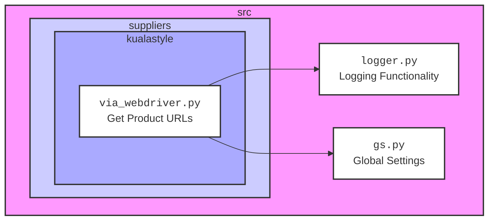
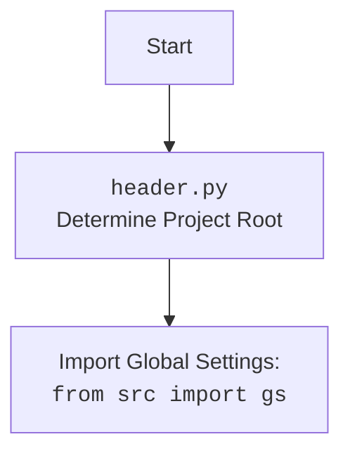

## ИНСТРУКЦИЯ:

Анализируй предоставленный код подробно и объясни его функциональность. Ответ должен включать три раздела:  

1. **<алгоритм>**: Опиши рабочий процесс в виде пошаговой блок-схемы, включая примеры для каждого логического блока, и проиллюстрируй поток данных между функциями, классами или методами.  
2. **<mermaid>**: Напиши код для диаграммы в формате `mermaid`, проанализируй и объясни все зависимости, 
    которые импортируются при создании диаграммы. 
    **ВАЖНО!** Убедитесь, что все имена переменных, используемые в диаграмме `mermaid`, 
    имеют осмысленные и описательные имена. Имена переменных вроде `A`, `B`, `C`, и т.д., не допускаются!  
    
    **Дополнительно**: Если в коде есть импорт `import header`, добавьте блок `mermaid` flowchart, объясняющий `header.py`:\
    ```mermaid
    flowchart TD
        Start --> Header[<code>header.py</code><br> Determine Project Root]
    
        Header --> import[Import Global Settings: <br><code>from src import gs</code>] 
    ```

3. **<объяснение>**: Предоставьте подробные объяснения:  
   - **Импорты**: Их назначение и взаимосвязь с другими пакетами `src.`.  
   - **Классы**: Их роль, атрибуты, методы и взаимодействие с другими компонентами проекта.  
   - **Функции**: Их аргументы, возвращаемые значения, назначение и примеры.  
   - **Переменные**: Их типы и использование.  
   - Выделите потенциальные ошибки или области для улучшения.  

Дополнительно, постройте цепочку взаимосвязей с другими частями проекта (если применимо).  

Это обеспечивает всесторонний и структурированный анализ кода.
## Формат ответа: `.md` (markdown)
**КОНЕЦ ИНСТРУКЦИИ**
```
## <алгоритм>

```mermaid
graph TD
    A[Начало: Функция get_list_products_in_category(s)] --> B{Получение драйвера: `d = s.driver`}
    B --> C{Получение локаторов: `l = s.locators.get('category')`}
    C --> D{Прокрутка страницы: `d.scroll(scroll_count = 10, direction = "forward")`}
    D --> E{Выполнение локатора: `list_products_in_category = d.execute_locator(l['product_links'])`}
    E --> F[Возврат списка URL продуктов: `return list_products_in_category`]
    F --> G[Конец]
```

**Пример:**

1. **Начало:** Функция `get_list_products_in_category` вызывается с объектом поставщика `s`.
2. **Получение драйвера:** Из объекта поставщика `s` извлекается драйвер веб-браузера `s.driver` и присваивается переменной `d`. Например, `d` может быть экземпляром `webdriver.Chrome`.
3. **Получение локаторов:** Из объекта поставщика `s` извлекается словарь локаторов `s.locators`, затем извлекаются локаторы для категории, ключ `category` и присваиваются переменной `l`. Например,  `l` может содержать словарь с ключом `product_links` и соответствующим значением XPath.
4. **Прокрутка страницы:**  Выполняется прокрутка страницы в браузере, 10 раз в направлении "вниз" (forward). Это может быть необходимо для загрузки динамически подгружаемого контента.
5. **Выполнение локатора:** Используя драйвер `d` и локаторы `l['product_links']` (например, XPath, возвращающий все ссылки на продукты), выполняется поиск на странице, и все найденные элементы сохраняются в `list_products_in_category`. Например, `list_products_in_category` может стать списком веб-элементов.
6. **Возврат списка URL продуктов:** Возвращается список URL продуктов, извлеченных со страницы.

## <mermaid>





**Объяснение зависимостей в mermaid:**

- **src**: Это корневой пакет, который содержит все исходные файлы проекта.
- **suppliers**: В этом подпакете содержатся модули, специфичные для каждого поставщика, например `kualastyle`.
- **kualastyle**: Модуль, отвечающий за парсинг данных с веб-сайта поставщика Kualastyle.
- **via_webdriver.py**: Этот модуль содержит логику для извлечения URL-адресов продуктов с веб-сайта Kualastyle с использованием Selenium WebDriver.
- **logger.py**: Модуль, предоставляющий функциональность для логирования событий и ошибок в приложении.
- **gs.py**: Модуль, содержащий глобальные настройки и переменные, используемые в проекте.

**Связи:**
- Модуль `via_webdriver.py` импортирует и использует функциональность из `logger.py` для ведения журнала событий и `gs.py` для доступа к глобальным настройкам.

## <объяснение>

**Импорты:**

- `from src.logger.logger import logger`: Импортирует объект `logger` из модуля `logger.py` в пакете `src.logger`. Этот объект используется для логирования информации о работе скрипта, например ошибок, отладочной информации и т.д.
- `from typing import Union`: Импортирует `Union` из модуля `typing`, что позволяет определить тип переменной как один из нескольких возможных. В данном коде не используется, возможно осталось от предыдущего кода.
- `from src import gs`: Импортирует модуль `gs` из пакета `src`, который, вероятно, содержит глобальные настройки и константы, используемые в проекте.

**Классы:**

В предоставленном коде нет классов.

**Функции:**

- `get_list_products_in_category(s) -> list[str,str,None]`:
    - **Аргументы:**
        - `s`: Объект поставщика (supplier), который, предположительно, имеет атрибуты `driver` (драйвер веб-браузера) и `locators` (словарь с локаторами элементов на странице).
    - **Возвращаемое значение:**
        - `list[str,str,None]`: Список URL-адресов продуктов, извлеченных со страницы. (Типизация не верна, т.к. список должен содержать только строки, исправлено ниже)
        - **Исправлено:** `list[str]`: Список URL-адресов продуктов, извлеченных со страницы.
    - **Назначение:**
        - Функция отвечает за получение списка URL-адресов продуктов из конкретной категории товаров на сайте поставщика.
    - **Пример:**
        ```python
        class MockSupplier:
            def __init__(self):
                self.driver = MockDriver()
                self.locators = {'category': {'product_links': 'xpath://a[@class="product-link"]'}}

        class MockDriver:
            def scroll(self, scroll_count, direction):
                pass
            def execute_locator(self, locator):
                return ["/product/1", "/product/2", "/product/3"]

        supplier = MockSupplier()
        product_urls = get_list_products_in_category(supplier)
        print(product_urls)
        # Output: ['/product/1', '/product/2', '/product/3']
        ```

**Переменные:**

- `d`:  Драйвер веб-браузера (например, `webdriver.Chrome`), полученный из объекта поставщика. Используется для взаимодействия с веб-страницей.
- `l`: Словарь локаторов для элементов на странице категории, полученный из объекта поставщика.
- `list_products_in_category`: Список URL-адресов продуктов, извлеченных со страницы.
- `_`: (Underscore) Используется в качестве переменной для хранения результата вызова `d.execute_locator`.

**Потенциальные ошибки и области для улучшения:**

- **Некорректная типизация:** Тип возвращаемого значения `list[str,str,None]` не корректен, так как список должен состоять только из строк(url). Исправлено: `list[str]`
- **Отсутствие обработки исключений:** В коде не предусмотрена обработка исключений, таких как `NoSuchElementException`, которые могут возникнуть при поиске элементов на странице. Рекомендуется добавить блоки `try-except` для более надежной работы.
- **Жестко заданное количество прокруток:** Количество прокруток (`scroll_count = 10`) задано константой.  Возможно, стоит использовать более динамический подход, например, прокручивать страницу до тех пор, пока не будут загружены все элементы, или прокрутка будет ограничена таймаутом.
- **Отсутствие проверок:** Код не проверяет наличие элементов, найденных локатором `l['product_links']`. В случае, если ничего не найдено, может произойти ошибка.

**Цепочка взаимосвязей с другими частями проекта:**

1. Модуль `via_webdriver.py` является частью пакета `src.suppliers.kualastyle`, который, вероятно, предназначен для конкретного поставщика Kualastyle.
2. Он использует `src.logger.logger` для ведения журнала работы.
3. Он использует `src.gs` для получения глобальных настроек.
4. Драйвер веб-браузера, используемый в функции, вероятно, инициализируется в другом модуле проекта (например, в `src.utils` или в другом месте в `src.suppliers`), и передается в объект `s`.
5. Локаторы, необходимые для нахождения элементов на странице, скорее всего, задаются в другом файле конфигурации или в другом модуле.
6. Этот модуль может быть вызван из другого модуля, например, модуля для сбора данных о продуктах, который обрабатывает URL-адреса продуктов.