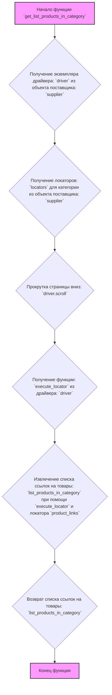
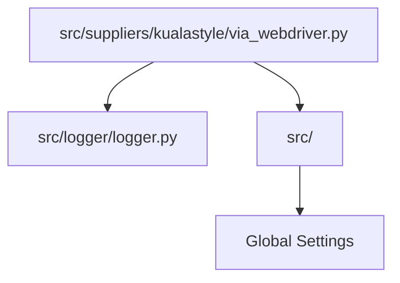
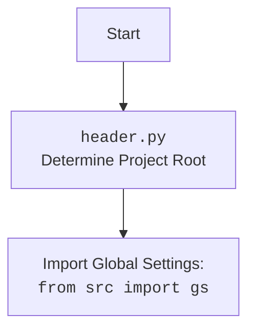

## АНАЛИЗ КОДА: `hypotez/src/suppliers/kualastyle/via_webdriver.py`

### 1. <алгоритм>

**Блок-схема:**

```mermaid
flowchart TD
    A[Начало функции `get_list_products_in_category`] --> B{Получение экземпляра драйвера (d) из объекта поставщика (s)};
    B --> C{Получение локаторов (l) для категории из объекта поставщика (s)};
    C --> D{Прокрутка страницы вниз 10 раз (d.scroll)};
    D --> E{Получение функции `execute_locator` из драйвера};
    E --> F{Извлечение списка ссылок на товары (list_products_in_category) при помощи `execute_locator` и локатора `product_links`};
    F --> G{Возврат списка ссылок на товары `list_products_in_category`};
    G --> H[Конец функции];
```

**Примеры:**

1. **Начало:** Функция `get_list_products_in_category` вызывается с объектом поставщика `s`.
2. **Получение драйвера:** `d = s.driver` - Извлекается объект webdriver, для взаимодействия со страницей.
3. **Получение локаторов:** `l = s.locators.get('category')` - Извлекается словарь с локаторами элементов страницы, для текущей категории.
   ```python
   # Пример структуры l
   l = {
       'product_links': {
            'type': 'css selector',
            'locator': 'a.product-link'
        }
   }
   ```
4. **Прокрутка страницы:** `d.scroll(scroll_count = 10, direction = "forward")` - Страница прокручивается 10 раз, чтобы гарантировать, что все товары подгрузились.
5. **Получение `execute_locator`:**  `_ = d.execute_locator` - Получение функции для поиска элементов на странице, опираясь на ранее заданные локаторы.
6. **Извлечение ссылок на товары:** `list_products_in_category = _(l['product_links'])` - Используя функцию `execute_locator` и локатор `product_links` (например, `a.product-link`), на странице находятся все соответствующие элементы. В результате, формируется список веб элементов.
    ```python
    # Пример структуры list_products_in_category (после вызова execute_locator)
    list_products_in_category = [
       <selenium.webdriver.remote.webelement.WebElement (session="...", element="...")>,
       <selenium.webdriver.remote.webelement.WebElement (session="...", element="...")>,
       # и так далее...
    ]
    ```
7. **Возврат списка ссылок:** Функция возвращает список `list_products_in_category`.
8. **Конец:** Функция завершает работу.

### 2. <mermaid>



**Объяснение:**

*   **`flowchart TD`**: Объявляет диаграмму типа "блок-схема" с направлением сверху вниз.
*   **`A[Начало функции get_list_products_in_category]`**: Начало процесса, когда функция вызывается.
*   **`B{Получение экземпляра драйвера: driver из объекта поставщика: supplier}`**: Из объекта `supplier` извлекается драйвер браузера (`driver`).
*   **`C{Получение локаторов: locators для категории из объекта поставщика: supplier}`**: Из объекта `supplier` извлекаются локаторы для текущей категории товаров (`locators`).
*   **`D{Прокрутка страницы вниз: driver.scroll}`**: Выполняется прокрутка страницы вниз для загрузки всех товаров на странице.
*   **`E{Получение функции: execute_locator из драйвера: driver}`**: Из драйвера извлекается функция `execute_locator`, которая используется для поиска элементов на странице.
*   **`F{Извлечение списка ссылок на товары: list_products_in_category при помощи execute_locator и локатора product_links}`**: С помощью `execute_locator` и локатора `product_links` извлекается список элементов, представляющих ссылки на товары.
*   **`G{Возврат списка ссылок на товары: list_products_in_category}`**: Функция возвращает список найденных ссылок на товары.
*    **`H[Конец функции]`**: Конец работы функции.
*   **`classDef classFill fill:#f9f,stroke:#333,stroke-width:2px`**: Определяет стиль для классов, выделяя начало и конец работы функции.
*   **`class A,H classFill`**: Применяет стиль к началу и концу работы функции.

**Импорты:**

В коде используются следующие импорты, которые не отображены в диаграмме `mermaid`, но играют важную роль:

*   `from src.logger.logger import logger`:  Импортируется объект `logger` из модуля `src.logger.logger`. Этот объект используется для логирования различных событий и отладки.
*   `from typing import Union`: Импортируется `Union` из модуля `typing`, чтобы объявлять тип с объединением нескольких вариантов.
*   `from src import gs`: Импортируется глобальные настройки `gs` из пакета `src`.

### 3. <объяснение>

**Импорты:**

*   `from src.logger.logger import logger`:
    *   **Назначение**: Импортирует объект `logger` для записи сообщений (логирование) о ходе выполнения программы.
    *   **Взаимосвязь**: Используется внутри функции `get_list_products_in_category`, но в текущем коде не используется.
*   `from typing import Union`:
    *   **Назначение**: Импортирует `Union` для определения типов переменных, которые могут принимать несколько типов значений.
    *   **Взаимосвязь**: В текущем коде `Union` не используется, но он является частью стандартной библиотеки `typing` и может использоваться для аннотации типов.
*    `from src import gs`:
    *    **Назначение**: Импортирует глобальные настройки из модуля `src`.
    *    **Взаимосвязь**: `gs` используется для доступа к глобальным настройкам проекта, которые могут влиять на работу программы, но в коде не используется.

**Функции:**

*   `get_list_products_in_category(s) -> list[str, str, None]`:
    *   **Аргументы**:
        *   `s`: Объект, представляющий поставщика (supplier), который должен иметь атрибуты `driver` (объект webdriver) и `locators` (словарь локаторов).
    *   **Возвращаемое значение**:
        *   `list[str, str, None]`: Список строк, представляющих ссылки на товары. В текущем коде возвращаемый тип аннотирован не верно, `list[str, str, None]` -  это список с  типом элементов `str`, `str` или `None`, но `list_products_in_category` возвращает `list[WebElement]`
    *   **Назначение**: Извлекает список ссылок на товары со страницы категории, используя драйвер веб-браузера и локаторы, предоставленные объектом поставщика.
    *   **Примеры**:
        ```python
        # Пример вызова
        supplier_obj = ... # Объект поставщика
        product_links = get_list_products_in_category(supplier_obj)
        print(product_links) # Выведет список ссылок на товары
        ```
        ```python
        # Пример структуры supplier_obj
        supplier_obj = {
            "driver": <selenium.webdriver.chrome.webdriver.WebDriver>, #  объект webdriver
            "locators": {
                "category":{
                'product_links': {
                    'type': 'css selector',
                    'locator': 'a.product-link'
                    }
                }
            }
        }
        ```

**Переменные:**

*   `d`: Объект веб-драйвера, извлеченный из `s.driver`. Используется для управления браузером.
*   `l`: Словарь локаторов для категории, полученный из `s.locators.get('category')`.
*   `_`:  Функция `execute_locator` из драйвера, для поиска элементов по локатору.
*   `list_products_in_category`: Список веб-элементов, найденных на странице, которые представляют собой ссылки на товары.

**Потенциальные ошибки и области для улучшения:**

1.  **Аннотация типов:** Тип возвращаемого значения функции `get_list_products_in_category` (`list[str,str,None]`) не соответствует фактическому возвращаемому значению (списку WebElement). Это нужно исправить.
2.  **Обработка ошибок:** Отсутствует обработка исключений, например, если не удается найти элементы на странице. Следует добавить блоки `try-except` для обработки потенциальных ошибок при использовании webdriver.
3. **Не используется logger:** В коде импортируется logger, но не используется.
4.  **Не используется `gs`:** Глобальные настройки импортируются, но не используются. Нужно добавить логику использования глобальных настроек.
5.  **Не явная работа с веб-элементами:** После получения списка элементов `list_products_in_category`, необходимо извлекать из них ссылки (атрибут href) и возвращать именно список строк, а не список `WebElement`
6.  **Улучшение читаемости:** Переменную `_` можно переименовать в `execute_locator`, для более явного использования.

**Взаимосвязь с другими частями проекта:**

*   Этот файл (`via_webdriver.py`) является частью пакета `src.suppliers.kualastyle`. Он предназначен для получения данных о товарах с сайта `kualastyle`.
*   Он использует драйвер веб-браузера (предположительно, из `src.webdriver_utils`) для навигации по сайту и поиска элементов.
*   Данные, полученные из этой функции, вероятно, будут использоваться для дальнейшего парсинга и обработки информации о товарах (например, в других модулях, которые обрабатывают полученный список ссылок, либо скачивают информацию со страниц товаров).
*   Модуль зависит от объекта поставщика `s`, который в свою очередь вероятно содержит в себе настройки поставщика и другие нужные зависимости.

**Цепочка взаимосвязей:**

```
src (пакет)
    ├── suppliers (пакет)
    │   └── kualastyle (пакет)
    │       ├── via_webdriver.py (текущий файл)
    │       └── ...
    ├── logger (пакет)
    │   └── logger.py
    └── ...
```

