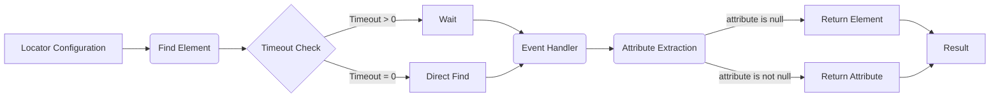

```MD
# Анализ файла locator.md

## <input code>

```
Here is the English translation for the updated `locator.ru.md` file, including the new `timeout` and `timeout_for_event` keys:

---

# Field Locators on an `HTML` Page

### Example Locator:

```json
"close_banner": {
    "attribute": null, 
    "by": "XPATH",
    "selector": "//button[@id = 'closeXButton']",
    "if_list": "first",
    "use_mouse": false,
    "mandatory": false,
    "timeout": 0,
    "timeout_for_event": "presence_of_element_located",
    "event": "click()",
    "locator_description": "Close the pop-up window. If it doesn't appear — no problem (`mandatory`: `false`).",
  },
  // ... (остальные локейторы)
```
```

## <algorithm>

**Блок-схема (в формате Markdown, так как mermaid не поддерживается):**

**Шаг 1: Поиск элемента (функция locator).**
  * Вход: JSON-конфигурация локейтора.
  * Алгоритм:
     * Используя значение ключа `by` (XPATH, ID, и т.д.), формируется объект поиска веб-элемента.
     * Используя значение ключа `selector`,  формируется условие поиска по выбранному типу.
     * Если ключ `if_list` определен, выполняется фильтрация по списку найденных элементов.
     * Пример:  `selector` = "//button[@id = 'closeXButton']", `if_list` = "first" - выбирается первый найденный элемент с указанным id.
     * Проверяется `timeout`. Если `timeout` > 0, выполняется ожидание с заданным тайм-аутом.
     * Выход: Найденный веб-элемент или None, если элемент не найден в течение таймаута.

**Шаг 2: Обработка события (функция event).**
 * Вход: Найденный веб-элемент и значения из JSON.
 * Алгоритм:
   * Если `event` определен, выполняется указанное действие (например, `click()`, `screenshot()`).
   * Выход:  Измененный веб-элемент или None, если событие не выполнилось.
   
**Шаг 3: Получение атрибута (функция attribute).**
 * Вход: Результат шага 2 (веб-элемент) и значение из JSON.
 * Алгоритм:
   * Если `attribute` определен, извлечение значения из указанного атрибута.
   * Пример: `attribute` = "innerText" - возвращается текст внутри элемента.
   * Если `attribute` = null, возвращается сам веб-элемент.
   * Выход: Значение атрибута или сам веб-элемент.

**Шаг 4: Обработка списка (функция if_list).**
   * Вход: Список найденных элементов, ключ `if_list`.
   * Алгоритм:
     * Выбирается элемент согласно значению `if_list` ("first", "last", "all").
     * Выход: Результат выбора одного или всех элементов.


## <mermaid>



## <explanation>

**Импорты:**
Файл `locator.md` не содержит импортов.  Он описывает структуру данных для локейторов веб-элементов, используемых для автоматизации тестирования веб-приложений.

**Классы:**
Файл не содержит классов. Описывается словарь (JSON-формат) для задания локейторов элементов.

**Функции:**
Нет явных функций, но описаны логические операции, выполняемые при обработке локейторов.  Файл описывает структуру данных, а не реализацию функций.

**Переменные:**
Ключи и значения в словаре, описывающие локейтор.  Типы данных: строки, числа, булевы значения.  Примеры: `"attribute": "src"`, `"timeout": 0`, `"mandatory": true`.

**Возможные ошибки/улучшения:**

* **Отсутствует обработка ошибок:** Не описаны механизмы обработки ошибок при поиске элементов (например, элемент не найден).
* **Неопределенный контекст:**  Не указано, какой фреймворк (Selenium, Playwright) или библиотека (например, python library) используется для взаимодействия с веб-элементами.  Это необходимо для точного понимания реализации.
* **Сложность обработки списков:**  Необходимо детальнее описать, как обрабатываются списки `attribute`, `by`, `selector`, `event` и как происходит выбор элемента из списка при  `if_list`.
* **Сложность обработки событий:** Разнообразные типы событий (например, `click()`, `send_message()`, `screenshot()`) потребуют отдельной реализации.
* **Не хватает документации:** Недостаточно информации по интеграции с другими частями проекта (`ProductFields` class).  Важно знать, как эти локейторы используются в тестах и какие данные они передают.


**Цепочка взаимосвязей:**

Локейторы (`locator.md`) определяют, как найти элементы на веб-странице.  Они используются другими частями проекта, например, классом `ProductFields`, который, вероятно, отвечает за извлечение данных с использованием этих локейторов. Цепочка взаимосвязей:  `ProductFields` -> `locator.md` ->  (код тестирования).


**Примечания:**  Данный анализ основывается исключительно на предоставленном `.md` файле.  Для более глубокого анализа нужен код, в котором используются эти локейторы.