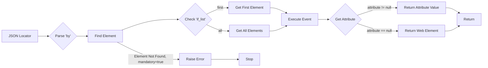

# Field Locators on the `HTML` Page

### Example Locator:

```json
  "close_banner": {
    "attribute": null, 
    "by": "XPATH",
    "selector": "//button[@id = 'closeXButton']",
    "if_list": "first",
    "use_mouse": false,
    "mandatory": false,
    "event": "click()",
    "locator_description": "Closes the pop-up window. If it doesn’t appear, it’s not critical (`mandatory`:`false`)."
  },
  "additional_images_urls": {
    "attribute": "src",
    "by": "XPATH",
    "selector": "//ol[contains(@class, 'flex-control-thumbs')]//img",
    "if_list": "all",
    "use_mouse": false,
    "mandatory": false,
    "event": null,
    "locator_description": "Retrieves a list of `URL`s for additional images."
  },
  "id_supplier": {
    "attribute": "innerText",
    "by": "XPATH",
    "selector": "//span[@class = 'ltr sku-copy']",
    "if_list": "first",
    "use_mouse": false,
    "mandatory": true,
    "event": null,
    "locator_description": "SKU for Morlevi."
  },
  "default_image_url": {
    "attribute": null,
    "by": "XPATH",
    "selector": "//a[@id = 'mainpic']//img",
    "if_list": "first",
    "use_mouse": false,
    "event": "screenshot()",
    "mandatory": true,
    "locator_description": "Attention! In Morlevi, the image is captured via a screenshot and returned as a PNG (`bytes`)."
  }
```

### <algorithm>

**Пошаговая блок-схема:**

1. **Получение локейтора:**  Программа получает JSON-объект, содержащий информацию о локейторе (например, `close_banner`).
2. **Определение типа поиска:**  Интерпретируется значение поля `by` (например, "XPATH").
3. **Локализация элемента:**  Используя заданный `selector` (например, `//button[@id = 'closeXButton']`), на странице ищется элемент.
4. **Обработка списка элементов:**  Если `if_list` указано значение, отличное от `first`, программа ищет все элементы, соответствующие `selector` (например, `all`).  В случае `first` выбирается первый найденный.
5. **Выполнение действия (event):** Если `event` указан (например, `click()`), выполняется соответствующее действие на найденном элементе.
6. **Извлечение атрибута:**  Если `attribute` указан (например, `innerText`), извлекается значение указанного атрибута. Если `attribute` равен `null`, возвращается сам элемент.
7. **Обработка ошибки:**  Если `mandatory` равно `true` и элемент не найден, генерируется исключение.
8. **Возврат данных:**  Результат (атрибут или элемент) возвращается.

**Пример:**

Для локейтора `id_supplier` алгоритм выполняется так:
1. Локейтор извлекается.
2. Тип поиска – `XPATH`.
3. По `//span[@class = 'ltr sku-copy']` находим элемент.
4. `if_list` – `first`, поэтому берется только первый.
5. `event` отсутствует.
6. `attribute` – `innerText`, поэтому извлекается текст элемента.
7. `mandatory` – `true`. Если элемент не найден, генерируется ошибка.
8. Возвращается значение `innerText` найденного элемента.

### <mermaid>



### <explanation>

**Импорты:**
Нет явных импортов в представленном коде.  Это JSON-описание локейторов.  Импорты, необходимые для работы с этими локейторами, должны быть сделаны в другом коде, где используется данное описание. Например, импорт `webdriver` для управления браузером.


**Классы:**
Нет классов в представленном коде.


**Функции:**
Нет функций в представленном коде.


**Переменные:**
Переменные - это поля `attribute`, `by`, `selector`, `if_list`, `event`, `mandatory`, `locator_description` в JSON объектах.


**Возможные ошибки или области для улучшений:**

* **Типизация данных:**  JSON структура не явным образом указывает типы данных для каждого поля (например, string, boolean, list).  Это может привести к ошибкам во время работы программы, если ожидается другой тип.  Использование более строгой схемы JSON (например,  с помощью библиотеки `dataclasses` в Python) повысит надежность.
* **Обработка ошибок:**  Хотя в коде описана обработка случая, когда `mandatory`  равно `true` и элемент не найден,  не описана обработка других ошибок (например, если в `selector` есть синтаксическая ошибка). Добавление обработки исключений (try-except блоков) улучшит устойчивость кода.
* **Связь с другими частями проекта:** Локейторы должны использоваться в методах классов, отвечающих за взаимодействие с веб-страницей (например, в классах из пакета `src.pages`).  Необходимо обеспечить корректный механизм загрузки и использования этих данных. Локейторы не хранят информацию о том, *где* их использовать. Это нужно прописывать в другом месте.
* **Отсутствие проверки ввода:** Не описаны проверки корректности вводимых значений для локейторов, что может привести к проблемам в работе.
* **Избыточные `selector`:** Использование отдельных `selector` для `attribute` и `event` может быть избыточным, если в каждом локейторе только один запрос.


**Цепочка взаимосвязей с другими частями проекта:**

Описание локейторов `(hypotez/src/suppliers/locator.md)` должно использоваться в других частях проекта `(src.pages)` для поиска и взаимодействия с веб-элементами.  Например, `ProductFields` класс определяет, какие поля нужно получить и с помощью каких локейторов.  Методы, работающие с веб-страницей, будут использовать эти локейторы для поиска и работы с элементами.