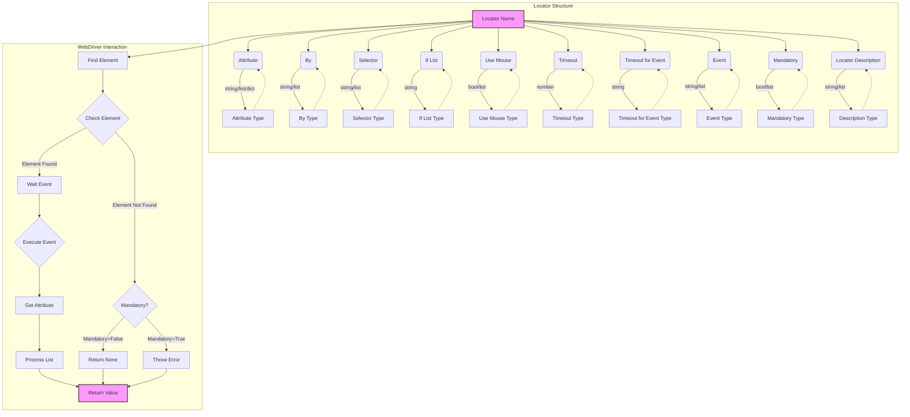

## Анализ кода: Локаторы полей на HTML-странице

### 1. <алгоритм>

**Общее описание:**
Этот код описывает структуру JSON для хранения локаторов веб-элементов на странице. Локаторы используются для автоматизированного поиска и взаимодействия с элементами на веб-странице с помощью Selenium WebDriver.
Каждый локатор представляет собой словарь, который содержит информацию о том, как найти элемент, какое действие с ним выполнить, какой атрибут получить и т.д.

**Блок-схема:**

```mermaid
graph TD
    A[Начало: Чтение файла локаторов] --> B{Для каждого локатора};
    B -- Да --> C[Извлечение параметров локатора];
    C --> D{Проверка типа локатора};
    D -- Простой локатор --> E[Поиск элемента по стратегии (`by`) и селектору (`selector`)];
    D -- Локатор-список --> F[Итерирование по списку параметров];
    F --> E;
     D -- Локатор-словарь --> G[Итерация по ключам словаря]
     G --> E;

    E --> H{Элемент найден?};
    H -- Да --> I{Ожидание события};
    I --> J{Выполнить событие (`event`) если есть};
        J --> K{Получить атрибут (`attribute`)};
    H -- Нет --> L{Проверка `mandatory`};
    L -- `mandatory=true` --> M[Выбросить ошибку];
    L -- `mandatory=false` --> N[Вернуть `None`];
    K --> O{Обработка списка элементов (`if_list`)};
    O --> P[Возврат результата];

     N --> P
    
    B -- Нет --> P;
    M --> P;
   
    P --> Q[Конец]

    style A fill:#f9f,stroke:#333,stroke-width:2px
    style Q fill:#f9f,stroke:#333,stroke-width:2px
```

**Примеры по блокам:**

1.  **Начало: Чтение файла локаторов**: 
    *   `locators = json.load(open("product.json"))` - Загружается JSON файл, содержащий словари локаторов.
2.  **Для каждого локатора**:
    *   `for locator_name, locator_params in locators.items():` - Проходится по каждому локатору в загруженном словаре.
3.  **Извлечение параметров локатора**:
    *   Извлекаются значения `attribute`, `by`, `selector`, `if_list`, `use_mouse`, `timeout`, `timeout_for_event`, `event`, `mandatory`, `locator_description` для каждого локатора.
4.  **Проверка типа локатора**:
    *   Проверяется тип данных каждого параметра (`attribute`, `by`, `selector` и др.). Это может быть строка, список или словарь.
5.  **Простой локатор**:
    *   Пример: `"close_banner": {"attribute": null, "by": "XPATH", "selector": "//button[@id = 'closeXButton']", ...}`.
    *   Поиск элемента с помощью `driver.find_element(By.XPATH, "//button[@id = 'closeXButton']")`.
6.  **Локатор-список**:
    *   Пример: `"sample_locator": {"attribute": [null, "href"], "by": ["XPATH", "XPATH"], "selector": ["//a[contains(@href, '#tab-description')]", "//div[@id = 'tab-description']//p"], ...}`.
    *   Для каждого элемента списка выполняется поиск элемента и действие.
7.  **Локатор-словарь**:
    *  Пример: `"sample_locator": {"attribute": {"href": "name"}, ...}`
    *  Для каждого ключа в словаре выполняется поиск элемента и действие.
8.  **Элемент найден?**:
    *   Проверяется, был ли найден элемент с помощью WebDriver.
9.  **Ожидание события**:
    *   Если указано `timeout_for_event`, ждем появления элемента.
10. **Выполнить событие**:
     *   Если `event` не `null`, то вызываем соответствующее действие (клик, скриншот, отправка сообщения и т.д.) над найденным веб-элементом
    *   Пример: `element.click()`, `element.screenshot()`, `element.send_message(message)`
11. **Получить атрибут**:
    *   Получение значения атрибута `attribute` у найденного элемента.
    *   Пример: `element.get_attribute("href")`, `element.text`.
12. **Проверка `mandatory`**:
    *   Если элемент не найден и `mandatory` равен `true`, то вызывается исключение.
13. **Вернуть None**:
    *  Если элемент не найден и `mandatory` равен `false`, возвращается `None`.
14. **Обработка списка элементов**:
    *   Пример: Если `if_list` равен `first`, возвращается первый элемент из списка. Если `all`, возвращается весь список.
15. **Возврат результата**:
    *   Возвращается полученное значение или список значений.
16. **Конец**:
    *   Возвращается результат работы функции.

### 2. <mermaid>



**Описание:**

*   **Locator Structure**:
    *   `Locator Name`: Имя локатора, которое является ключом в словаре.
    *   `Attribute`: Атрибут элемента, который нужно получить (`innerText`, `src`, `href` или `null` для получения всего элемента).
    *   `By`: Метод поиска элемента (`XPATH`, `CSS_SELECTOR`, `ID` и т.д.).
    *   `Selector`: Селектор для поиска элемента (например, XPath или CSS-селектор).
    *   `If List`: Правило обработки списка элементов (`first`, `all`, `last` и т.д.).
    *   `Use Mouse`: Флаг, указывающий, нужно ли использовать мышь для взаимодействия с элементом.
    *   `Timeout`: Время ожидания элемента.
    *   `Timeout for Event`: Время ожидания события.
    *   `Event`: Событие для выполнения с элементом (`click()`, `screenshot()` и т.д.).
    *   `Mandatory`: Флаг, указывающий, является ли локатор обязательным.
    *   `Locator Description`: Описание локатора.

*   **WebDriver Interaction**:
    *   `Find Element`: Поиск элемента на странице с использованием заданных параметров.
    *   `Check Element`: Проверка, найден ли элемент.
    *    `Wait Event`: Ожидание события по условию `timeout_for_event`
    *   `Execute Event`: Выполнение события с найденным элементом.
    *   `Get Attribute`: Получение значения атрибута элемента.
    *   `Process List`: Обработка списка элементов согласно правилу `if_list`.
    *   `Return Value`: Возврат полученного значения или None.
    *   `Throw Error`: Выброс исключения, если элемент не найден и является обязательным (`mandatory: true`).

**Зависимости**:

*   Диаграмма показывает, что структура локатора определяет процесс взаимодействия с веб-элементами через WebDriver.
*   Каждый параметр локатора (`attribute`, `by`, `selector` и т.д.) влияет на то, как WebDriver будет искать и взаимодействовать с элементом.
*   Параметры `timeout`, `timeout_for_event` управляют поведением WebDriver при ожидании.
*   Параметр `mandatory` определяет, как обрабатывать ситуацию, когда элемент не найден.
*   В случае ошибки выбрасывается исключение (в случае `mandatory=true`) или возвращается `None` (в случае `mandatory=false`)

### 3. <объяснение>

**Импорты**:

*   В данном коде нет импортов. Однако, из контекста понятно, что используются библиотеки `json` (для работы с JSON) и `selenium` (`from selenium.webdriver.common.by import By`).

**Классы**:

*   В явном виде классы в коде не используются, но контекст подразумевает использование класса `ProductFields` из `../product/product_fields.py`,  который, вероятно, описывает структуру данных, содержащих информацию о продукте,  и в качестве ключей которого выступают имена локаторов.
*   Также, подразумевается использование классов и методов из библиотеки `selenium.webdriver` для взаимодействия с веб-элементами.

**Функции**:

*   **Нет явно определенных функций.** Однако, подразумевается, что этот JSON-словарь используется в некоторой функции, которая выполняет следующие действия:
    1.  Загружает JSON-словарь.
    2.  Итерируется по локаторам.
    3.  Использует `selenium` для поиска и взаимодействия с веб-элементами, основываясь на параметрах локаторов.
    4.  Возвращает данные о продукте в виде объекта `ProductFields`.

**Переменные**:

*   **`attribute`**:
    *   Тип: строка, список строк, словарь строк или `null`.
    *   Назначение: Атрибут элемента, значение которого нужно получить (например, `'innerText'`, `'href'`). Если `null` — возвращается весь веб-элемент (`WebElement`).
*   **`by`**:
    *   Тип: строка или список строк.
    *   Назначение: Стратегия поиска элемента (`'XPATH'`, `'CSS_SELECTOR'`, `'ID'` и т.д.).
*   **`selector`**:
    *   Тип: строка или список строк.
    *   Назначение: Селектор для поиска элемента (например, XPath или CSS-селектор).
*   **`if_list`**:
    *   Тип: строка.
    *   Назначение: Правило обработки списка элементов, если их несколько (`'first'`, `'all'`, `'last'`, `'even'`, `'odd'`, `'1,2,...'`, `'[1,3,5]'`).
*   **`use_mouse`**:
    *   Тип: boolean или список booleans.
    *   Назначение: Указывает, использовать ли мышь для взаимодействия с элементом (`true` или `false`).
*  **`timeout`**:
    *  Тип: число.
    *  Назначение: Время ожидания для поиска элемента.
*  **`timeout_for_event`**:
    *  Тип: строка.
    *  Назначение: Тип ожидания события (`'presence_of_element_located'`).
*   **`event`**:
    *   Тип: строка или список строк, или `null`.
    *   Назначение: Событие, которое нужно выполнить с элементом (`'click()'`, `'screenshot()'`, `'send_message()'`, `null`).
*   **`mandatory`**:
    *   Тип: boolean или список booleans.
    *   Назначение: Указывает, является ли локатор обязательным (`true` или `false`).
*   **`locator_description`**:
    *   Тип: строка или список строк.
    *   Назначение: Описание локатора.

**Потенциальные ошибки и области для улучшения:**

1.  **Обработка исключений**: Код не включает явную обработку исключений, которые могут возникнуть при работе с `selenium` (например, `NoSuchElementException`, `TimeoutException`).  Рекомендуется добавить блоки `try...except` для более надежной работы.
2.  **Гибкость `if_list`**: Реализация `if_list` может быть расширена для поддержки более сложных сценариев фильтрации и обработки списков элементов.
3.  **Динамические селекторы**: Код не рассматривает динамически изменяющиеся селекторы на веб-страницах. Необходимо реализовать механизм для работы с такими селекторами, например, с использованием регулярных выражений или динамической генерации XPath/CSS-селекторов.
4.  **Унификация событий**: Можно унифицировать обработку событий (таких как `click`, `screenshot`, `send_message`) для улучшения читаемости и расширяемости.
5.  **Обработка `None`**: Более явно и централизовано обрабатывать ситуации, когда элемент не найден (возвращает `None` в случае  `mandatory=false`) во избежание ошибок при работе с атрибутами `None`-объекта.

**Взаимосвязь с другими частями проекта:**

*   Локаторы (`product.json`, `product_mobile_site.json`) используются в коде грабера страницы поставщика для извлечения данных о продукте.
*   Структура локаторов тесно связана с классом `ProductFields`, который определяет структуру данных для хранения информации о товаре.
*   Локаторы зависят от HTML-структуры конкретных страниц поставщиков, поэтому необходимо иметь отдельные файлы локаторов для каждой версии страниц.
*   В коде грабера страницы поставщика происходит загрузка и выбор файла с локаторами.

**Цепочка взаимосвязей:**

1.  **`product.json` (или `product_mobile_site.json`)**: JSON-файлы, хранящие локаторы элементов на странице поставщика.
2.  **`suppliers/locator.ru.md`**: Документ, описывающий формат и использование локаторов.
3.  **`grab_page()` в файле грабера поставщика**: Функция, которая загружает JSON-файл с локаторами.
4.  **`selenium.webdriver`**: Библиотека, используемая для взаимодействия с веб-страницей на основе локаторов.
5.  **`ProductFields`**: Класс, который определяет структуру данных о продукте.
6.  **Результат работы грабера**: Объект класса `ProductFields`, содержащий данные о товаре, извлеченные с помощью локаторов.

Этот анализ предоставляет исчерпывающее описание структуры и поведения кода.