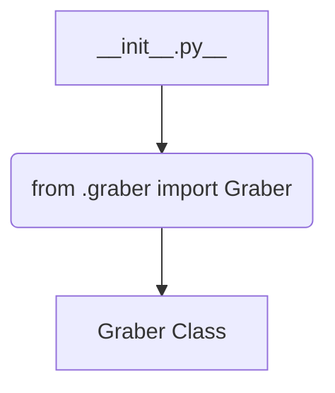
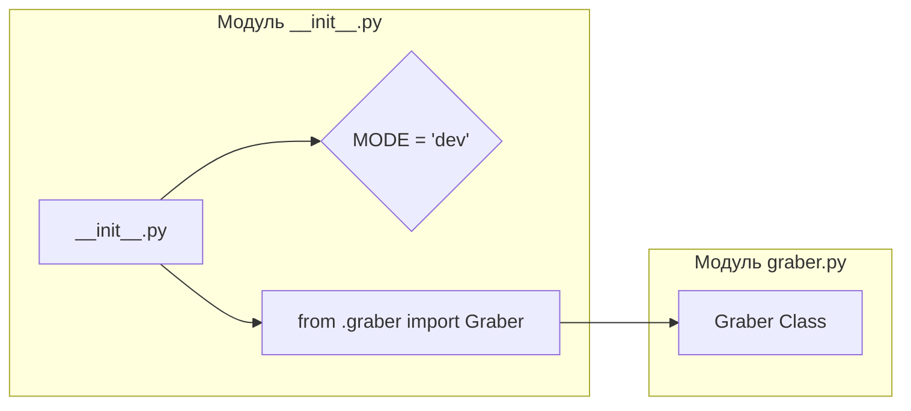

# <input code>

```python
## \file hypotez/src/suppliers/morlevi/__init__.py
# -*- coding: utf-8 -*-
#! venv/Scripts/python.exe
#! venv/bin/python/python3.12

"""
.. module: src.suppliers.morlevi 
	:platform: Windows, Unix
	:synopsis:

"""
MODE = 'dev'

from .graber import Graber
```

# <algorithm>



Пример:

Модуль `__init__.py` импортирует класс `Graber` из модуля `graber.py` внутри папки `morlevi`.  `MODE` переменная, скорее всего, определяет режим работы (например, 'dev' - для разработки, 'prod' - для производства).  Без дополнительного контекста, дальше действия неизвестны.  


# <mermaid>




# <explanation>

- **Импорты**: Модуль `__init__.py` (пакет `morlevi`) импортирует класс `Graber` из модуля `graber.py`, который находится внутри подпапки `graber`.  Эта конструкция используется для организации кода по модулям и позволяет импортировать нужные классы и функции в другие части проекта.  `src` предположительно, это корневая директория проекта, и модули находятся в поддиректориях.  Для импорта необходимых зависимостей следует следить за корректным установленным и работающим `venv`.

- **Классы**:  Класс `Graber` (определён в `graber.py`) - основной класс для работы с источником данных.  Без кода `graber.py` невозможно определить его точное поведение, атрибуты и методы.  Но скорее всего, этот класс будет содержать методы для получения данных, обработки данных или работы с определённым API или источником данных.

- **Функции**: Нет функций в текущем коде.

- **Переменные**: `MODE = 'dev'` - глобальная переменная, вероятно, используемая для определения режима работы скрипта (разработка, производство).  Эта переменная может быть использована для выбора различных конфигураций или поведения.

- **Возможные ошибки или области для улучшений**:  Без кода `graber.py` сложно оценить потенциальные ошибки.  Важно было бы добавить документацию к классу `Graber`, пояснения о том, какие данные он собирает,  как использует эти данные, и какие параметры может принимать для настройки.  Добавление обработчика ошибок (например, `try...except`) в методы класса `Graber` может повысить надёжность кода и предотвратить возникновение исключений.

- **Цепочка взаимосвязей**:  `__init__.py` служит входом для пакета `morlevi`. `Graber` вероятно, взаимодействует с другими частями проекта (например, `processors`, `services`) через API или передачу данных.  Без дополнительного кода сложно определить более точные взаимосвязи.  Цепочка использования `Graber` (получение данных → обработка → использование) может уходить в другие части проекта, которые еще не продемонстрированы в представленной части кода.