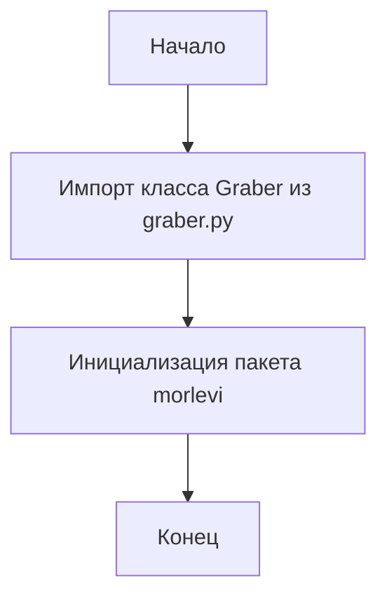

## АНАЛИЗ КОДА: `hypotez/src/suppliers/morlevi/__init__.py`

### <алгоритм>

1.  **Импорт `Graber`**:
    *   Импортируется класс `Graber` из модуля `graber.py`, расположенного в той же директории (`src/suppliers/morlevi`).
    *   **Пример**: Если есть `graber.py` с классом `Graber`, то после импорта можно создать экземпляр класса: `my_graber = Graber()`. Этот экземпляр будет обладать методами и атрибутами, определенными в `Graber`.
2.  **Инициализация модуля `morlevi`**:
    *   Файл `__init__.py` служит для того, чтобы директория `morlevi` воспринималась Python как пакет. 
    *   В данном случае, после импорта `Graber`, можно обращаться к нему через `morlevi.Graber`, если импортируется пакет `morlevi`. 
    *   **Пример**: В другом файле, где используется этот пакет, можно импортировать `Graber` следующим образом: `from src.suppliers.morlevi import Graber`.

### <mermaid>

**Объяснение `mermaid`:**

1.  **`Start[Начало]`**: Начало процесса обработки файла `__init__.py`.
2.  **`ImportGraber[Импорт класса Graber из graber.py]`**: Импорт класса `Graber` из модуля `graber.py` (он находится в той же директории). Это делает класс `Graber` доступным для использования в этом пакете.
3.  **`ModuleInitialization[Инициализация пакета morlevi]`**: Инициализация пакета `morlevi`, т.е. превращение директории `morlevi` в модуль. Это позволяет другим частям кода импортировать и использовать модули и классы, определенные в этой директории.
4.  **`End[Конец]`**: Конец процесса.

### <объяснение>

**Импорты:**

*   `from .graber import Graber`:
    *   Импортирует класс `Graber` из модуля `graber.py`. Точка перед именем (`.graber`) обозначает относительный импорт, то есть модуль `graber.py` находится в той же директории, что и файл `__init__.py` (`src/suppliers/morlevi`).
    *   **Назначение**: Класс `Graber`, предположительно, содержит логику для извлечения или обработки данных (скрапинга), связанную с поставщиком "morlevi". Это может включать методы для запросов к API, разбора HTML и т.д.
    *   **Взаимосвязь**: Этот импорт устанавливает зависимость между файлами в пакете `morlevi`. Класс `Graber` становится частью этого пакета и может быть использован в других модулях, импортирующих `morlevi`.

**Классы:**

*   `Graber`:
    *   Класс, импортируемый из `graber.py`. Из-за контекста, предполагается, что это класс, который отвечает за извлечение данных.
    *   **Роль**: Вероятно, класс содержит методы, необходимые для скрапинга или получения данных с веб-сайта или API поставщика "morlevi".
    *   **Атрибуты и методы**: Не определены в данном файле (`__init__.py`), но можно ожидать, что класс будет иметь методы, такие как `grab_data()`, `parse_data()`, и атрибуты для хранения конфигурации или состояния.
    *   **Взаимодействие**: Экземпляры класса `Graber` могут быть созданы и использованы в других частях проекта, где требуется получить данные от этого конкретного поставщика.

**Функции:**

*   В данном файле нет явно определенных функций, кроме стандартной роли `__init__.py` для определения пакета.

**Переменные:**

*   В данном файле нет явно определенных переменных.

**Потенциальные ошибки и области для улучшения:**

*   Отсутствие docstring для модуля, хотя он указан в начале файла.
*   Необходимость анализа `graber.py` для более полного понимания работы `Graber`.
*   Отсутствие обработки ошибок при импорте.

**Цепочка взаимосвязей:**

1.  `src/suppliers/morlevi/__init__.py` импортирует `src/suppliers/morlevi/graber.py`.
2.  Модуль `src/suppliers/morlevi` может быть импортирован в другие модули проекта, где необходимы данные от поставщика "morlevi". Например, в модуле, отвечающем за агрегацию данных от разных поставщиков.

**Дополнительное пояснение:**

`__init__.py` служит для обозначения директории как Python-пакета, а импорт `Graber` позволяет использовать этот класс в других модулях, которые импортируют пакет `morlevi`. Этот файл организует структуру проекта и упрощает использование кода, связанного с поставщиком "morlevi".