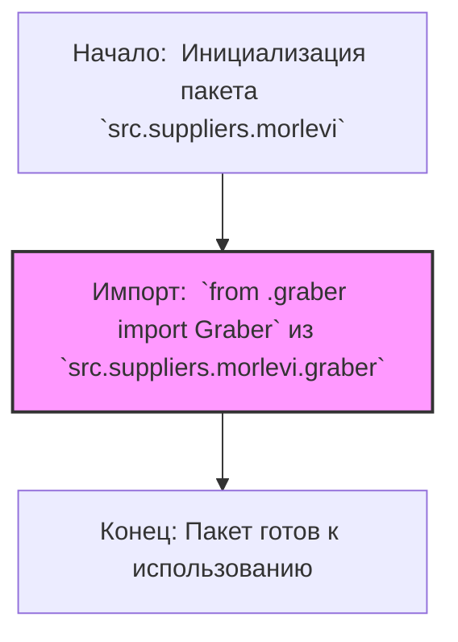

## АНАЛИЗ КОДА: `src/suppliers/morlevi/__init__.py`

### 1. <алгоритм>

1.  **Начало**: Инициализация пакета `src.suppliers.morlevi`.
2.  **Импорт**: Импортируется класс `Graber` из модуля `graber.py`, расположенного в текущей директории.
3.  **Конец**: Пакет `src.suppliers.morlevi` готов к использованию, предоставляя доступ к классу `Graber`.

**Пример:**

```python
from src.suppliers.morlevi import Graber

# Теперь можно использовать класс Graber
graber_instance = Graber()
graber_instance.fetch_data()
```

В данном примере, `Graber()` инициализирует класс `Graber`, а `fetch_data()` (который должен быть определен в классе `Graber`) демонстрирует возможное использование.

### 2. <mermaid>



**Объяснение зависимостей:**

*   `Start`: Начало выполнения кода, инициализация пакета `src.suppliers.morlevi`.
*   `ImportGraber`: Импортирует класс `Graber` из модуля `graber.py`, который расположен в той же директории. Это означает, что модуль `graber` должен существовать и содержать класс `Graber`.
*   `End`: Завершение работы кода. Пакет `src.suppliers.morlevi` теперь готов к использованию, предоставляя доступ к классу `Graber`.

### 3. <объяснение>

**Импорты:**

*   `from .graber import Graber`:
    *   `.` указывает на текущую директорию (пакет `src.suppliers.morlevi`).
    *   `graber` — это модуль (файл `graber.py`), расположенный в той же директории.
    *   `Graber` — это класс, импортируемый из модуля `graber`. Класс предназначен для получения данных (вероятно, от поставщика).
    *   **Взаимосвязь с `src.`**: Этот импорт явно указывает, что модуль `graber.py` является частью пакета `src.suppliers.morlevi` в структуре проекта `src`.

**Классы:**

*   `Graber`:
    *   **Роль**: Этот класс, вероятно, отвечает за получение данных от поставщика (в данном случае, `morlevi`).
    *   **Атрибуты**: Не указаны в `__init__.py`. Скорее всего, атрибуты будут определены в самом классе `Graber` в `graber.py`. Примеры: URL поставщика, ключи API, логика парсинга.
    *   **Методы**: Также не указаны в `__init__.py`, но вероятны методы для извлечения данных, обработки данных, и другие вспомогательные методы. Примеры: `fetch_data()`, `parse_data()`, `save_data()`.
    *   **Взаимодействие**: `Graber` является точкой входа для получения данных от поставщика `morlevi`. Другие части проекта могут использовать этот класс для получения данных, которые могут быть использованы в дальнейшем для анализа, отчетов или других целей.

**Функции**:

*   В данном файле нет функций.

**Переменные**:

*   В данном файле нет явно определенных переменных.

**Потенциальные ошибки и области для улучшения:**

*   **Отсутствие документации**: Файл `__init__.py` имеет docstring, но не содержит явных описаний функциональности импортируемого класса.
*   **Исключения и обработка ошибок**: Не описаны. В `graber.py` должны быть предусмотрены механизмы обработки ошибок (например, ошибки сети, ошибки парсинга).
*   **Модульность**: Хотя `Graber` является отдельным классом, можно подумать о дальнейшей модульности, например, вынести общую логику работы с данными поставщиков в базовый класс, от которого будут наследоваться классы для конкретных поставщиков.

**Цепочка взаимосвязей:**

1.  `src` (Корневой каталог проекта).
2.  `src.suppliers` (Пакет, содержащий модули для разных поставщиков).
3.  `src.suppliers.morlevi` (Пакет для поставщика `morlevi`, текущий файл).
4.  `src.suppliers.morlevi.graber` (Модуль `graber.py`, содержащий класс `Graber`, который используется для получения данных).
5.  Другие части проекта могут использовать `Graber` через `from src.suppliers.morlevi import Graber`.