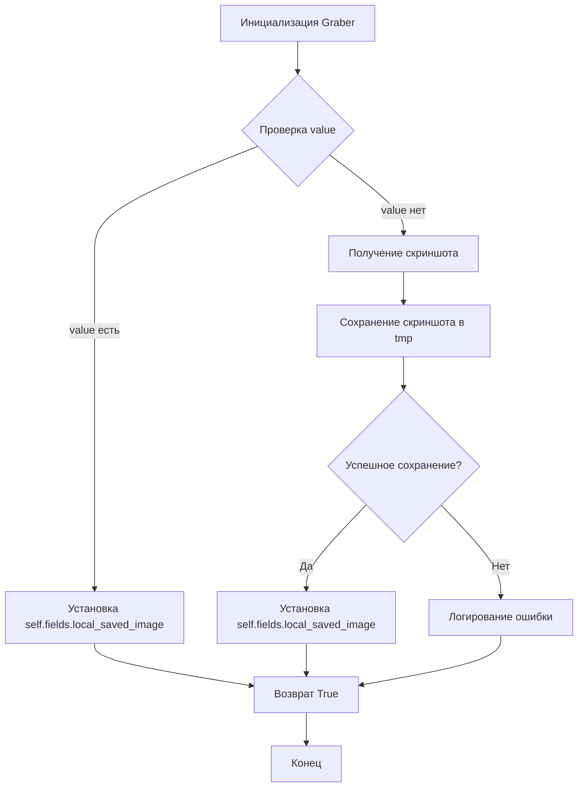

```MD
# <input code>

```python
## \file hypotez/src/suppliers/morlevi/graber.py
# -*- coding: utf-8 -*-\
#! venv/Scripts/python.exe
#! venv/bin/python/python3.12

"""
.. module: src.suppliers.morlevi 
	:platform: Windows, Unix
	:synopsis: Класс собирает значение полей на странице  товара `morlevi.co.il`. 
    Для каждого поля страницы товара сделана функция обработки поля в родительском классе.
    Если нужна нестандертная обработка, функция перегружается в этом классе.
    ------------------
    Перед отправкой запроса к вебдрайверу можно совершить предварительные действия через декоратор. 
    Декоратор по умолчанию находится в родительском классе. Для того, чтобы декоратор сработал надо передать значение 
    в `Context.locator`, Если надо реализовать свой декоратор - раскоментируйте строки с декоратором и переопределите его поведение


"""
MODE = 'dev'
from pathlib import Path
from typing import Any
import header
from src import gs
from src.suppliers.graber import Graber as Grbr, Context, close_pop_up
from src.webdriver.driver import Driver
from src.utils.image import save_png
from src.logger import logger


# # Определение декоратора для закрытия всплывающих окон
# # В каждом отдельном поставщике (`Supplier`) декоратор может использоваться в индивидуальных целях
# # Общее название декоратора `@close_pop_up` можно изменить 


# def close_pop_up(value: Any = None) -> Callable:
#     """Создает декоратор для закрытия всплывающих окон перед выполнением основной логики функции.

#     Args:
#         value (Any): Дополнительное значение для декоратора.

#     Returns:
#         Callable: Декоратор, оборачивающий функцию.
#     """
#     def decorator(func: Callable) -> Callable:
#         @wraps(func)
#         async def wrapper(*args, **kwargs):
#             try:
#                 await Context.driver.execute_locator(Context.locator.close_pop_up)  # Await async pop-up close   
#             except ExecuteLocatorException as ex:
#                 logger.debug(f'Ошибка выполнения локатора: ',ex)
#             return await func(*args, **kwargs)  # Await the main function
#         return wrapper
#     return decorator


class Graber(Grbr):
    """Класс для операций захвата Morlevi."""
    supplier_prefix: str

    def __init__(self, driver: Driver):
        """Инициализация класса сбора полей товара."""
        self.supplier_prefix = 'morlevi'
        super().__init__(supplier_prefix=self.supplier_prefix, driver=driver)
        #Context.locator_for_decorator = self.locator.close_pop_up  # <- Вместо этого я делаю рефреш

    # # 
    # @close_pop_up()
    # async def local_saved_image(self, value: Any = None):
    #     """Fetch and save image locally.
    #     Функция получает изображение как скриншот сохраняет через файл в `tmp` и сохраняет путь к локальному файлу в поле `local_saved_image` объекта `ProductFields`
    #     Args:
    #     value (Any): это значение можно передать в словаре kwargs через ключ {local_saved_image = `value`} при определении класса.
    #     Если `value` был передан, его значение подставляется в поле `ProductFields.local_saved_image`.
    #     .. note:
    #         путь к изображению ведет в директорию  `tmp`
    #     .. todo:
    #         - Как передать значение из `**kwards` функции `grab_product_page(**kwards)`
    #         - Как передать путь кроме жестко указанного   
    #     """
       
    #     if not value:
    #         try:
    #             if not self.fields.id_product:
    #                 self.id_product() # < ~~~~~~~~~~~~~~~~~~~~~~~~~~~~~~~~~~~~~~~~~  BUG! Как передать значение из `**kwards` функции `grab_product_page(**kwards)`
    #             raw = await self.driver.execute_locator(self.locator.default_image_url) # <- получаю скриншот как `bytes` 
    #             img_tmp_path = await save_png(raw[0] if isinstance(raw, list) else raw , Path( gs.path.tmp / f'{self.fields.id_product}.png'))
    #             if img_tmp_path:
    #                 self.fields.local_saved_image = img_tmp_path
    #                 return True
    #             else:
    #                 logger.debug(f"Ошибка сохранения изображения")
    #                 ...
    #                 return
    #         except Exception as ex:
    #             logger.error(f'Ошибка сохранения изображения в поле `local_saved_image`', ex)
    #             ...
    #             return
```

# <algorithm>

**Блок-схема:**



**Примеры:**

* **Шаг A:** `Graber` инициализируется с веб-драйвером.
* **Шаг B:** Проверяется, был ли передан параметр `value` в метод `local_saved_image`.
* **Шаг C:** Если `value` передан, то его значение устанавливается в соответствующее поле объекта `ProductFields`.
* **Шаг D:** Используется `self.driver.execute_locator` для получения скриншота.
* **Шаг E:** Используется функция `save_png` для сохранения скриншота в папку tmp.
* **Шаг F:** Проверяется, был ли файл успешно сохранен.
* **Шаг G:** Если файл был сохранен, то путь к нему устанавливается в поле `local_saved_image` объекта `ProductFields`.
* **Шаг H:** Если произошла ошибка при сохранении, то генерируется соответствующее сообщение об ошибке.
* **Шаг I:** Метод возвращает `True`, если все прошло успешно, или ничего не делает в случае ошибки.

# <mermaid>

```mermaid
graph LR
    subgraph Импорты
        A[hypotez/src/suppliers/morlevi/graber.py] --> B(pathlib);
        A --> C(typing);
        A --> D(header);
        A --> E(gs);
        A --> F(src.suppliers.graber);
        A --> G(src.webdriver.driver);
        A --> H(src.utils.image);
        A --> I(src.logger);
    end
    subgraph Классы
        F --> J(Graber);
        F --> K(Grbr);
        G --> L(Driver);
        H --> M(save_png);
        I --> N(logger);
    end
    subgraph Взаимодействие
        J --> F;  
        F --> K;
        L -- execute_locator --> M;
        M -- сохранение --> K;


    
```

# <explanation>

**Импорты:**

* `from pathlib import Path`: Импортирует класс `Path` для работы с путями к файлам.
* `from typing import Any`: Импортирует тип `Any` для указания универсального типа.
* `import header`: Импортирует модуль `header`,  (назначение неясно без контекста)
* `from src import gs`: Импортирует модуль `gs`, вероятно, содержащий константы или настройки, используемые в проекте.
* `from src.suppliers.graber import Graber as Grbr, Context, close_pop_up`: Импортирует класс `Graber` и связанные с ним объекты (возможно, `Context`, `close_pop_up`) из модуля `src.suppliers.graber`.
* `from src.webdriver.driver import Driver`: Импортирует класс `Driver`, вероятно, для управления веб-драйвером.
* `from src.utils.image import save_png`: Импортирует функцию `save_png` для сохранения изображений.
* `from src.logger import logger`: Импортирует объект `logger` для ведения журналов.

**Классы:**

* `Graber`:  Наследует от `Grbr` и предназначен для сбора данных с сайта morlevi.co.il.  Метод `__init__` инициализирует объект `Graber`, принимая `driver` для взаимодействия с веб-драйвером.
* `Grbr`: Родительский класс, возможно, содержит общие методы для работы с веб-драйвером.

**Функции:**

* `local_saved_image`:  Эта функция предназначена для получения изображения с сайта и сохранения его локально.  Поля `id_product` и `local_saved_image` предполагаются атрибутами класса `ProductFields` (который, вероятно, тоже импортирован).  Важно, что в реализации есть недочет - функция `id_product()` используется неявно, а не как вызов метода, что создает баг.  В функции есть нереализованная обработка ошибок и валидация, что требует доработки.

**Переменные:**

* `MODE`: Переменная, вероятно, хранит режим работы приложения (например, 'dev' или 'prod').
* `supplier_prefix`: Хранит префикс для названия поставщика.

**Возможные ошибки и улучшения:**

* Неясно, откуда берётся `self.fields.id_product`.  Необходимо либо получить ID продукта из веб-страницы, либо явно передать его как параметр в `local_saved_image`.  В данном виде, это ведет к потенциальной ошибке.
* Нет явной обработки ошибок при получении скриншота и сохранении файла (try...except). Обработка ошибок должна быть более полная.
* Неясно, что возвращает `self.locator.default_image_url` – это должно быть описано.
* Декоратор `@close_pop_up` не используется.  Учитывая комментарий в коде, он не нужен в данном классе.
* Отсутствует явное описание, как передать значение `value` в `grab_product_page`. Возможно, это нужно через параметры при вызове функции или через `self.fields`.
* Логирование ошибок (`logger.error`) должно быть более детальным и информативным.

**Взаимосвязи с другими частями проекта:**

Класс `Graber` взаимодействует с другими частями проекта через импортированные классы и функции (`Driver`, `save_png`, `logger`, `Context`, `gs`, `close_pop_up`, `ProductFields`, `grab_product_page`).  Эти классы и функции, вероятно, определены в других модулях проекта (`src.webdriver.driver`, `src.utils.image`, `src.logger`, ...).  Для корректного выполнения кода необходимо, чтобы все импортированные части проекта были работоспособны.  Также важно, что код предполагает наличие класса `ProductFields`.