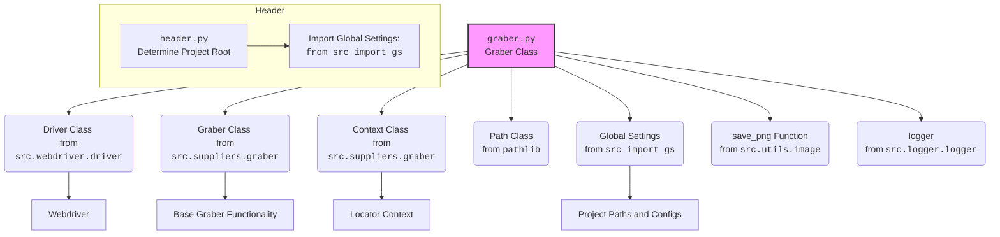

## АНАЛИЗ КОДА

### 1. <алгоритм>

**Блок-схема процесса:**

```mermaid
graph LR
    A[Начало] --> B{Инициализация класса Graber};
    B --> C{Установка префикса поставщика: `supplier_prefix = 'morlevi'`};
    C --> D{Вызов конструктора родительского класса `Graber`};
    D --> E{Настройка `Context.locator_for_decorator` (закомментировано)};
    E --> F{Определение метода `local_image_path` (закомментировано)};
    F --> G{Вызов `local_image_path`};
    G --> H{Проверка `value` (аргумент функции `local_image_path`)};
    H -- value не передан --> I{Проверка `self.fields.id_product`};
    I -- self.fields.id_product есть --> J{Получение скриншота через `self.driver.execute_locator(self.locator.default_image_url)`};
    I -- self.fields.id_product нет --> K{Вызов `self.id_product()`};
    K --> J;
     J --> L{Сохранение скриншота в файл через `save_png`};
    L --> M{Проверка успешности сохранения};
     M -- Успешно --> N{Установка пути к изображению в `self.fields.local_image_path`};
     M -- Ошибка --> O{Логирование ошибки, выход из функции};
    N --> P{Выход из `local_image_path` с `True`};
     O --> P
    H -- value передан --> Q{Установка `self.fields.local_image_path`  в значение `value`};
    Q --> P;
     P --> R[Конец];

    style A fill:#f9f,stroke:#333,stroke-width:2px
    style R fill:#f9f,stroke:#333,stroke-width:2px
```

**Примеры:**

1.  **Инициализация `Graber`:** Создается экземпляр класса `Graber`, передавая объект `Driver`. При этом устанавливается `supplier_prefix` как `morlevi`.
2.  **Вызов  `local_image_path`**:
    *   Если `value` не передано, функция проверяет, существует ли `self.fields.id_product`. Если нет, вызывается метод `self.id_product()`. Далее, делается скриншот с помощью `self.driver.execute_locator(self.locator.default_image_url)`, сохраняется в файл.
    *   Если `value` передано, то `self.fields.local_image_path` устанавливается в значение `value`.

### 2. <mermaid>



**Анализ импорта:**

*   `pathlib.Path`: Используется для работы с путями файлов.
*   `typing.Any`: Используется для аннотации типов, позволяя переменным принимать любой тип данных.
*   `header`: Импортируется для получения глобальных настроек проекта и работы с путями.
*   `src.gs`: Импортируется для доступа к глобальным настройкам проекта.
*   `src.suppliers.graber.Graber as Grbr`, `src.suppliers.graber.Context` : Импортируются базовый класс `Graber` и класс `Context`  из `src.suppliers.graber`. Это нужно для наследования и использования общих методов.
*   `src.webdriver.driver.Driver`: Импортируется для управления браузером.
*    `src.utils.image.save_png`: Импортируется функция для сохранения изображений.
*   `src.logger.logger.logger`: Импортируется объект `logger` для логирования событий.

### 3. <объяснение>

**Импорты:**

*   `pathlib.Path`: Используется для создания и управления путями к файлам, что необходимо для сохранения изображений.
*   `typing.Any`: Обеспечивает гибкость в типах данных, что позволяет методам работать с различными типами аргументов и возвращаемых значений.
*   `header`:  Обеспечивает доступ к корневой директории проекта и глобальным настройкам, что важно для определения путей и конфигураций.
*   `src.gs`:  Используется для доступа к глобальным настройкам, таким как пути к файлам и каталогам, что позволяет адаптировать скрипт к различным окружениям.
*   `src.suppliers.graber.Graber as Grbr`: Импортируется базовый класс `Graber`, который предоставляет общую структуру и методы для сбора данных с веб-страниц. Этот класс используется для наследования и повторного использования логики.
*   `src.suppliers.graber.Context`: Импортируется класс `Context`, который может содержать информацию о текущем контексте выполнения, такую как локаторы.
*   `src.webdriver.driver.Driver`: Этот класс предоставляет абстракцию для управления веб-браузером, позволяя выполнять навигацию и взаимодействие с веб-страницами.
*   `src.utils.image.save_png`: Используется для сохранения изображений в формате PNG, что важно для работы со скриншотами.
*   `src.logger.logger.logger`: Позволяет записывать сообщения о ходе выполнения программы и ошибках.

**Классы:**

*   **`Graber`**:
    *   **Роль:**  Класс `Graber` предназначен для сбора данных с веб-страниц конкретного поставщика (в данном случае, `morlevi.co.il`). Он наследуется от `src.suppliers.graber.Graber`.
    *   **Атрибуты:**
        *   `supplier_prefix`: Строка, указывающая префикс поставщика.
    *   **Методы:**
        *   `__init__(self, driver: Driver)`: Конструктор класса, инициализирует префикс поставщика и вызывает конструктор родительского класса. Также, в конструкторе был закомментирован код для настройки декоратора, который устанавливает `Context.locator_for_decorator`.
        *   `local_image_path(self, value: Any = None)`: (Закомментирован)  Этот метод должен был загружать изображение со страницы товара и сохранять его локально, а также сохраняет путь к изображению в поле `local_image_path` объекта `ProductFields`.  Он использует `self.driver` для взаимодействия с браузером и `save_png` для сохранения изображения. Присутствует логика для получения `id_product` если его нет и сохранения скриншота только после получения `id_product`.

**Функции:**

*   `__init__(self, driver: Driver)`:
    *   **Аргументы**: `driver` (объект `Driver`).
    *   **Возвращаемое значение**: Нет (конструктор).
    *   **Назначение**: Инициализирует класс, устанавливая префикс поставщика и вызывая конструктор родительского класса.
    *   **Пример**: `graber_instance = Graber(driver_instance)`.
*   `local_image_path(self, value: Any = None)`:
    *   **Аргументы**: `value` (необязательный аргумент любого типа).
    *   **Возвращаемое значение**:  `True` если изображение сохранено, `None` если произошла ошибка
    *   **Назначение**: Сохраняет изображение со страницы товара. Если `value` передано - используется в качестве пути.  Использует `self.driver.execute_locator()` для получения данных с веб-страницы и `src.utils.image.save_png` для сохранения изображения.
    *   **Пример**: `await graber_instance.local_image_path()`, `await graber_instance.local_image_path("path/to/image.png")`.

**Переменные:**

*   `supplier_prefix`: Строка, содержащая префикс поставщика (например, 'morlevi').
*   `self.driver`: Объект драйвера браузера, используемый для взаимодействия с веб-страницами.
*   `self.locator`: Объект, содержащий локаторы для поиска элементов на странице.
*   `self.fields`: Объект, содержащий данные о товаре, которые будут извлекаться со страницы.
*   `img_tmp_path`: Путь к сохраненному изображению.
*   `raw`:  `bytes` или list[bytes] полученные с помощью `self.driver.execute_locator()`.

**Потенциальные ошибки и области для улучшения:**

1.  **Закомментированный декоратор**: Код декоратора `close_pop_up` закомментирован, что означает, что он не используется. Это может быть необходимо, если на странице есть всплывающие окна, которые нужно закрывать перед выполнением основной логики.
2.  **Закомментированный метод `local_image_path`**:  Функциональность сохранения изображений отключена. Эта логика может быть полезна для получения изображений товаров.
3.  **Жестко заданный путь**: Путь к сохраняемому файлу изображения задан жестко. Необходимо обеспечить возможность его настройки.
4. **BUG**: Не ясен способ передачи значения из `**kwards` функции `grab_product_page(**kwards)` в `local_image_path`

**Взаимосвязи с другими частями проекта:**

*   Класс `Graber` использует `Driver` из `src.webdriver.driver` для взаимодействия с веб-браузером.
*   Использует `Context` и базовый класс `Graber` из `src.suppliers.graber`.
*   Использует  `save_png` из `src.utils.image` для сохранения изображений.
*   Использует `logger` из `src.logger.logger` для логирования.
*   Использует `gs` из `src` для получения глобальных настроек.
*   Использует  `header.py` для определения корневой директории проекта.

Этот код предназначен для автоматического сбора информации с веб-страниц поставщика `morlevi.co.il`. Он предоставляет базовую структуру для сбора данных и может быть расширен и адаптирован для выполнения различных задач.