## Анализ кода `hypotez/src/suppliers/morlevi/header.py`

### 1. <алгоритм>

**1. Определение константы `MODE`:**

   - Задается глобальная переменная `MODE` со значением `'dev'`.
   - Пример: `MODE = 'dev'`

**2. Импорт необходимых модулей:**
   - Импортируются модули `sys`, `json`, `Version` из `packaging.version`, и `Path` из `pathlib`.
   - Пример: `import sys`, `import json`, `from packaging.version import Version`, `from pathlib import Path`
  
**3. Функция `set_project_root`:**
   - **Аргументы**: принимает кортеж `marker_files` (по умолчанию `('pyproject.toml', 'requirements.txt', '.git')`).
   - **Логика**:
       - Получает абсолютный путь к директории, где находится текущий файл.
       - Перебирает текущую директорию и все её родительские директории.
       - Проверяет наличие любого из файлов-маркеров в каждой директории.
       - Если маркер найден, возвращает путь к этой директории как корень проекта.
       - Если корень проекта не добавлен в `sys.path`, добавляет его.
       - Возвращает путь к корневой директории проекта.
   - **Примеры**:
       - Если текущий файл находится в `/home/user/project/src/suppliers/morlevi/header.py`, а файл `pyproject.toml` находится в `/home/user/project/`, функция вернет `/home/user/project/`.
       - Если ни один из маркеров не найден, вернет директорию, где находится текущий файл.
   - **Поток данных:**
     - Вход: `marker_files`
     - Выход: `Path` (путь к корню проекта)

**4. Определение переменной `__root__`:**
   - Вызывает функцию `set_project_root` для определения корневой директории проекта.
   - Записывает путь в переменную `__root__`.
   - Пример: `__root__ = set_project_root()`

**5. Импорт модуля `gs`:**
    - Импортируется `gs` из директории `src`.
    - Пример: `from src import gs`

**6. Загрузка настроек из `settings.json`:**
    - Инициализируется переменная `settings` как `None`.
    - Пытается открыть файл `settings.json` в директории `src` относительно корня проекта.
    - Если файл найден и успешно прочитан, десериализует JSON данные в словарь `settings`.
    - Если файл не найден или JSON некорректный, пропускает блок `try`.
    - Пример: 
      - `with open(gs.path.root / 'src' /  'settings.json', 'r') as settings_file:`
      - `settings = json.load(settings_file)`
    - **Поток данных:**
        - Вход: путь к `settings.json`
        - Выход: `settings` (словарь с настройками проекта)

**7. Загрузка документации из `README.MD`:**
    - Инициализируется переменная `doc_str` как `None`.
    - Пытается открыть файл `README.MD` в директории `src` относительно корня проекта.
    - Если файл найден и успешно прочитан, считывает содержимое в переменную `doc_str`.
    - Если файл не найден или происходит ошибка чтения, пропускает блок `try`.
    - Пример:
       - `with open(gs.path.root / 'src' /  'README.MD', 'r') as settings_file:`
       - `doc_str = settings_file.read()`
    - **Поток данных:**
        - Вход: путь к `README.MD`
        - Выход: `doc_str` (строка с содержимым файла)

**8. Инициализация глобальных переменных:**
    - Инициализируются глобальные переменные:
        - `__project_name__` - название проекта, значение берется из `settings.get("project_name", 'hypotez')` или 'hypotez', если `settings` не существует.
        - `__version__` - версия проекта, значение берется из `settings.get("version", '')` или '', если `settings` не существует.
        - `__doc__` - документация проекта, значение берется из `doc_str` или ''.
        - `__details__` - пустая строка.
        - `__author__` - автор проекта, значение берется из `settings.get("author", '')` или '', если `settings` не существует.
        - `__copyright__` - авторское право проекта, значение берется из `settings.get("copyrihgnt", '')` или '', если `settings` не существует.
        - `__cofee__` - строка для поддержки разработчика, значение берется из `settings.get("cofee", "...")` или "..." если `settings` не существует.
    - Пример: `__project_name__ = settings.get("project_name", 'hypotez') if settings  else 'hypotez'`

```mermaid
graph LR
    A[Start] --> B(set_project_root);
    B --> C{Marker Files Found?};
    C -- Yes --> D(Set Project Root);
    C -- No --> E(Set Current Directory as Root);
    D --> F(Add to sys.path);
    E --> F;
    F --> G(__root__ = Result);
    G --> H(Import gs);
    H --> I{settings.json Exists?};
    I -- Yes --> J(Load Settings);
    I -- No --> K(settings=None);
    J --> L(Set settings);
    K --> L;
    L --> M{README.MD Exists?};
    M -- Yes --> N(Load Documentation);
    M -- No --> O(doc_str=None);
    N --> P(Set doc_str);
     O --> P;   
    P --> Q(Set Project Metadata);
    Q --> R[End];

    style A fill:#f9f,stroke:#333,stroke-width:2px
    style R fill:#f9f,stroke:#333,stroke-width:2px
```

### 2. <mermaid>



**Объяснение диаграммы:**

1.  **Start (A):** Начало выполнения скрипта.
2.  **set_project_root (B):** Вызов функции для определения корня проекта.
3.  **Marker Files Found? (C):** Проверка наличия файлов-маркеров в текущей и родительских директориях.
4.  **Set Project Root (D):** Если маркер найден, устанавливается корень проекта.
5.  **Set Current Directory as Root (E):** Если маркеры не найдены, текущая директория устанавливается как корень.
6.  **Add to sys.path (F):** Добавление пути к корню проекта в список путей Python.
7.  **__root__ = Result (G):** Присваивание найденного пути переменной `__root__`.
8.  **Import gs (H):** Импорт модуля `gs`.
9.  **settings.json Exists? (I):** Проверка наличия файла `settings.json`.
10. **Load Settings (J):** Загрузка данных из `settings.json`.
11. **settings=None (K):** Если `settings.json` не найден, то `settings` = `None`.
12. **Set settings (L):** Установка значения переменной `settings`.
13. **README.MD Exists? (M):** Проверка наличия файла `README.MD`.
14. **Load Documentation (N):** Загрузка содержимого файла `README.MD`.
15. **doc_str=None (O):** Если `README.MD` не найден, то `doc_str` = `None`.
16. **Set doc_str (P):** Установка значения переменной `doc_str`.
17. **Set Project Metadata (Q):** Инициализация переменных с метаданными проекта (имя, версия, документация, автор и т.д.).
18. **End (R):** Конец выполнения скрипта.

**Импорты и зависимости:**

*   **sys:** Используется для модификации путей поиска модулей (`sys.path`).
*   **json:** Используется для загрузки данных из файла `settings.json`.
*   **Version (из packaging.version):** Хотя он импортируется, в коде не используется.
*   **Path (из pathlib):** Используется для работы с путями файлов и директорий.
*   **gs (из src):** Используется для доступа к пути корня проекта через `gs.path.root`.

### 3. <объяснение>

**Импорты:**

*   `sys`: Модуль для работы с параметрами и функциями, специфичными для системы. Здесь используется для добавления пути к корню проекта в `sys.path`, чтобы Python мог находить другие модули из этого проекта.
*   `json`: Модуль для работы с JSON-данными. Используется для загрузки настроек проекта из файла `settings.json`.
*   `packaging.version.Version`: Этот импорт есть, но фактически нигде не используется. Возможно, планировался для работы с версиями проекта, но в текущем коде не задействован.
*   `pathlib.Path`: Модуль для работы с файловыми путями в объектно-ориентированном стиле. Используется для определения корня проекта и работы с путями к файлам.

**Функция `set_project_root`:**

*   **Аргументы**: `marker_files` (кортеж строк) - список файлов или директорий, которые указывают на корень проекта.
*   **Возвращаемое значение**: `Path` - объект, представляющий путь к корню проекта.
*   **Назначение**: Функция предназначена для определения корневой директории проекта, что позволяет запускать скрипты из любой вложенной директории. Она ищет родительские директории, пока не найдет файл-маркер (например, `pyproject.toml`, `requirements.txt`, `.git`).
*   **Пример:**
    ```python
    root_path = set_project_root()
    print(root_path)  # Выведет путь к корню проекта
    ```

**Переменные:**

*   `MODE`: Строковая константа, определяющая режим работы. В данном случае установлено значение `'dev'`, что предполагает режим разработки.
*   `__root__`: `Path` - Путь к корневой директории проекта, полученный через вызов `set_project_root()`.
*   `settings`: `dict` - Словарь, содержащий настройки проекта, загруженные из `settings.json`. Если файл не найден или происходит ошибка, то `settings` будет равен `None`.
*   `doc_str`: `str` - Строка, содержащая содержимое файла `README.MD`. Если файл не найден, то `doc_str` будет равен `None`.
*   `__project_name__`: `str` - Название проекта, извлекается из `settings` или установлено по умолчанию как `hypotez`.
*   `__version__`: `str` - Версия проекта, извлекается из `settings` или установлена пустой строкой.
*   `__doc__`: `str` - Документация проекта, значение берется из `doc_str` или является пустой строкой.
*   `__details__`: `str` - Пустая строка, вероятно, предназначенная для будущих деталей проекта.
*   `__author__`: `str` - Автор проекта, извлекается из `settings` или является пустой строкой.
*   `__copyright__`: `str` - Авторские права, извлекается из `settings` или является пустой строкой.
*   `__cofee__`: `str` - Сообщение для поддержки разработчика, извлекается из `settings` или установлено по умолчанию.

**Объяснение кода:**

Этот код предназначен для инициализации окружения проекта, определения корневой директории, загрузки настроек и метаданных.

1.  **Определение корня проекта:** Функция `set_project_root` автоматически определяет корневую директорию проекта, что делает скрипты переносимыми и независимыми от текущей рабочей директории.
2.  **Загрузка настроек:** Из файла `settings.json` загружаются настройки проекта.  Если файл не найден, то настройки не загружаются.
3.  **Загрузка документации:** Из файла `README.MD` загружается документация проекта.
4.  **Инициализация метаданных:** На основе загруженных настроек и данных устанавливаются метаданные проекта, такие как имя, версия, автор и т.д.

**Потенциальные ошибки и области для улучшения:**

1.  **Обработка ошибок:** В блоках `try-except`  используется `...` для игнорирования ошибок.  Рекомендуется выводить хотя бы минимальные логи, чтобы отслеживать ошибки при работе с файлами `settings.json` и `README.MD`.
2.  **Использование `Version`:**  Модуль `packaging.version` импортируется, но не используется, что является неоптимальным.  Удалить или использовать для проверки версии.
3.  **Константы:** Константу `MODE` лучше объявить с помощью `UPPER_CASE_WITH_UNDERSCORES` соглашения, например `MODE = 'DEV'`

**Взаимосвязь с другими частями проекта:**

*   **`src.gs`:** Модуль `gs` из пакета `src` используется для доступа к корневому пути проекта (`gs.path.root`), который был определен функцией `set_project_root`. Это обеспечивает единую точку доступа к корню проекта для всего проекта.
*   **`settings.json` и `README.MD`:** Эти файлы должны находиться в директории `src`. Код предполагает их наличие для загрузки настроек и документации, которые используются для инициализации переменных.

**Цепочка взаимосвязей:**

1.  Скрипт начинает работу с определения корневой директории проекта (`set_project_root`).
2.  Используется модуль `gs` для доступа к корневой директории проекта.
3.  Из `settings.json` загружаются настройки.
4.  Из `README.MD` загружается документация.
5.  На основе загруженных данных устанавливаются метаданные проекта.