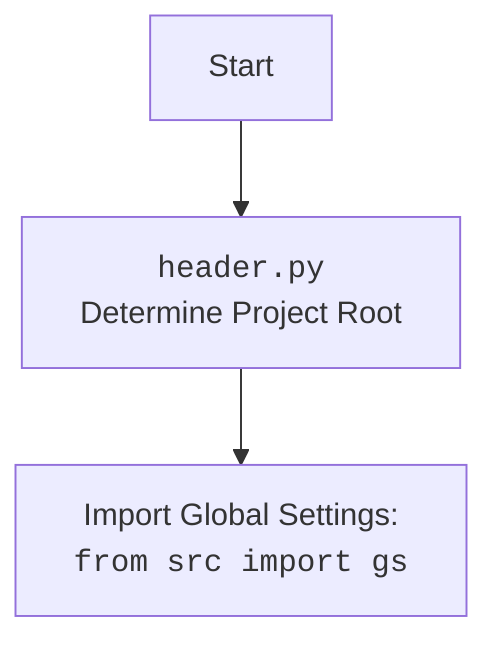

## ИНСТРУКЦИЯ:

Анализируй предоставленный код подробно и объясни его функциональность. Ответ должен включать три раздела:  

1.  **<алгоритм>**: Опиши рабочий процесс в виде пошаговой блок-схемы, включая примеры для каждого логического блока, и проиллюстрируй поток данных между функциями, классами или методами.  
2.  **<mermaid>**: Напиши код для диаграммы в формате `mermaid`, проанализируй и объясни все зависимости,  
    которые импортируются при создании диаграммы.  
    **ВАЖНО!** Убедитесь, что все имена переменных, используемые в диаграмме `mermaid`,  
    имеют осмысленные и описательные имена. Имена переменных вроде `A`, `B`, `C`, и т.д., не допускаются!  
    
    **Дополнительно**: Если в коде есть импорт `import header`, добавьте блок `mermaid` flowchart, объясняющий `header.py`:
    ```mermaid
    flowchart TD
        Start --> Header[<code>header.py</code><br> Determine Project Root]
    
        Header --> import[Import Global Settings: <br><code>from src import gs</code>] 
    ```

3.  **<объяснение>**: Предоставьте подробные объяснения:  
    -   **Импорты**: Их назначение и взаимосвязь с другими пакетами `src.`.  
    -   **Классы**: Их роль, атрибуты, методы и взаимодействие с другими компонентами проекта.  
    -   **Функции**: Их аргументы, возвращаемые значения, назначение и примеры.  
    -   **Переменные**: Их типы и использование.  
    -   Выделите потенциальные ошибки или области для улучшения.  

Дополнительно, постройте цепочку взаимосвязей с другими частями проекта (если применимо).  

Это обеспечивает всесторонний и структурированный анализ кода.
## Формат ответа: `.md` (markdown)
**КОНЕЦ ИНСТРУКЦИИ**

### <алгоритм>

1.  **Начало**: Выполнение начинается с импорта необходимых модулей (`sys`, `json`, `packaging.version`, `pathlib.Path`).
2.  **Определение `set_project_root`**:
    *   Функция `set_project_root` вызывается без аргументов, используя значения по умолчанию для `marker_files` ( `("__root__", ".git")` ).
    *   Определяется `current_path` как абсолютный путь к директории, где находится текущий файл.
    *   `__root__` инициализируется значением `current_path`.
    *   **Цикл**:
        *   Перебираются родительские директории (`current_path` и его предки).
        *   **Проверка**: Для каждой родительской директории проверяется наличие в ней файлов или директорий, перечисленных в `marker_files`. 
            *   **Пример**: Если `current_path` = `/path/to/hypotez/src/suppliers/morlevi`, и одна из родительских директорий содержит файл `__root__`, то `__root__` становится равным этой директории.
        *   Если хотя бы один из маркерных файлов найден, `__root__` обновляется и цикл прерывается.
    *   **Добавление в `sys.path`**: Если `__root__` нет в `sys.path`, то `__root__` добавляется в начало `sys.path`, чтобы импорты работали относительно корня проекта.
    *   Функция возвращает `__root__`.
3.  **Присвоение `__root__`**:
    *   Результат выполнения `set_project_root()` присваивается переменной `__root__`.
    *   Теперь `__root__` содержит путь к корню проекта.
4.  **Импорт `gs`**: Импортируется модуль `src.gs`.
5.  **Чтение `settings.json`**:
    *   `settings` инициализируется как `None`.
    *   **Попытка**: Открывается и загружается файл `settings.json` из каталога `src`, относительно корня проекта.
    *   Если файл найден и успешно загружен, содержимое сохраняется в `settings`.
    *   **Исключение**: Если происходит ошибка `FileNotFoundError` или `json.JSONDecodeError`, исключение обрабатывается (ничего не делается).
6.  **Чтение `README.MD`**:
    *   `doc_str` инициализируется как `None`.
    *   **Попытка**: Открывается и читается файл `README.MD` из каталога `src`, относительно корня проекта.
    *   Если файл найден и успешно прочитан, содержимое сохраняется в `doc_str`.
    *   **Исключение**: Если происходит ошибка `FileNotFoundError` или `json.JSONDecodeError`, исключение обрабатывается (ничего не делается).
7.  **Инициализация глобальных переменных**:
    *   Глобальные переменные `__project_name__`, `__version__`, `__doc__`, `__details__`, `__author__`, `__copyright__`, `__cofee__` инициализируются значениями из `settings` или значениями по умолчанию.
        *   **Пример**: Если `settings` содержит `"project_name": "my_project"`, то `__project_name__` будет присвоено значение `"my_project"`.
        *   Если `settings` отсутствует или в нём нет ключа `"project_name"`, то `__project_name__` будет равно `"hypotez"`.

### <mermaid>

```mermaid
flowchart TD
    Start --> FindProjectRoot[<code>set_project_root()</code><br> Determine Project Root]
    
    FindProjectRoot --> CheckMarkerFiles[Check for Marker Files<br> (__root__, .git)]
    CheckMarkerFiles -- Found --> SetProjectRoot[Set Project Root: <br> <code>__root__ = parent_dir</code>]
     CheckMarkerFiles -- Not Found -->  NextParentDir[Move to Parent Directory]
      NextParentDir --> CheckMarkerFiles
    SetProjectRoot --> AddRootToPath[Add Project Root to sys.path]
    AddRootToPath --> ImportGlobalSettings[Import Global Settings: <br><code>from src import gs</code>]
    ImportGlobalSettings --> LoadSettingsJSON[Load settings from JSON: <br> <code>settings = json.load('settings.json')</code>]
    LoadSettingsJSON --> LoadReadmeMD[Load README.MD file: <br> <code>doc_str = file.read()</code>]
    LoadReadmeMD --> SetGlobalVars[Set Global Variables: <br><code>__project_name__, __version__, etc.</code>]
    SetGlobalVars --> End
  
    Start -->  InitializeVariables[Initialize Variables:<br><code>__root__ = None,<br> settings = None,<br> doc_str = None</code>]
      InitializeVariables --> FindProjectRoot
    
  
   
```

**Объяснение:**

*   Диаграмма `mermaid` показывает последовательность выполнения кода, начиная с поиска корневой директории проекта и заканчивая инициализацией глобальных переменных.
*   `FindProjectRoot`: Представляет функцию `set_project_root()`, которая ищет корень проекта.
*   `CheckMarkerFiles`: Ищет маркерные файлы в текущей и родительских директориях.
*   `SetProjectRoot`: Устанавливает корень проекта при обнаружении маркерных файлов.
*   `AddRootToPath`: Добавляет корень проекта в `sys.path`.
*   `ImportGlobalSettings`: Импортирует глобальные настройки (`from src import gs`).
*   `LoadSettingsJSON`: Загружает настройки из `settings.json`.
*   `LoadReadmeMD`: Загружает содержимое из файла `README.MD`.
*   `SetGlobalVars`: Инициализирует глобальные переменные, используя данные из `settings` и `README.MD` или значения по умолчанию.
*   `InitializeVariables`: Инициализирует основные переменные для последующего использования.



**Объяснение:**
Этот блок `mermaid` показывает, что файл `header.py` начинается с определения корневой директории проекта, а затем импортирует глобальные настройки из модуля `src.gs`.

### <объяснение>

**Импорты:**

*   `sys`: Используется для работы с системными параметрами, в частности, для добавления пути к корню проекта в `sys.path`. Это позволяет импортировать модули из проекта, даже если они находятся вне текущей директории.
*   `json`: Используется для чтения данных из файла `settings.json` в формате JSON.
*   `packaging.version.Version`: Импортируется, но нигде не используется в предоставленном коде. Возможно, это оставшийся импорт от предыдущей версии кода.
*   `pathlib.Path`: Используется для работы с путями к файлам и директориям. Позволяет более удобно манипулировать путями.

**Функции:**

*   `set_project_root(marker_files: tuple = ('__root__', '.git')) -> Path`:
    *   **Аргументы**:
        *   `marker_files`: Кортеж строк, представляющих имена файлов или директорий, которые обозначают корень проекта. По умолчанию это `('__root__', '.git')`.
    *   **Возвращаемое значение**:
        *   `Path`: Объект `Path`, представляющий путь к корню проекта.
    *   **Назначение**:
        *   Функция ищет корневую директорию проекта, начиная с текущей директории и поднимаясь вверх по дереву директорий, пока не найдет один из маркерных файлов.
        *   Добавляет корень проекта в `sys.path`, чтобы импорт модулей работал корректно.
    *   **Пример**:
        *   Если структура проекта `/project/__root__/src/suppliers/morlevi/header.py`, то функция вернёт `/project`, добавив его в `sys.path`.

**Переменные:**

*   `__root__`: (Path) Путь к корню проекта.
*   `settings`: (dict) Словарь, содержащий настройки проекта, загруженные из файла `settings.json`.
*   `doc_str`: (str) Строка, содержащая текст из файла `README.MD`.
*   `__project_name__`: (str) Название проекта (по умолчанию `'hypotez'`).
*   `__version__`: (str) Версия проекта (по умолчанию `''`).
*   `__doc__`: (str) Документация проекта (содержимое `README.MD` или `''` по умолчанию).
*   `__details__`: (str) Детали проекта (по умолчанию `''`).
*   `__author__`: (str) Автор проекта (по умолчанию `''`).
*   `__copyright__`: (str) Авторское право проекта (по умолчанию `''`).
*   `__cofee__`: (str) Сообщение о спонсорстве проекта (по умолчанию "Treat the developer to a cup of coffee for boosting enthusiasm in development: https://boosty.to/hypo69").

**Взаимосвязи с другими частями проекта:**

*   `src.gs`: Этот модуль используется для получения глобальных настроек, включая путь к корню проекта. Файл `settings.json` расположен относительно корня проекта.
*   Файл `README.MD` также расположен относительно корня проекта.

**Потенциальные ошибки и области для улучшения:**

*   **Обработка исключений:** Обработка исключений `FileNotFoundError` и `json.JSONDecodeError` в блоках try-except просто пропускает ошибку. Было бы полезно логировать ошибки или генерировать исключения, чтобы разработчик знал о проблемах с файлами.
*  **Неиспользуемый импорт**: Импорт `from packaging.version import Version` не используется, его можно удалить.
*  **Несоответствие имени**: Переменная `__cofee__`  имеет опечатку, правильное написание  `__coffee__`.
*  **Отсутствие комментариев:** Комментарии к глобальным переменным могут быть более подробными и объяснять, откуда они берутся.
*  **Зависимость от имени файлов**:  Жестко закодированные имена файлов `settings.json` и `README.MD` могут быть изменены. Можно рассмотреть возможность использования констант или переменных для хранения имен файлов.
*  **Отсутствие типовой аннотации**: Улучшить читаемость кода можно с помощью аннотации типов для переменных.
*  **Улучшенное обнаружение корня проекта:**  Использование нескольких маркерных файлов повышает надежность обнаружения корня проекта, но возможны и другие способы его определения (например, использование `.git` или специальных файлов настроек).

Этот анализ обеспечивает полное понимание функциональности предоставленного кода, включая его структуру, импорты, классы, функции, переменные, взаимосвязи с другими частями проекта, а также потенциальные ошибки и области для улучшения.