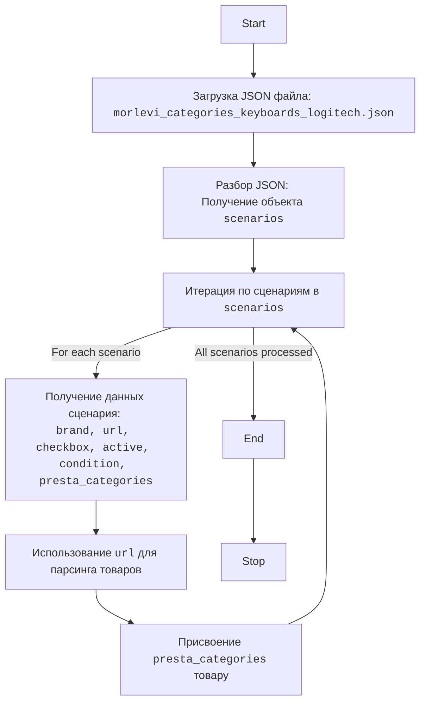

## АНАЛИЗ КОДА

### 1. <алгоритм>

Представленный код - это JSON-файл, который определяет сценарии для парсинга категорий товаров Logitech с сайта Morlevi. Каждый сценарий описывает определенный тип продукта, например, "LOGITECH WIRELESS KEYBOARD" или "LOGITECH USB MOUSE".

**Пошаговая блок-схема:**

1.  **Начало:** Загрузка JSON-файла.
    *   *Пример*: Программа загружает `morlevi_categories_keyboards_logitech.json`.

2.  **Разбор структуры:** JSON-файл содержит объект `scenarios`, внутри которого находятся объекты, представляющие отдельные сценарии. Каждый сценарий имеет следующие ключи:
    *   `brand` (строка): Бренд продукта, всегда "LOGITECH".
    *   `url` (строка): URL-адрес страницы продукта на сайте Morlevi.
    *   `checkbox` (логическое значение): Всегда `false`, вероятно, используется в UI.
    *   `active` (логическое значение): Всегда `true`, вероятно, определяет активность сценария.
    *   `condition` (строка): Всегда `new`, указывает на новое состояние товара.
    *    `presta_categories` (строка): строка с id категорий PrestaShop, к которым относится товар.
    *   *Пример*: Для сценария "LOGITECH WIRELESS KEYBOARD":
        *   `brand`: "LOGITECH"
        *   `url`: "-----------------------------------------------LOGITECH WIRELESS KEYBOARD----------------------------------------------"
        *   `checkbox`: false
        *   `active`: true
        *   `condition`: "new"
         *   `presta_categories`: "203,204,316"

3.  **Итерация:** Программа проходит по всем сценариям внутри объекта `scenarios`.

4.  **Обработка сценария:**  Для каждого сценария программа использует значения полей `url` для парсинга товаров и `presta_categories` для присвоения категорий товару.

5.  **Завершение:** Обработаны все сценарии.
    *   *Пример*: После прохождения всех сценариев программа завершает работу.

### 2. <mermaid>

**Объяснение `mermaid` диаграммы:**

*   **Start**: Начало процесса.
*   **LoadJson**:  Загружает JSON-файл, содержащий данные о сценариях. Файл имеет имя `morlevi_categories_keyboards_logitech.json`.
*   **ParseJson**: Разбирает загруженный JSON-файл и извлекает объект `scenarios`, который содержит все сценарии.
*   **LoopThroughScenarios**: Программа начинает цикл, перебирая каждый сценарий, содержащийся в объекте `scenarios`.
*   **GetScenarioData**: Для каждого сценария извлекаются данные, такие как `brand`, `url`, `checkbox`, `active`, `condition`, и `presta_categories`.
*  **ParseUrl**: Использует извлеченный `url` для парсинга данных о товарах с веб-страницы.
*   **MapPrestaCategories**: Присваивает товару соответствующие категории `presta_categories`, полученные из сценария.
*   **LoopThroughScenarios**: После обработки каждого сценария цикл продолжается до тех пор, пока все сценарии не будут обработаны.
*   **End**:  Конец цикла обработки сценариев.
*   **Stop**: Завершение процесса.

### 3. <объяснение>

**Импорты**:

В данном коде нет явных импортов. Это JSON-файл, и он не выполняет никаких действий, поэтому не имеет импортов.

**Классы**:

В этом JSON-файле нет классов. Он содержит данные в формате JSON, используемые для конфигурации.

**Функции**:

В этом JSON-файле нет функций. Он содержит только структурированные данные.

**Переменные**:

*   `scenarios`:  Объект, содержащий все сценарии.
*   `brand`: Строка, представляющая бренд товара.
*   `url`:  Строка, представляющая URL-адрес страницы товара.
*   `checkbox`: Логическое значение, вероятно, для UI.
*   `active`: Логическое значение, указывающее, активен ли сценарий.
*   `condition`: Строка, указывающая на состояние товара (всегда "new").
*   `presta_categories`: Строка, содержащая идентификаторы категорий PrestaShop, к которым относится товар.

**Потенциальные ошибки и области для улучшения**:

*   **Жестко закодированные URL**: URL-адреса жестко закодированы в JSON. В идеале их следует параметризовать или хранить в отдельном файле конфигурации, чтобы облегчить обновление.
*   **Отсутствие проверок**: Нет проверок на валидность URL-адресов или категорий `presta_categories`.
*   **Неинформативные URL для некоторых сценариев:** URL в сценариях "LOGITECH WIRELESS KEYBOARD" и "LOGITECH USB KEYBOARD"  имеют вид "-----------------------------------------------LOGITECH WIRELESS KEYBOARD----------------------------------------------" , что не имеет смысла для парсинга. Их следует заменить на реальные URL-адреса.
*   **Использование строк для категорий**: `presta_categories` хранятся в виде строки, что может потребовать дополнительной обработки.

**Взаимосвязь с другими частями проекта:**

Данный JSON-файл, вероятно, используется как конфигурационный файл для модуля парсинга товаров. Модуль парсинга будет загружать этот файл, итерировать по сценариям и использовать значения полей `url` для получения данных о товарах и `presta_categories` для присваивания категорий в PrestaShop.