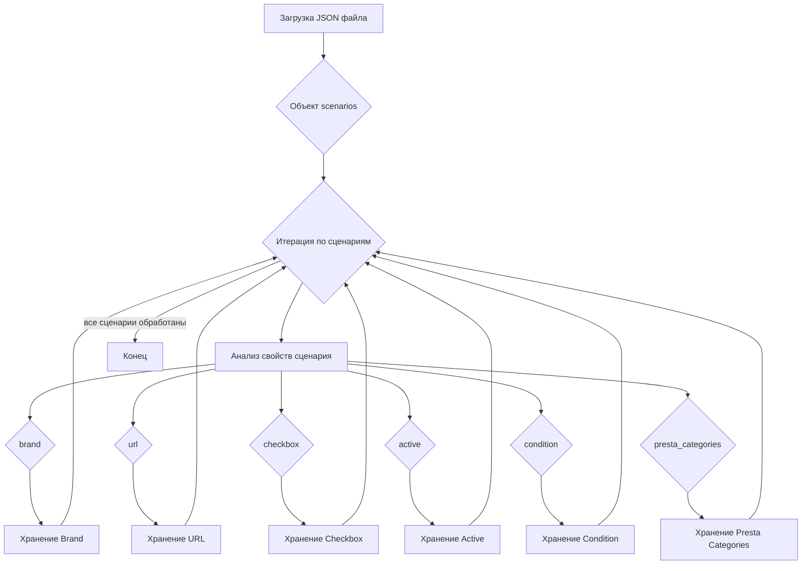

## АНАЛИЗ JSON ФАЙЛА

### 1. <алгоритм>

1.  **Начало:** Загрузка JSON-файла `morlevi_categories_keyboards_microsoft.json`.
2.  **Разбор:**  Файл содержит JSON-объект с ключом `scenarios`. Значение этого ключа — объект, где каждый ключ представляет собой название сценария (например, `"MICROSOFT WIRELESS KEYBOARD"`).
3.  **Итерация:** Происходит итерация по каждому ключу (сценарию) в объекте `scenarios`.
4.  **Анализ сценария:** Для каждого сценария извлекаются следующие поля:
    *   `brand` (строка):  Бренд продукта (например, `"MICROSOFT"`).
    *   `url` (строка): URL-адрес страницы товара. Если строка является набором дефисов `"-----------------------------------------------MICROSOFT WIRELESS KEYBOARD----------------------------------------------"`  это означает, что необходимо использовать другие URLS.
    *   `checkbox` (логическое значение): Флаг (всегда `false` в данном файле).
    *   `active` (логическое значение): Флаг, указывающий на активность сценария (всегда `true` в данном файле).
    *   `condition` (строка): Состояние товара (всегда `"new"` в данном файле).
    *   `presta_categories` (строка):  Список ID категорий PrestaShop, разделенных запятыми (например, `"203,204,316"`).
5.  **Пример:**
    *   **Сценарий:** `"MICROSOFT USB KEYBOARD"`
        *   `brand`: `"MICROSOFT"`
        *   `url`: `"https://www.morlevi.co.il/Cat/155?p_315=42&sort=datafloat2%2Cprice&keyword="`
        *   `checkbox`: `false`
        *   `active`: `true`
        *   `condition`: `"new"`
        *   `presta_categories`: `"203,204,315"`
6.  **Конец:** Завершение обработки всех сценариев.

### 2. <mermaid>

**Описание диаграммы Mermaid:**

*   **A (Загрузка JSON файла)**: Начало процесса. Представляет собой загрузку JSON-файла.
*   **B (Объект scenarios)**: JSON-объект `scenarios` со всеми сценариями.
*   **C (Итерация по сценариям)**: Цикл перебора всех сценариев внутри объекта `scenarios`.
*   **D (Анализ свойств сценария)**: Анализ свойств каждого отдельного сценария.
*   **E (brand), F (url), G (checkbox), H (active), I (condition), J (presta_categories)**: Отдельные свойства сценария.
*    **K (Хранение Brand), L (Хранение URL), M (Хранение Checkbox), N (Хранение Active), O (Хранение Condition), P (Хранение Presta Categories):** - сохранение проанализированных свойств.
*   **Q (Конец)**: Завершение обработки всех сценариев.

**Зависимости:**

*   Диаграмма не имеет импортированных зависимостей, так как описывает структуру данных в JSON, а не исполняемый код.

### 3. <объяснение>

**Импорты:**

В данном фрагменте кода нет импортов, так как это просто JSON файл. JSON - это формат данных, а не исполняемый код.

**Классы:**

В JSON файле нет классов. Это файл конфигурации.

**Функции:**

JSON файл не содержит функции.

**Переменные:**

*   `scenarios`: Объект, содержащий все сценарии. Каждый ключ является названием сценария, а значение — объект с параметрами сценария.
    *   `brand` (строка): Бренд продукта. Например, `"MICROSOFT"`.
    *   `url` (строка): URL-адрес страницы товара.
    *   `checkbox` (логическое значение): Флаг для отметки, всегда `false` в этом примере.
    *   `active` (логическое значение): Флаг, указывающий, что сценарий активен, всегда `true` в этом примере.
    *   `condition` (строка): Состояние товара, всегда `"new"` в этом примере.
    *   `presta_categories` (строка): Список категорий PrestaShop, разделенный запятыми.

**Назначение:**

Этот JSON файл используется для хранения конфигурационных данных, описывающих различные сценарии для товаров Microsoft. Каждый сценарий определяет конкретный тип продукта (например, "MICROSOFT WIRELESS KEYBOARD") и его параметры.

**Использование:**

Этот файл может использоваться в системе обработки данных для автоматизации сбора информации о товарах, определения категорий товаров на сайте prestashop или других целях, связанных с обработкой каталога товаров.

**Потенциальные ошибки и области для улучшения:**

*   **Отсутствие валидации:** Нет валидации данных внутри JSON, например, проверка типа данных или обязательных полей.
*   **Жестко заданные значения:** Флаги `checkbox` и `active` всегда `false` и `true` соответственно. Это может указывать на то, что они не используются или настроены неправильно.
*   **Неоднозначность URL**: Использование `"-----------------------------------------------MICROSOFT WIRELESS KEYBOARD----------------------------------------------"` говорит о том, что URL не является прямой ссылкой.
*   **Отсутствие единой структуры для категорий**:  `presta_categories`  представлены как строка, что может вызвать трудности при парсинге, лучше использовать массив.
*   **Отсутствие обработки ошибок:** нет обработки ошибок в случае, если какие-либо из полей отсутствуют в JSON.

**Цепочка взаимосвязей с другими частями проекта:**

Этот JSON файл может быть использован в связке с другими частями проекта, такими как:

1.  **Скрипт сбора данных**: Этот файл используется как входные данные для скрипта, который сканирует веб-сайты и извлекает информацию о товарах, используя значения `url`.
2.  **Система управления каталогом товаров**: Информация из файла используется для автоматизации заполнения каталога товаров, например, для создания или обновления позиций товаров в интернет-магазине.
3.  **Скрипты для работы с PrestaShop**:  `presta_categories` используются для правильного отнесения товаров к категориям в PrestaShop.

**Дополнительные замечания:**

*   Файл является примером конфигурации и не содержит исполняемого кода.
*   Файл предоставляет структурированный способ хранения данных о товарах, что упрощает их обработку и использование в различных процессах.