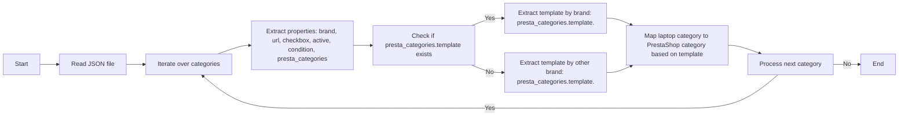

## АНАЛИЗ КОДА:

### 1. <алгоритм>

Код представляет собой JSON-файл, описывающий категории ноутбуков для определенного бренда (`<BRAND>`). Каждая категория ноутбука, идентифицированная по ключевому наименованию (например, `"<BRAND> 11.6 I3"`), имеет набор свойств, определяющих ее характеристики и соответствие категориям PrestaShop.

**Пошаговый алгоритм:**

1.  **Начало**: Файл начинается с открывающей фигурной скобки `{`, указывающей на начало JSON объекта.
2.  **Обход ключей**: Каждая пара ключ-значение представляет собой отдельную категорию ноутбука. Ключ - это строка, описывающая модель ноутбука (например, `"<BRAND> 11.6 I3"`).
3.  **Обработка свойств**: Для каждой категории ноутбука обрабатываются следующие свойства:
    *   `brand`: Строка, указывающая на бренд ноутбука (`"<BRAND>"`).
    *   `url`: Строка, представляющая URL (в данном случае всегда `null`).
    *   `checkbox`: Булево значение, указывающее на наличие чекбокса (всегда `false`).
    *   `active`: Булево значение, указывающее, активна ли категория (всегда `true`).
    *   `condition`: Строка, указывающая на состояние товара (всегда `"new"`).
    *   `presta_categories`: Объект, содержащий информацию о категориях PrestaShop.
        *   `template`: Объект, содержащий шаблон для сопоставления категорий.
            *   `"<BRAND>"`:  Массив, содержащий название категории PrestaShop и ее числовой ID. Например `[ "LAPTOPS INTEL I3", "11" ]`

4.  **Повторение**: Шаги 2 и 3 повторяются для каждой категории ноутбука в JSON-объекте.
5.  **Конец**: Файл заканчивается закрывающей фигурной скобкой `}`.

**Примеры:**

*   **Логический блок:** Обработка категории `"<BRAND> 11.6 I3"`:
    *   `brand`: `<BRAND>`
    *   `url`: `null`
    *   `checkbox`: `false`
    *   `active`: `true`
    *   `condition`: `"new"`
    *   `presta_categories.template.<BRAND>`: `["LAPTOPS INTEL I3", "11"]`
*   **Логический блок:** Обработка категории `"<BRAND> 15 AMD RYZEN 5"`:
    *   `brand`: `<BRAND>`
    *   `url`: `null`
    *   `checkbox`: `false`
    *   `active`: `true`
    *   `condition`: `"new"`
     *   `presta_categories.template.gigabyte`: `["LAPTOPS AMD RYZEN 5", "15"]`

**Поток данных:**
Данные считываются как JSON-объект, затем происходит итерация по каждой категории ноутбука. Для каждой категории извлекаются значения свойств и записываются в соответствующие поля. Значения используются для дальнейшей обработки в приложении (например, для автоматизации сопоставления категорий товаров с категориями в PrestaShop).

### 2. <mermaid>

**Объяснение:**

1.  **Start:** Начало процесса обработки JSON-файла.
2.  **ReadJSON:** Считывание содержимого JSON-файла.
3.  **ProcessCategories:** Итерация по каждой категории ноутбука в JSON-файле.
4.  **ExtractProps:** Извлечение основных свойств каждой категории, таких как `brand`, `url`, `checkbox`, `active`, `condition`, и `presta_categories`.
5.  **CheckPrestaTemplate**: Проверка наличия шаблона PrestaShop ( `presta_categories.template`).
6.  **ExtractTemplate**: Если шаблон найден, извлекается шаблон сопоставления, используя бренд (`presta_categories.template.<BRAND>`), например,  `"<BRAND>"`  из категории.
7. **ExtractTemplateOtherBrand**: Если шаблон не найден, то извлекается шаблон сопоставления, используя имя бренда, например, `"gigabyte"` из категории.
8.  **MapCategory:** На основании извлеченного шаблона, категория ноутбука сопоставляется с категорией в PrestaShop.
9.  **ProcessNext:** Проверка, есть ли еще категории для обработки.
10. **End:** Конец обработки JSON-файла.

### 3. <объяснение>

**Импорты**:
В представленном коде нет явных импортов. Этот файл является статическим JSON-файлом, который, скорее всего, используется другими частями проекта `src`. В контексте поставленной задачи подразумевается, что этот файл может использоваться для преобразования данных, в другие более удобные для использования форматы.

**Классы**:
В данном файле нет классов. Он представляет собой JSON-объект, который служит для хранения и передачи структурированных данных.

**Функции**:
В данном файле нет функций. Он представляет собой статическую структуру данных.

**Переменные**:

*   **Ключи верхнего уровня**: Каждая строка, представляющая модель ноутбука (например, `"<BRAND> 11.6 I3"`), является ключом JSON-объекта и служит для идентификации конкретной категории товара.
*   `brand`: Строка, указывающая на бренд товара.
*   `url`: Строка, представляющая URL (в данном случае всегда `null`).
*   `checkbox`: Булево значение, определяющее наличие чекбокса.
*   `active`: Булево значение, определяющее активность категории.
*   `condition`: Строка, обозначающая состояние товара (всегда `"new"`).
*   `presta_categories`: Объект, содержащий информацию о сопоставлении с категориями PrestaShop.
*   `template`: Объект, содержащий шаблоны для сопоставления категорий PrestaShop. Ключи этого объекта  - это названия брендов. Значения представляют собой массив из названия категории PrestaShop и ее ID.

**Взаимосвязь с другими частями проекта**:
Этот JSON-файл, вероятно, используется в рамках системы импорта товаров поставщика `morlevi`, в частности, для сопоставления категорий ноутбуков с категориями в интернет-магазине PrestaShop. Он может быть частью более крупного процесса автоматизации, где данные из JSON используются для обновления или создания категорий товаров в базе данных магазина.

**Потенциальные ошибки и области для улучшения**:

1.  **Отсутствие обработки ошибок:** В коде не предусмотрена обработка случаев, когда `url` не является `null` или `checkbox` не является `false`.
2.  **Жестко заданные значения:** Значения `url`, `checkbox` и `condition` всегда заданы жестко (`null`, `false`, и `"new"`). Это может быть изменено, в зависимости от требований проекта.
3.  **Дублирование данных:** Структура `presta_categories` с вложенным `template` может быть упрощена, если бренд всегда будет одним и тем же.
4.  **Сопоставление категорий:** Использование жестко заданных сопоставлений категорий PrestaShop в JSON файле может быть не гибким. Желательно рассмотреть возможность загрузки этой информации из базы данных или другого внешнего источника.
5.  **Обработка исключений:** Не предусмотрена обработка исключений при чтении JSON или при доступе к полям объекта.
6.  **Объединение категорий**: Некоторые категории, такие как `"<BRAND> 14 AMD RYZEN 7"` , имеют соответствие `[ "LAPTOPS INTEL I7", "14" ]`. Это может потребовать дополнительного внимания при обработке, чтобы не допустить неправильной классификации товара.
7.  **Обработка различных брендов**: В некоторых категориях, например, `"<BRAND> 15 AMD RYZEN 5"`, используется бренд `"gigabyte"` вместо `"<BRAND>"`. Это может вызвать проблемы, если код ожидает, что все бренды будут одинаковыми. Этот момент можно обработать создав несколько шаблонов `template`.
8. **Соответствие категорий**:  Обратите внимание, что `"LAPTOPS INTEL CELERON"`  используется для `Celeron` и `Pentium`. Это может быть не совсем корректно и привести к некорректной категоризации.

**Цепочка взаимосвязей**:

1.  Файл `morlevi_categories_laptops_SCENARIO_EMPTY.json` используется как входные данные.
2.  Вспомогательные классы или функции читают данные из этого файла и трансформируют их.
3.  Полученные данные используются для обновления категорий в PrestaShop.

**Заключение**:

Предоставленный JSON-файл служит для хранения информации о категориях ноутбуков для поставщика `morlevi`. Этот файл является важной частью процесса автоматизации сопоставления категорий и требует внимания для обработки крайних случаев. В перспективе, его структура и содержание могут быть усовершенствованы для большей гибкости и надежности.