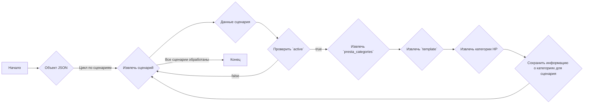
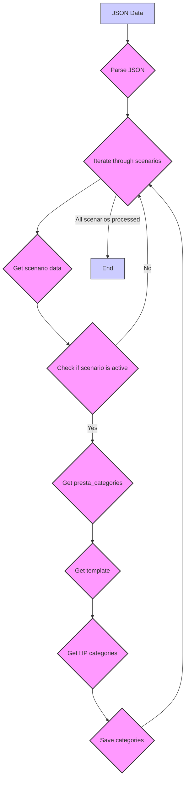

## Анализ кода `morlevi_categories_laptops_hp.json`

### 1. <алгоритм>
Данный JSON-файл представляет собой конфигурацию сценариев для категоризации ноутбуков HP. Каждый сценарий описывает конкретную модель ноутбука (например, "HP 11.6 I3", "HP 15 AMD RYZEN 7"),  ее характеристики и соответствия категориям в PrestaShop.

**Блок-схема:**

**Примеры:**

1. **Сценарий "HP 11.6 I3"**:
    -  `active` равно `true`, поэтому сценарий обрабатывается.
    -  `presta_categories.template.HP` содержит массив `[ "LAPTOPS INTEL I3", "11" ]`.
    -  Информация сохраняется, указывая, что ноутбуки HP 11.6 I3 относятся к категориям "LAPTOPS INTEL I3" и "11".
2. **Сценарий "HP 15 AMD RYZEN 5"**:
     -  `active` равно `true`, поэтому сценарий обрабатывается.
    -  `presta_categories.template.gigabyte` содержит массив `[ "LAPTOPS AMD RYZEN 5", "15" ]`.
    - Информация сохраняется, указывая, что ноутбуки HP 15 AMD RYZEN 5 относятся к категории "LAPTOPS AMD RYZEN 5" и "15" (хотя бренд в ключе стоит `gigabyte`, а должен быть `HP` ).
3.  **Потенциальная ошибка**: В сценарии `"HP 15 AMD RYZEN 5"`  `"template": { "gigabyte": [ "LAPTOPS AMD RYZEN 5", "15" ] }`. Ожидалось `"template": { "HP": [ "LAPTOPS AMD RYZEN 5", "15" ] }`. Это может привести к неправильной категоризации продукта.

**Поток данных:**
- JSON-объект загружается.
- Данные каждого сценария обрабатываются и извлекаются.
- Активные сценарии передаются для извлечения `presta_categories`.
- Информация о категориях извлекается из шаблона и сохраняется.

### 2. <mermaid>

**Объяснение:**

*   `JSON Data`: Начальная точка, представляющая JSON-файл.
*   `Parse JSON`: Разбор JSON-данных в структуру, с которой можно работать.
*   `Iterate through scenarios`: Цикл по всем сценариям, определенным в файле.
*    `Get scenario data`: Извлечение данных для текущего сценария.
*   `Check if scenario is active`: Проверка, является ли сценарий активным (значение `active` равно `true`).
*   `Get presta_categories`: Извлечение данных о категориях PrestaShop.
*  `Get template`: Извлечение шаблона категорий.
*   `Get HP categories`: Извлечение массива категорий HP из шаблона.
*   `Save categories`: Сохранение извлеченных категорий для текущего сценария.
*  `All scenarios processed`: Завершение обработки всех сценариев.
*   `End`: Конечная точка процесса.

### 3. <объяснение>

**Структура файла:**

Файл представляет собой JSON-объект, содержащий поле `scenarios`. Это поле является объектом, где ключи - это названия сценариев (например, "HP 11.6 I3"). Значения - это объекты, представляющие данные каждого сценария.

**Объект сценария:**
Каждый сценарий содержит следующие поля:

*   `brand`: Строка, представляющая бренд продукта (в данном случае всегда "HP").
*   `url`: Может быть `null`, что означает отсутствие URL-адреса.
*   `checkbox`: Булево значение, всегда `false`, предположительно, для указания, отображается ли чекбокс.
*   `active`: Булево значение, определяющее, активен ли сценарий. Если `true`, сценарий обрабатывается.
*   `condition`: Строка, представляющая состояние продукта (в данном случае всегда "new").
*   `presta_categories`: Объект, содержащий информацию о категориях PrestaShop.

**Объект `presta_categories`:**
*   `template`: объект, где ключ `HP` (или `gigabyte`, что является ошибкой, как упомянуто ранее)  содержит массив из двух элементов. Первый элемент - название категории (например, "LAPTOPS INTEL I3"), а второй - размер экрана.

**Использование:**

Этот JSON-файл, вероятно, используется для автоматического сопоставления моделей ноутбуков HP с соответствующими категориями в PrestaShop. Программа, обрабатывающая этот файл, проходит по каждому сценарию и, если он активен, сопоставляет модель с категориями, указанными в `presta_categories.template`.

**Потенциальные ошибки и области для улучшения:**

1.  **Ошибка в названии ключа `gigabyte` в `template`**: В сценарии "HP 15 AMD RYZEN 5" используется ключ `"gigabyte"` вместо `"HP"`, что является ошибкой и должно быть исправлено на `"HP"`.

2.  **Жестко заданный бренд**: Все сценарии имеют бренд "HP". Если бы были сценарии для других брендов, это потребовало бы дополнительной обработки. Можно добавить возможность использовать бренд как ключ и соответствующую настройку в шаблоне.

3. **Негибкость структуры категорий:** Структура категорий в массиве `[категория_процессор, размер_экрана]` является жесткой. Если понадобится добавить дополнительные уровни категорий, структуру придется менять. Можно сделать её более гибкой.

4.  **Отсутствие обработки ошибок**: Не предусмотрена обработка ошибок, если, например, в `presta_categories.template` отсутствует ключ "HP", либо `template` вообще отсутствует, это приведет к сбою программы, обрабатывающей данный файл.

5. **Отсутствие URL:** `url` для всех сценариев равен `null`. Если `url` является важным элементом для обработки, это поле можно было бы пересмотреть.

**Взаимосвязи с другими частями проекта:**

Этот файл, скорее всего, является частью более крупной системы, которая занимается:

1. **Импортом продуктов:** Файл может использоваться для определения категорий при импорте новых продуктов в PrestaShop.
2. **Обновлением категорий:** Файл может использоваться для обновления категорий существующих продуктов.
3. **Синхронизацией данных:**  Файл может быть частью системы, синхронизирующей данные между поставщиком и магазином PrestaShop.

Этот анализ предоставляет всестороннее понимание структуры JSON-файла, его функциональности, потенциальных проблем и взаимосвязей с другими частями проекта.