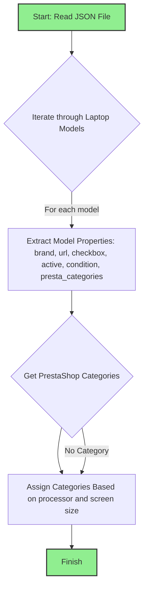

## <алгоритм>

1.  **Чтение JSON файла:**
    *   Начинается с чтения JSON файла, который содержит конфигурацию для различных моделей ноутбуков Lenovo.
    *   Файл представлен в виде словаря (dict) с ключом "scenarios", где каждый ключ внутри "scenarios" - это название модели ноутбука.
    *   Пример: `"LENOVO 11.6 I3": { ... }`

2.  **Обход моделей ноутбуков:**
    *   Проходим итерацию по всем ключам внутри словаря "scenarios" (т.е., по названиям моделей ноутбуков).
    *   Пример итерации: Для каждой модели `"LENOVO 11.6 I3"`, `"LENOVO 11.6 I5"` и т.д.

3.  **Извлечение свойств модели:**
    *   Для каждой модели ноутбука извлекаются её характеристики:
        *   `brand`: Бренд ноутбука (всегда "LENOVO").
        *   `url`: URL-адрес для категории на сайте morlevi.co.il (может быть `null`).
        *   `checkbox`: Флаг, определяющий использование чекбокса (всегда `false`).
        *   `active`: Флаг активности (всегда `true`).
        *   `condition`: Состояние товара (всегда "new").
        *   `presta_categories`: Информация о категориях для PrestaShop.

4.  **Извлечение данных о категориях:**
    *   Внутри `presta_categories` есть ключ `template`, который содержит словарь с ключом "LENOVO" (или иногда "gigabyte").
    *   Значением для "LENOVO" является список из двух элементов:
        *   Первый элемент - категория процессора (например, "LAPTOPS INTEL I3").
        *   Второй элемент - размер экрана (например, "11", "13", "14", "15", "17").
    *   Пример: `"LENOVO": [ "LAPTOPS INTEL I3", "11" ]`

5.  **Присвоение категорий:**
    *   Полученные категории процессора и размера экрана используются для отнесения ноутбука к определенной категории в PrestaShop.
    *   Данные могут быть использованы для интеграции с PrestaShop.

6.  **Завершение:**
    *   После обработки всех моделей ноутбуков, процесс завершается.

## <mermaid>

**Объяснение:**

*   `Start: Read JSON File`: Начальная точка процесса, где происходит чтение данных из JSON файла.
*   `Iterate through Laptop Models`: Цикл, который перебирает каждую модель ноутбука, представленную в JSON файле.
*   `Extract Model Properties`: Извлечение всех необходимых свойств для каждой модели: бренда, URL, флага использования чекбокса, флага активности, состояния товара и информации о категориях для PrestaShop.
*   `Get PrestaShop Categories`: Извлечение категорий PrestaShop из данных, полученных на предыдущем шаге, на основе ключей `template` и `LENOVO` (или `gigabyte`).
*   `Assign Categories Based on processor and screen size`: Определение и присвоение категорий в PrestaShop на основе полученных данных о типе процессора и размере экрана.
*   `Finish`: Конечная точка процесса, завершение обработки данных.
* `No Category`: Возврат к `Assign Categories Based on processor and screen size`  если категория не найдена.

## <объяснение>

**Импорты:**
*   В данном коде нет импортов, поскольку это просто данные в формате JSON.

**Классы:**

*   В данном JSON файле нет классов. Структура данных представлена в виде словаря и списков.

**Функции:**

*   Функций нет, это просто структура данных.

**Переменные:**

*   `scenarios`: Главный словарь, содержащий данные по всем моделям ноутбуков.
    *   Тип: `dict`
    *   Использование: Ключи - названия моделей, значения - словари с характеристиками.
*   `brand`: Бренд ноутбука (всегда "LENOVO").
    *   Тип: `str`
    *   Использование: Идентификатор бренда.
*   `url`: URL страницы категории ноутбука на сайте morlevi.co.il.
    *   Тип: `str` или `null`
    *   Использование: URL для перехода к категории на сайте поставщика.
*    `checkbox`: флаг для чекбокса (всегда `false`).
    *   Тип: `bool`
    *   Использование: Флаг для чекбокса (не используется в коде).
*   `active`: Флаг, указывающий, активна ли данная модель.
    *   Тип: `bool`
    *   Использование: Флаг активности.
*   `condition`: Состояние товара (всегда "new").
    *   Тип: `str`
    *   Использование: Состояние товара.
*   `presta_categories`: Словарь с категориями PrestaShop.
    *   Тип: `dict`
    *   Использование: Содержит шаблон для категорий PrestaShop.
*   `template`: Шаблон категорий PrestaShop.
    *   Тип: `dict`
    *   Использование: Содержит конкретные категории.
*   `LENOVO`: Ключ в `template`, указывающий на категории Lenovo (или `gigabyte`).
    *   Тип: `list`
    *   Использование: Список из двух элементов: категория процессора и размер экрана.

**Потенциальные ошибки и области для улучшения:**

1.  **Разнородность категорий:** В модели `"LENOVO 15 AMD RYZEN 5"` используется категория `gigabyte`, что не соответствует остальным, где используется `LENOVO`. Это может привести к ошибкам при дальнейшем использовании данных.
2.  **Отсутствие единой логики:** Данные выглядят как статичные, и было бы полезно добавить логику для динамического добавления или обновления категорий и моделей.
3.  **Жестко заданные бренды и категории:**  Использование `LENOVO` в качестве ключа в шаблоне и жесткое кодирование списка категорий внутри могут создать проблемы при расширении каталога или добавлении новых брендов. Было бы лучше использовать более гибкую структуру.
4.  **Дублирование кода:** Данные по многим моделям практически идентичны, что потенциально может быть улучшено за счет использования шаблонов или функций.

**Взаимосвязь с другими частями проекта:**

*   Предполагается, что этот JSON файл является частью системы, которая обрабатывает данные о товарах для интеграции с PrestaShop.
*   Данные из этого файла могут быть использованы другими частями проекта, например, скриптами для загрузки товаров в базу данных PrestaShop или для создания категорий.
*   Файл можно рассмотреть как часть конфигурации для модуля импорта товаров.
*   Связь с другими частями проекта будет зависеть от реализации, но обычно этот файл является входными данными для других модулей, которые используют его для заполнения базы данных или управления категориями.

Данный файл содержит статическую конфигурацию для определения категорий товаров Lenovo на PrestaShop, что делает его важной частью модуля импорта товаров в рамках более крупной системы.