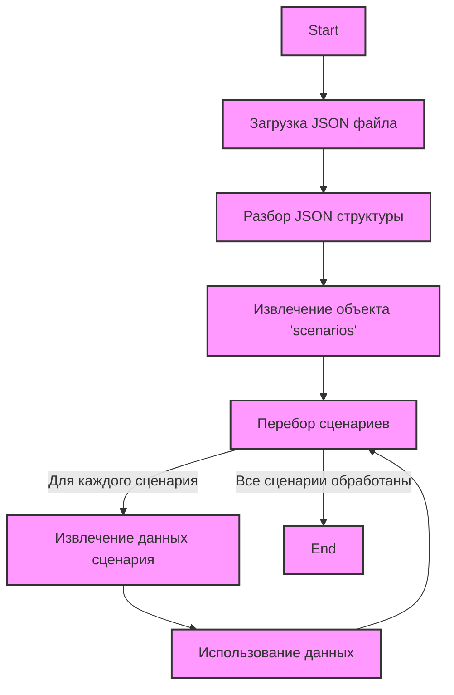

## Анализ кода `morlevi_categories_minipc_intel.json`

### 1. <алгоритм>

Этот JSON-файл представляет собой конфигурационный файл, который содержит набор сценариев для парсинга категорий мини-ПК Intel с веб-сайта поставщика Morlevi.

**Блок-схема:**

1.  **Начало:** Загрузка JSON-файла `morlevi_categories_minipc_intel.json`.
    
    *Пример*: JSON-файл загружается в программу.
2.  **Разбор:** Извлечение данных из JSON-структуры.
    
    *Пример*: Извлечение объекта `scenarios`.
3.  **Итерация:** Перебор ключей (названий сценариев) внутри объекта `scenarios`.
    
    *Пример*: Перебор ключей: "INTEL MINIPC I3 8-9th GEN", "INTEL MINIPC I3 10th GEN" и т.д.
4.  **Обработка сценария:** Для каждого ключа (сценария) извлечение связанных с ним значений (бренд, URL, флаг checkbox, флаг active, условие, presta_categories).
    *Пример*: Для "INTEL MINIPC I3 8-9th GEN": бренд = "INTEL", url = "https://www.morlevi.co.il/Cat/127?p_315=3&p_189=3339&sort=datafloat2%2Cprice&keyword=", checkbox = false, active = true, condition = "new", presta_categories = "159,160"
5.  **Использование данных:** Данные могут использоваться для настройки парсера, который будет сканировать веб-страницы Morlevi.

    *Пример:* URL используется для загрузки веб-страницы, а `presta_categories` - для привязки товаров в PrestaShop.
6.  **Конец:** Завершение обработки всех сценариев.

### 2. <mermaid>

**Объяснение:**

*   **Start:** Начало процесса.
*   **LoadJSON:** Загрузка JSON файла `morlevi_categories_minipc_intel.json`.
*   **ParseJSON:** Разбор структуры JSON.
*   **ExtractScenarios:** Извлечение данных по ключу `scenarios`.
*  **LoopThroughScenarios:** Итерация по всем ключам внутри объекта scenarios
*   **ExtractData:** Извлечение данных для каждого сценария. Сюда входят бренд (`brand`), URL (`url`), флаг `checkbox`, флаг `active`, `condition` и категории `presta_categories`.
*   **UseData:**  Использование извлеченных данных для дальнейшей обработки (настройки парсера, сканирования веб-страниц и т.д.)
*   **End:** Конец процесса.

**Зависимости:**

Данный файл JSON не имеет внешних зависимостей в плане импорта других модулей или библиотек. Он является самодостаточным файлом конфигурации.

### 3. <объяснение>

**Импорты:**

В данном коде импорты отсутствуют, так как это файл в формате JSON, а не Python.
Однако, можно предположить, что при использовании данного JSON файла в коде Python, понадобится импортировать модуль `json` для работы с JSON-форматом.

**Классы:**

В данном файле нет классов, так как это файл конфигурации в формате JSON, а не Python.

**Функции:**

Функции как таковые в этом файле отсутствуют, поскольку он представляет собой данные. Однако, в Python-скрипте, использующем этот JSON, будут использоваться функции для работы с этими данными (чтение, разбор и обработка).

**Переменные:**

*   `scenarios`: Объект JSON, содержащий вложенные объекты, представляющие собой сценарии парсинга.
*   `brand`: Строка, указывающая бренд (в данном случае, "INTEL").
*   `url`: Строка, представляющая URL страницы для парсинга.
*   `checkbox`: Логическое значение (boolean), которое указывает, использовать ли чекбокс.
*   `active`: Логическое значение (boolean), указывающее, активен ли данный сценарий.
*   `condition`: Строка, указывающая условие ("new").
*   `presta_categories`: Строка, представляющая идентификаторы категорий PrestaShop через запятую.

**Цепочка взаимосвязей с другими частями проекта:**

Данный JSON-файл является частью системы сбора данных с сайта поставщика `Morlevi` и связан с другими частями проекта через:

1.  **Парсер данных**: Данные из этого файла используются для настройки и управления парсером.
2.  **PrestaShop**: Категории `presta_categories`  используются для связывания товаров с категориями PrestaShop.

**Потенциальные ошибки или области для улучшения:**

1.  **Неполные URL для некоторых сценариев:** URL для `INTEL MINIPC I9`, `INTEL MINIPC AMD` и `INTEL MINIPC Celeron` являются просто строками-"заглушками". Это явная ошибка, т.к. парсер не сможет работать без правильных URL-ов.
2.  **Жестко заданные параметры URL**: URL содержат параметры `p_315` и `p_189`, которые возможно следует вынести в настройки, для большей гибкости.
3.  **Отсутствие обработки ошибок:** В коде, который будет использовать этот JSON, должна быть предусмотрена обработка ошибок, например, если URL недействителен или отсутствует.
4.  **Дублирование кода**: все scenario имеют одинаковые `checkbox`, `active`, `condition`. Возможно, их можно вынести в глобальные настройки.

**Улучшения:**

1.  **Добавить корректные URL для всех сценариев:** Исправить URL для `INTEL MINIPC I9`, `INTEL MINIPC AMD` и `INTEL MINIPC Celeron` на корректные.
2.  **Параметризация URL**:  Сделать параметры URL более гибкими, возможно вынести их в конфигурацию
3.  **Валидация JSON**: Добавить проверку формата JSON.
4.  **Унификация параметров**: Оптимизировать код, используя общие настройки для повторяющихся параметров.