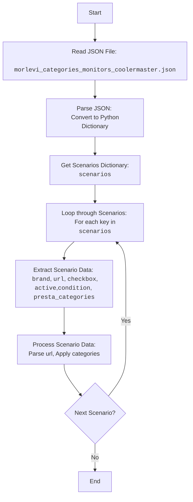

## Анализ кода `morlevi_categories_monitors_coolermaster.json`

### 1. <алгоритм>

Этот JSON-файл содержит данные о сценариях для мониторов бренда "COOLER MASTER" из магазина "Morlevi". Каждый сценарий представляет собой категорию мониторов определенного размера (22, 24-25, 27-29, 32, 34, 49 дюймов) и содержит информацию для их обработки.

**Пошаговая блок-схема:**

1.  **Начало:** Чтение JSON-файла.
    *   Пример: Загрузка файла `morlevi_categories_monitors_coolermaster.json` в память.

2.  **Разбор JSON:** Преобразование JSON-структуры в объект Python (словарь).
    *   Пример: Получение словаря с ключом `scenarios`, содержащего вложенные словари для каждого сценария.

3.  **Итерация по сценариям:** Проход по каждому ключу в словаре `scenarios`.
    *   Пример: На первом шаге итерации будет обработан сценарий с ключом `COOLER MASTER 22`.

4.  **Извлечение данных сценария:** Извлечение значений атрибутов для каждого сценария.
    *   Пример: Для сценария `COOLER MASTER 22`:
        *   `brand`: "COOLER MASTER"
        *   `url`: "----------------------------------COOLER MASTER 22---------------------------------------"
        *   `checkbox`: `false`
        *   `active`: `true`
        *   `condition`: `"new"`
        *   `presta_categories`: `"127,128,981"`

5.  **Обработка данных:** Применение полученных данных для обработки товаров.
    *   Пример: URL, может использоваться для парсинга страниц магазина. Значение `presta_categories` может быть использовано для привязки товаров к категориям в PrestaShop.

6.  **Завершение:** Обработка всех сценариев.

**Поток данных:**

*   **JSON-файл** --> **Чтение файла** --> **Разбор JSON** --> **Словарь `scenarios`** --> **Итерация по сценариям** --> **Извлечение атрибутов** --> **Обработка данных**

### 2. <mermaid>

**Объяснение `mermaid` диаграммы:**

*   `Start`: Начало процесса.
*   `ReadJson`: Чтение JSON-файла `morlevi_categories_monitors_coolermaster.json`.
*   `ParseJson`: Разбор JSON-структуры и преобразование ее в словарь Python.
*   `Scenarios`: Получение словаря `scenarios`, содержащего данные по каждому сценарию.
*   `LoopStart`: Начало цикла итерации по каждому сценарию.
*   `ExtractData`: Извлечение данных, таких как `brand`, `url`, `checkbox`, `active`, `condition` и `presta_categories`, из текущего сценария.
*   `ProcessData`: Обработка данных. Например, URL для парсинга, `presta_categories` для привязки к категориям.
*   `LoopEnd`: Проверка, есть ли еще сценарии для обработки.
*   `End`: Конец процесса.

### 3. <объяснение>

**Импорты:**
В данном коде нет импортов. Это JSON-файл, содержащий данные, а не исполняемый код. Поэтому здесь нет зависимостей от пакетов `src`.

**Классы:**
В данном коде нет классов. Это JSON-файл, а не Python-код.

**Функции:**
В данном коде нет функций. Это JSON-файл, а не Python-код.

**Переменные:**

*   `scenarios`: Это объект JSON, представляющий словарь, где ключи — это названия сценариев (например, "COOLER MASTER 22"), а значения — словари с атрибутами сценария.
    *   Тип: `dict`.
*   `brand`: Строка, представляющая бренд товара (например, "COOLER MASTER").
    *   Тип: `str`.
*   `url`: Строка, представляющая URL-адрес страницы или какой-либо идентификатор, связанный со сценарием.
    *   Тип: `str`.
*   `checkbox`: Логическое значение, определяющее состояние чекбокса (в данном случае, всегда `false`).
    *   Тип: `bool`.
*   `active`: Логическое значение, определяющее активность сценария (в данном случае, всегда `true`).
    *   Тип: `bool`.
*    `condition`: строка, определяющая состояние товара (в данном случае, всегда `new`).
    *    Тип: `str`.
*   `presta_categories`: Строка, представляющая идентификаторы категорий PrestaShop, к которым относятся товары данного сценария, разделенные запятыми.
    *   Тип: `str`.

**Потенциальные ошибки и области для улучшения:**

*   **Ошибки:**
    *   В URL-ах есть как нормальные ссылки, так и строки, которые являются просто разделителями  `"----------------------------------COOLER MASTER 22---------------------------------------"`, что может привести к ошибкам при парсинге.
    *   В данном примере, поле `checkbox` всегда false, что является избыточным.
    *   Все `condition` являются `new`, что можно вынести на более высокий уровень.
*   **Улучшения:**
    *   Использовать более строгую структуру для `url` (например, сделать поле обязательным и требовать валидный URL или заменить поле на `identifier`).
    *   Удалить поле `checkbox`, если оно всегда `false`.
    *   Добавить проверку корректности данных при загрузке (например, проверка типа данных, валидация URL).

**Взаимосвязи с другими частями проекта:**

*   Этот файл является конфигурационным файлом для парсинга данных с сайта "Morlevi" и привязки их к категориям в PrestaShop. Он используется в сочетании с кодом, который будет читать и обрабатывать эти данные, парсить URL-ы, и обновлять данные в PrestaShop.
*   Данные из этого файла, вероятно, будут использоваться в качестве входных данных для другого скрипта или сервиса, который обрабатывает каталоги товаров магазина.