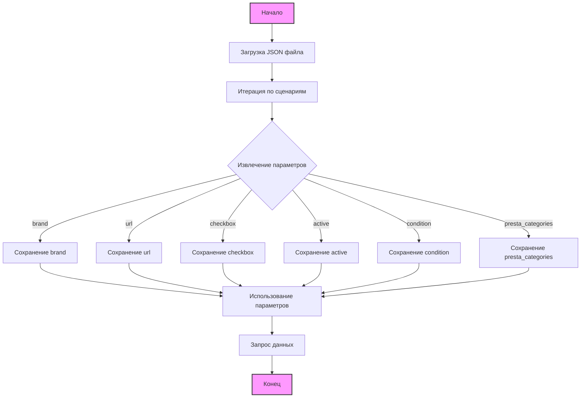

## Анализ кода `morlevi_categories_monitors_mag.json`

### 1. <алгоритм>

Этот JSON файл описывает конфигурацию для сбора данных о мониторах бренда MAG с сайта morlevi.co.il.

**Пошаговая блок-схема:**

1. **Начало**: Загрузка JSON файла с настройками.
   ```
    {
        "scenarios": {
            "MAG 22": { ... },
            "MAG 24-25": { ... },
            ...
        }
    }
   ```
2. **Итерация по сценариям**: Проход по каждому ключу (например, "MAG 22", "MAG 24-25"). Каждый ключ представляет собой конкретный сценарий сбора данных.
   *  Пример: "MAG 22" - первый сценарий.
   ```
     "MAG 22": {
         "brand": "MAG",
         "url": "https://www.morlevi.co.il/Cat/8?p_315=24&p_350=1805&sort=datafloat2%2Cprice&keyword=",
         "checkbox": false,
         "active": true,
         "condition":"new",
         "presta_categories": "127,128,529"
       }
   ```
3. **Извлечение параметров для каждого сценария**:
   - `brand` (строка): Название бренда монитора (например, "MAG").
   - `url` (строка): URL-адрес для запроса данных (например, `https://www.morlevi.co.il/Cat/8?...`).
   - `checkbox` (логическое): Флаг для управления, например, использовать чекбокс (в данном случае всегда `false`).
   - `active` (логическое): Флаг активности для сценария (в данном случае всегда `true`).
   - `condition` (строка): Состояние товара (в данном случае всегда "new").
   - `presta_categories` (строка): Категории PrestaShop, к которым относится товар (например, `"127,128,529"`).
4. **Использование параметров**: Полученные параметры используются для формирования запросов к сайту и обработки данных о товарах.
   -  URL используется для запроса данных с сайта.
   - `brand`, `condition`, и `presta_categories` используются для классификации и хранения данных.
5. **Завершение**: Обработка данных завершена. Результатом является набор данных о мониторах бренда MAG.

### 2. <mermaid>



**Разбор `mermaid` диаграммы:**

- `Start`: Начальная точка процесса.
- `LoadJSON`: Загрузка JSON файла, содержащего конфигурацию сценариев.
- `ProcessScenarios`: Итерация по каждому сценарию, описанному в JSON.
- `ExtractParameters`: Извлечение параметров из каждого сценария.
- `BrandParam`: Сохранение параметра `brand` (например, "MAG").
- `UrlParam`: Сохранение параметра `url` (например, URL-адрес).
- `CheckboxParam`: Сохранение параметра `checkbox` (например, `false`).
- `ActiveParam`: Сохранение параметра `active` (например, `true`).
- `ConditionParam`: Сохранение параметра `condition` (например, `"new"`).
- `PrestaCategoriesParam`: Сохранение параметра `presta_categories` (например, `"127,128,529"`).
- `UseParams`: Использование извлеченных параметров для дальнейшей обработки.
- `RequestData`: Запрос данных с использованием параметра `url`.
- `End`: Конечная точка процесса.

Диаграмма показывает поток данных от загрузки JSON к извлечению параметров и их использованию для запроса данных. Каждый параметр сохраняется отдельно для наглядности.

### 3. <объяснение>

#### Импорты:

- В данном коде импортов нет, так как это JSON файл. Он используется как файл конфигурации и не содержит исполняемого кода.

#### Классы:

- В данном коде нет классов, так как это JSON файл, представляющий собой структуру данных.

#### Функции:

- В данном коде нет функций, так как это JSON файл, представляющий собой структуру данных.

#### Переменные:

- `scenarios` (объект): Главный объект, содержащий в себе все сценарии.
    -  **Пример**:
        ```json
        "scenarios": {
           "MAG 22": { ... },
           "MAG 24-25": { ... },
           ...
        }
        ```
- `MAG 22`, `MAG 24-25`, `MAG 27-29`, `MAG 32`, `MAG 34`, `MAG 49` (ключи-строки): Ключи, представляющие собой конкретные сценарии. Каждый ключ содержит в себе объект с настройками.
- `brand` (строка): Название бренда монитора.
    -  **Пример**: `"brand": "MAG"`
- `url` (строка): URL-адрес для запроса данных с сайта.
    -  **Пример**: `"url": "https://www.morlevi.co.il/Cat/8?p_315=24&p_350=1805&sort=datafloat2%2Cprice&keyword="`
- `checkbox` (логическое): Флаг использования чекбокса (всегда `false` в данном случае).
    - **Пример**: `"checkbox": false`
- `active` (логическое): Флаг активации сценария (всегда `true` в данном случае).
    - **Пример**: `"active": true`
- `condition` (строка): Состояние товара (всегда `"new"` в данном случае).
    -  **Пример**: `"condition": "new"`
- `presta_categories` (строка): Строка с ID категорий PrestaShop через запятую.
    -  **Пример**: `"presta_categories": "127,128,529"`

#### Потенциальные ошибки или области для улучшения:

- **Отсутствие проверок URL**: В файле присутствуют заглушки для URL адресов "MAG 34" и "MAG 49". Необходимо заполнить правильные адреса.
- **Жестко заданные значения**: Значения `checkbox` и `condition` всегда `false` и `"new"` соответственно, можно сделать их более гибкими или удалить, если не планируется их изменение.
- **Отсутствие валидации**: Нет валидации данных, хотя можно добавить валидацию URL, `presta_categories` и т.д. для обеспечения корректной работы.
- **Обработка ошибок**: Нет механизма обработки ошибок, если URL невалидный или данные не могут быть получены.

#### Цепочка взаимосвязей с другими частями проекта:

1. **Загрузка JSON файла**: Данный JSON файл, вероятно, загружается в Python коде (или другом языке) для обработки.
2. **Использование URL**: URL-адреса используются для формирования HTTP запросов к сайту `morlevi.co.il`, вероятно с использованием библиотек, таких как `requests` (в Python).
3. **Парсинг HTML**: Полученный HTML контент, вероятно, парсится с помощью библиотек, таких как `BeautifulSoup4` (в Python), для извлечения данных о товарах.
4. **Интеграция с PrestaShop**: `presta_categories` используются для определения категорий товаров в интернет-магазине PrestaShop.
5. **Сохранение данных**: Извлеченные данные, вероятно, сохраняются в базу данных или в другом формате (CSV, XML).

**В заключение**:  
Этот JSON файл служит конфигурационным файлом для определения параметров сбора данных о мониторах бренда MAG с сайта morlevi.co.il. Он описывает несколько сценариев сбора данных, каждый из которых содержит URL-адрес, настройки активации, состояния и категории PrestaShop.  Для полноценного использования этого файла необходим отдельный исполняемый код, который будет загружать JSON, обрабатывать URL и сохранять полученные данные.