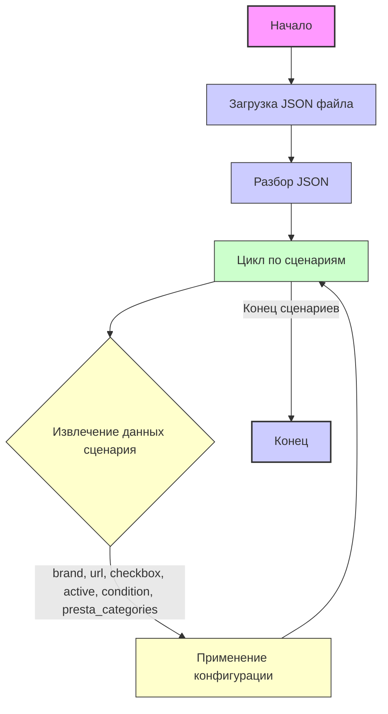

## Анализ кода `morlevi_categories_monitors_samsung.json`

### <алгоритм>

1. **Начало**: Загрузка JSON файла с конфигурацией сценариев.
2. **Разбор JSON**:  JSON разбирается и преобразуется в объект Python (словарь, в данном случае).
3. **Итерация по сценариям**: Цикл перебирает ключи в словаре `scenarios`. Каждый ключ представляет собой название сценария, например, `"SAMSUNG 21 - 22"`.
4. **Извлечение данных сценария**: Для каждого сценария извлекаются следующие данные:
    - `brand`: Бренд товара (например, `"SAMSUNG"`).
    - `url`: URL-адрес для получения списка товаров.
    - `checkbox`: Флаг, определяющий, должен ли быть включен чекбокс (в данном случае всегда `false`).
    - `active`: Флаг, определяющий активность сценария (всегда `true`).
    - `condition`: Состояние товара (например, `"new"`).
    - `presta_categories`: Категории PrestaShop, соответствующие размеру мониторов.
      - `template`: Шаблон, содержащий соответствие размера монитора категории PrestaShop (например, `{ "samsung": "PC MONITORS 21 - 22" }`).
5. **Применение конфигурации**: Данные каждого сценария могут быть использованы для настройки процесса парсинга товаров с сайта `morlevi.co.il` и их импорта в магазин PrestaShop.
6. **Конец**: Завершение обработки всех сценариев.

**Примеры:**

- Для сценария `"SAMSUNG 21 - 22"`:
  - `brand` = `"SAMSUNG"`
  - `url` = `"https://www.morlevi.co.il/Cat/8?p_350=1805&p_315=28&sort=datafloat2%2Cprice&keyword="`
  - `presta_categories` = `{ "template": { "samsung": "PC MONITORS 21 - 22" } }`
- Для сценария `"SAMSUNG 32 - 34"`:
  - `brand` = `"SAMSUNG"`
  - `url` = `"https://www.morlevi.co.il/Cat/8?p_350=1809&p_350=1810&p_315=28&sort=datafloat2%2Cprice&keyword="`
  - `presta_categories` = `{ "template": { "samsung": "PC MONITORS 32 - 34" } }`

### <mermaid>

**Объяснение `mermaid`:**

-   `Start`: Начало процесса.
-   `LoadJson`: Загружает JSON файл конфигурации.
-   `ParseJson`: Разбирает JSON файл в объект Python.
-   `LoopScenarios`: Итерация по каждому сценарию (ключу) в словаре.
-   `ExtractData`: Извлечение необходимых данных для текущего сценария. Включает в себя переменные `brand`, `url`, `checkbox`, `active`, `condition` и `presta_categories`.
-   `ApplyConfig`: Применение извлеченных данных для настройки процесса парсинга и импорта товаров.
-   `End`: Конец процесса.
-   Стили (`classDef`) применяются для визуального выделения различных типов блоков: начального/конечного, блоков загрузки/разбора, циклов и блоков данных.

### <объяснение>

**Импорты**:

В данном коде нет явных импортов. Этот файл представляет собой конфигурационный JSON файл и не содержит кода Python.

**Классы**:

В данном коде нет классов. Этот файл используется для хранения данных.

**Функции**:

В данном коде нет функций. Этот файл используется для хранения данных.

**Переменные**:

-   `scenarios`: (словарь) - Основной контейнер, содержащий все сценарии. Ключи словаря - это названия сценариев (например, `"SAMSUNG 21 - 22"`), а значения - это словари с параметрами сценария.
-   `brand`: (строка) - Бренд товара (например, `"SAMSUNG"`).
-   `url`: (строка) - URL-адрес, с которого нужно парсить товары.
-   `checkbox`: (логический) - Флаг, определяющий, нужно ли использовать чекбокс (всегда `false` в этом файле).
-   `active`: (логический) - Флаг, определяющий активность сценария (всегда `true` в этом файле).
-   `condition`: (строка) - Состояние товара (например, `"new"`).
-   `presta_categories`: (словарь) - Категории PrestaShop, соответствующие товару.
    - `template`: (словарь) - Содержит соответствие между брендом и категориями PrestaShop.

**Объяснение**:

Этот JSON файл описывает конфигурацию для парсинга и импорта мониторов Samsung различных размеров с сайта `morlevi.co.il` в магазин PrestaShop. Каждый сценарий представляет собой отдельную категорию мониторов (например, "21-22 дюйма", "23-24 дюйма" и т.д.).

-   `brand`: Указывает, что все товары в этих сценариях принадлежат бренду "SAMSUNG".
-   `url`: Задает URL-адрес, который будет использоваться для парсинга товаров конкретной категории. Обратите внимание, что `p_350` (размер) и `p_315` (категория) изменяются в каждом URL, что соответствует разным категориям размеров мониторов.
-   `checkbox` и `active`: Это флаги, которые могут использоваться для включения/отключения сценариев. В данном случае все сценарии активны и чекбоксы не используются.
-   `condition`: Показывает, что все товары в этих сценариях являются новыми (`"new"`).
-   `presta_categories`: Связывает каждую категорию мониторов с категорией PrestaShop. В данном случае используется шаблон, который устанавливает соответствие между размером монитора и категорией PrestaShop. Это позволяет автоматически добавлять товары в нужную категорию PrestaShop.

**Потенциальные ошибки и области для улучшения:**

-   **Дублирование параметров**: Параметры `checkbox`, `active`, и `condition` одинаковы для всех сценариев. Возможно, было бы лучше вынести их на уровень выше (вне каждого конкретного сценария) или использовать их по умолчанию, если это не требуется.
-   **Жестко закодированные URL**: URL-адреса содержат параметры, специфичные для `morlevi.co.il`. Это может вызвать проблемы, если структура сайта изменится.
-   **Расширяемость**: Если потребуется добавить другие бренды или дополнительные параметры, структура может потребовать изменений. Было бы полезно создать более гибкую и обобщенную структуру для сценариев.

**Цепочка взаимосвязей**:

Этот файл является частью процесса импорта товаров с сайта поставщика `morlevi.co.il`. Он используется совместно с кодом, который будет читать этот JSON, и использовать данные для парсинга товаров и импорта их в PrestaShop. В частности, код должен:

1.  **Прочитать** этот JSON файл.
2.  **Итерироваться** по сценариям.
3.  **Использовать** `url` для запроса HTML-кода страницы.
4.  **Парсить** HTML, извлекая информацию о товарах.
5.  **Использовать** `presta_categories` для определения категории PrestaShop, в которую нужно импортировать товар.
6.  **Импортировать** товары в PrestaShop.

Данный JSON файл выступает в качестве **конфигурационного файла**, который управляет процессом парсинга и импорта товаров.