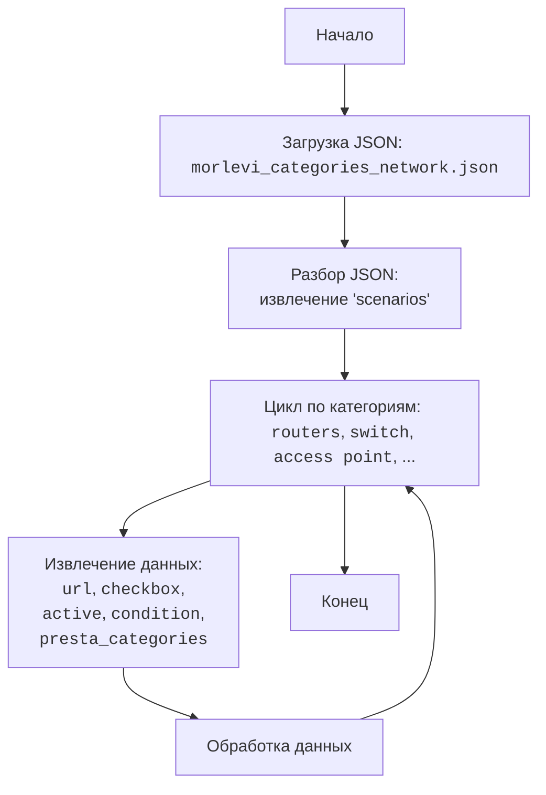

## АНАЛИЗ КОДА:

### <алгоритм>

1.  **Начало**: Загрузка JSON-файла `morlevi_categories_network.json`.
2.  **Разбор JSON**: Извлечение объекта `scenarios` из JSON.
3.  **Обход Категорий**: Перебор ключей внутри объекта `scenarios`, которые являются названиями категорий (например, `routers`, `switch`).
4.  **Извлечение Данных Категории**: Для каждой категории, извлекается URL (например, `https://www.morlevi.co.il/Cat/111`), свойство `checkbox` (логическое значение), `active` (логическое значение), `condition` (строка), `presta_categories` (строка).
5.  **Обработка Данных**: На основе этих данных, например, можно будет определить URL для загрузки товаров, определить нужно ли использовать чекбокс при парсинге, активна ли категория в данный момент, при каком условии её использовать и какие presta категории к ней относятся. 
6.  **Конец**: Завершение обработки данных и их использование в дальнейших процессах парсинга или настройки.

**Примеры для каждого блока:**

*   **Разбор JSON**:
    ```json
    {
      "scenarios": {
        "routers": {
            "url": "https://www.morlevi.co.il/Cat/111",
            "checkbox": false,
            "active": true,
            "condition":"new",
            "presta_categories": "210,211"
        },
    	"switch":{
            "url": "https://www.morlevi.co.il/Cat/141",
            "checkbox": false,
            "active": true,
            "condition":"new",
            "presta_categories": "210,212"
         }
     }
    }
    ```
    В результате разбора JSON будет получен Python словарь, в котором будет ключ `scenarios`, значением которого является словарь с категориями.
*   **Обход Категорий**: 
   Перебор ключей  `routers` и `switch`  в словаре `scenarios`
*   **Извлечение Данных Категории**: 
    Извлекаются значения:
    -   Для `routers`: `"url": "https://www.morlevi.co.il/Cat/111", "checkbox": false, "active": true, "condition":"new","presta_categories": "210,211"`
    -   Для `switch`: `"url": "https://www.morlevi.co.il/Cat/141", "checkbox": false, "active": true, "condition":"new","presta_categories": "210,212"`

### <mermaid>



**Объяснение зависимостей:**

1.  **Начало**: Начальная точка выполнения скрипта.
2.  **Загрузка JSON**: Загружает содержимое файла `morlevi_categories_network.json`. Не зависит от других частей проекта, кроме наличия самого файла.
3.  **Разбор JSON**: Преобразует загруженное содержимое JSON в структуру данных (словарь), откуда извлекается объект `scenarios`.
4. **Цикл по категориям**: Итерируется по всем ключам внутри объекта `scenarios`. Ключами являются названия категорий, например: `routers`, `switch`.
5.  **Извлечение данных**: Извлекаются данные для каждой категории: URL, checkbox, active, condition, presta_categories.
6.  **Обработка данных**: Извлеченные данные обрабатываются, чтобы быть использованы в дальнейшем процессе.
7.  **Конец**: Завершение обработки данных.

### <объяснение>

**Структура JSON:**

*   **`scenarios`**: Основной объект, содержащий все сценарии для различных категорий.
*   Каждый ключ внутри `scenarios` представляет собой **название категории** (например, `routers`, `switch`, `access point`, и т.д.).
*   Каждая категория содержит следующие атрибуты:
    *   `url` (строка): URL-адрес страницы с товарами данной категории.
    *   `checkbox` (логическое значение): Индикатор использования чекбокса при парсинге.
    *   `active` (логическое значение): Флаг, указывающий, активна ли данная категория.
    *   `condition` (строка): Условие, при котором используется данная категория.
    *   `presta_categories` (строка): Идентификаторы категорий в PrestaShop, связанные с данной категорией.

**Объяснение атрибутов:**

*   `url`: Этот URL используется для загрузки данных о товарах из конкретной категории на сайте Morlevi.
*   `checkbox`: Показывает, нужно ли проверять чекбоксы на странице категории при парсинге данных.
*   `active`: Позволяет включать или выключать парсинг данных для конкретной категории, не удаляя ее конфигурацию.
*   `condition`: Устанавливает условие (например, "new"), при котором данная категория должна быть обработана.
*   `presta_categories`: Указывает, к каким категориям в PrestaShop должны быть привязаны товары из данной категории.

**Потенциальные ошибки и области для улучшения:**

*   **Обработка ошибок**: В коде нет явной обработки ошибок, таких как некорректный JSON-формат или отсутствие нужных ключей в JSON. Желательно добавить обработку исключений для обеспечения стабильности приложения.
*   **Типизация**: Код не имеет строгой типизации, что может привести к ошибкам во время выполнения. Можно добавить проверку типов данных при парсинге JSON.
*   **Динамическая конфигурация**: Файл используется как статическая конфигурация. Можно предусмотреть вариант с динамической настройкой через базу данных или другое хранилище, чтобы изменения вступали в силу без необходимости перезапуска.
*   **Валидация данных**: Отсутствует валидация данных на корректность. Например, проверка URL на валидность, format `presta_categories` - строка, разделенная запятыми, и т.д.

**Взаимосвязь с другими частями проекта:**

Этот файл конфигурации используется для настройки парсера, определяя, какие URL нужно сканировать, какие чекбоксы проверять, какие условия применять, и как сопоставить категории с PrestaShop. Этот файл является частью модуля для работы с поставщиком Morlevi. Дальше, после извлечения данных, эти данные будут переданы в другие модули для парсинга, трансформации и загрузки данных в систему PrestaShop.

**Цепочка взаимосвязей:**

1.  Загрузка: `morlevi_categories_network.json`
2.  Использование: Парсер данных поставщика `Morlevi`
3.  Результат: Данные для загрузки в PrestaShop.